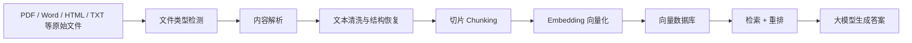
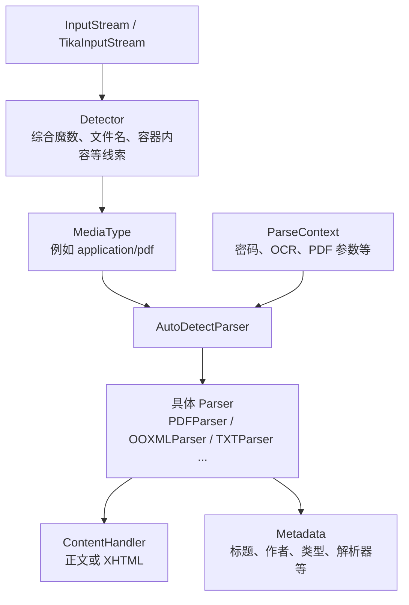
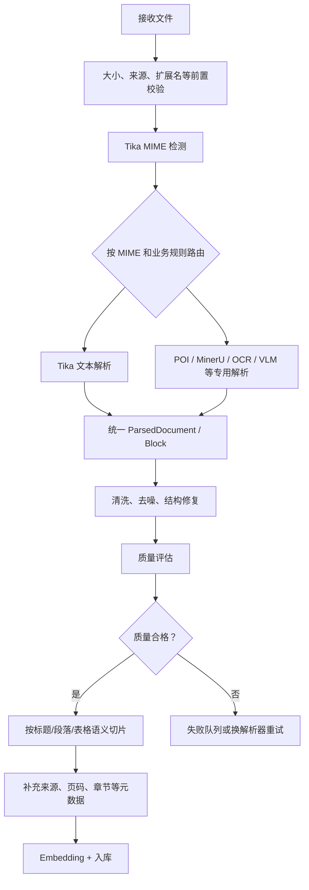
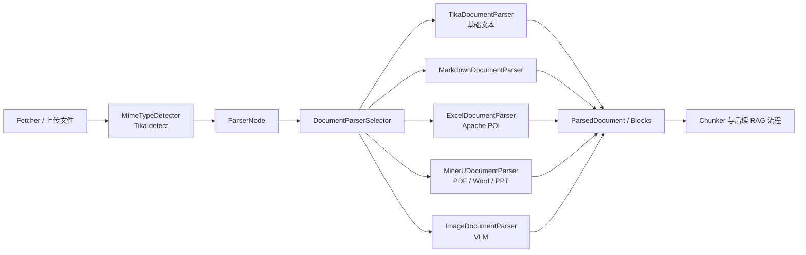

# Apache Tika 中文学习指南：从文件解析到 RAG 入库

> 面向刚接触 RAG、具备基础 Java/Maven 知识的同学。  
> 本文先建立直觉，再讲 API，最后回到本项目的真实代码。建议按顺序阅读。

## 0. 阅读前先记住三句话

1. **Apache Tika 负责“识别文件并抽取内容”，不负责向量化、检索或回答问题。**
2. **Tika 抽出的通常是文本与元数据，不等于保留了原文档的完整版面结构。**
3. **RAG 的上限很大程度取决于入库质量；解析错了，后面的切片、Embedding 和检索都会跟着错。**

本文写于 **2026-07-31**。当前项目使用：

| 项目 | 版本/情况 |
| --- | --- |
| Java | 17 |
| Apache Tika | 3.2.3 |
| Spring Boot | 3.5.7 |
| 构建工具 | Maven，多模块工程 |
| Tika 所在模块 | `bootstrap` |

截至本文编写时，Apache 官网公布的 3.x 最新稳定版是 **3.3.2**，同时存在 **4.0.0-beta-1**。本文的 Java 示例以本项目的 **Tika 3.2.3** 为准，不混用 4.x 的新配置格式和新行为。版本升级应单独做依赖审计与解析回归测试，不要只改一个版本号。

---

## 1. Tika 在 RAG 中处于什么位置

RAG 是 Retrieval-Augmented Generation，中文常译为“检索增强生成”。一个典型的知识库入库流程是：



Tika 主要覆盖上图中的 **文件类型检测** 和 **内容解析**：

- 判断字节内容更像 PDF、DOCX、HTML、纯文本还是其他格式；
- 从不同格式中抽取正文；
- 提取标题、作者、创建时间、Content-Type 等元数据；
- 在一定程度上处理压缩包、邮件附件、Office 内嵌对象等嵌套内容；
- 配合 Tesseract 对图片或扫描 PDF 做 OCR。

Tika **不直接负责**：

- 按 token 切片；
- 生成 Embedding；
- 写入 Milvus、Elasticsearch 或 PostgreSQL/pgvector；
- 相似度检索、重排；
- 调用大模型回答问题；
- 精确恢复复杂表格、页眉页脚、双栏顺序、坐标和视觉版面。

可以把 Tika 想成文档世界的“通用翻译入口”：

```text
不同格式的文件  --Tika-->  相对统一的文本 + 元数据 + SAX 事件
```

它最有价值的地方不是“每种格式都做到最精细”，而是“用一套统一接口覆盖大量格式”。Apache 官方称它能检测并抽取一千多种文件类型的文本和元数据。

---

## 2. 先建立 Tika 的核心心智模型

### 2.1 四个最重要的对象

| 对象 | 一句话作用 | 初学者类比 |
| --- | --- | --- |
| `Detector` | 猜测输入是什么 MIME 类型 | 文件分诊台 |
| `Parser` | 选择合适的格式解析器并读取内容 | 专科医生 |
| `ContentHandler` | 接收解析器产生的 XHTML SAX 事件 | 输出接收器 |
| `Metadata` | 携带输入提示并接收解析结果 | 双向信息袋 |

标准解析流程可以理解为：



### 2.2 为什么输出是 SAX 事件，而不是直接返回字符串

Tika 底层 `Parser` 接口的核心方法大致是：

```java
void parse(
        InputStream stream,
        ContentHandler handler,
        Metadata metadata,
        ParseContext context
) throws IOException, SAXException, TikaException;
```

Parser 把文档解析成一串 XHTML SAX 事件，交给 `ContentHandler`。这样做有几个好处：

- 可以流式消费，不一定先构建一棵完整 DOM；
- 可以选择只收集纯文本，也可以保留 XHTML 结构；
- 可以自定义 Handler，在解析过程中统计、过滤或写出内容；
- 对大文件更容易控制内存。

`Tika#parseToString(...)` 只是把上述复杂过程包装成了更容易上手的门面 API。

### 2.3 `Metadata` 为什么既是输入又是输出

解析前，可以往 `Metadata` 放入提示：

- 原始文件名；
- HTTP 返回的 `Content-Type`；
- 业务系统已知的信息。

解析后，Parser 又会向同一个对象写入：

- 实际解析使用的类型；
- 标题、作者、创建时间；
- 使用过的解析器；
- 页数、字符集等格式相关信息。

因此，`Metadata` 不是一个全局变量，也不应在多个请求之间复用。正确做法是 **每个文件新建一个 `Metadata`**。

### 2.4 `ParseContext` 是“按类型存对象的配置袋”

很多解析选项不是字符串键值，而是按类放进 `ParseContext`：

```java
ParseContext context = new ParseContext();
context.set(PDFParserConfig.class, pdfConfig);
context.set(TesseractOCRConfig.class, ocrConfig);
context.set(PasswordProvider.class, passwordProvider);
```

解析器会按类型取出自己关心的配置。与 `Metadata` 一样，包含请求级状态的 `ParseContext` 应按请求创建，不要跨请求随意共享。

---

## 3. Tika 的主要组件与依赖

### 3.1 常见构件

| Maven 构件 | 作用 | 是否能直接解析 PDF/Office |
| --- | --- | --- |
| `tika-core` | 核心接口、MIME 检测、基础类 | 只有它通常不够 |
| `tika-parsers-standard-package` | 常用解析器集合及相关依赖 | 可以处理大量常见格式 |
| `tika-app` | 可运行的命令行/GUI 应用 | 可以 |
| `tika-server-standard` | 提供 REST 服务的服务器 | 可以 |
| 扩展 Parser package | SQLite、科学数据等非标准集合 | 取决于具体包 |

最常见的初学者错误是：**只引入 `tika-core`，然后疑惑为什么 PDF 或 DOCX 解析不了。**  
`tika-core` 提供统一接口，但真正的格式解析通常来自 parser package。

### 3.2 本项目是怎样管理依赖的

父工程 [`pom.xml`](./pom.xml) 中：

```xml
<tika.version>3.2.3</tika.version>

<dependencyManagement>
    <dependencies>
        <dependency>
            <groupId>org.apache.tika</groupId>
            <artifactId>tika-bom</artifactId>
            <version>${tika.version}</version>
            <type>pom</type>
            <scope>import</scope>
        </dependency>
    </dependencies>
</dependencyManagement>
```

`bootstrap` 模块的 [`bootstrap/pom.xml`](./bootstrap/pom.xml) 中：

```xml
<dependency>
    <groupId>org.apache.tika</groupId>
    <artifactId>tika-parsers-standard-package</artifactId>
</dependency>

<dependency>
    <groupId>org.apache.tika</groupId>
    <artifactId>tika-core</artifactId>
</dependency>
```

这里使用 BOM 统一 Tika 组件版本，所以子模块不再重复写 `<version>`。本项目已经具备学习和使用 Tika 的依赖，不需要再添加一遍。

### 3.3 一个独立 Maven 小项目的参考写法

如果以后在其他项目中使用，可以参考：

```xml
<properties>
    <tika.version>3.2.3</tika.version>
</properties>

<dependencyManagement>
    <dependencies>
        <dependency>
            <groupId>org.apache.tika</groupId>
            <artifactId>tika-bom</artifactId>
            <version>${tika.version}</version>
            <type>pom</type>
            <scope>import</scope>
        </dependency>
    </dependencies>
</dependencyManagement>

<dependencies>
    <dependency>
        <groupId>org.apache.tika</groupId>
        <artifactId>tika-core</artifactId>
    </dependency>
    <dependency>
        <groupId>org.apache.tika</groupId>
        <artifactId>tika-parsers-standard-package</artifactId>
    </dependency>
</dependencies>
```

实际生产项目中还要定期检查传递依赖和 CVE，不应多年固定在旧版本。

---

## 4. 先用命令行认识 Tika

命令行是理解 Tika 最快的方式。`tika-app-3.2.3.jar` 是独立可运行 JAR，需要从 Apache Tika 官方下载页获取并校验签名/哈希。它不是本项目构建后自动产生的文件。

假设当前目录已有该 JAR 和 `sample.pdf`：

```powershell
# 查看版本
java -jar tika-app-3.2.3.jar --version

# 检测 MIME 类型
java -jar tika-app-3.2.3.jar --detect sample.pdf

# 抽取纯文本
java -jar tika-app-3.2.3.jar --text sample.pdf

# 只查看元数据
java -jar tika-app-3.2.3.jar --metadata sample.pdf

# 查看 XHTML，适合观察 Tika 保留了哪些结构
java -jar tika-app-3.2.3.jar --xml sample.pdf

# 递归输出容器及内嵌文档的内容和元数据
java -jar tika-app-3.2.3.jar --jsonRecursive sample.pdf

# 查看当前可用解析器
java -jar tika-app-3.2.3.jar --list-parsers

# 查看解析器与 MIME 类型的详细对应关系
java -jar tika-app-3.2.3.jar --list-parser-details
```

建议准备下面几类样本并比较结果：

1. 一个真正的文本 PDF；
2. 一个扫描图片生成的 PDF；
3. 一个含标题、表格和图片的 DOCX；
4. 一个把扩展名从 `.pdf` 改成 `.txt` 的文件；
5. 一个没有扩展名的文本文件。

观察重点不是“有没有输出”，而是：

- MIME 检测是否正确；
- 文本阅读顺序是否正确；
- 标题、表格是否丢失结构；
- 扫描 PDF 是否只有少量或完全没有文本；
- 改扩展名后，内容魔数是否仍能帮助识别。

---

## 5. 第一个 Java 程序：门面 API

`org.apache.tika.Tika` 是最适合入门的门面类。它把 Detector、Parser、Handler 等细节隐藏了。

```java
import org.apache.tika.Tika;
import org.apache.tika.metadata.Metadata;
import org.apache.tika.metadata.TikaCoreProperties;

import java.io.InputStream;
import java.nio.file.Files;
import java.nio.file.Path;
import java.util.Arrays;

public class TikaQuickStart {

    private static final int MAX_CHARS = 1_000_000;

    public static void main(String[] args) throws Exception {
        Path path = Path.of("sample.pdf");
        Tika tika = new Tika();

        // 1. 文件类型检测
        String mimeType = tika.detect(path);
        System.out.println("MIME = " + mimeType);

        // 2. 文本与元数据提取
        Metadata metadata = new Metadata();
        metadata.set(
                TikaCoreProperties.RESOURCE_NAME_KEY,
                path.getFileName().toString()
        );

        String text;
        try (InputStream input = Files.newInputStream(path)) {
            text = tika.parseToString(input, metadata, MAX_CHARS);
        }

        System.out.println("text length = " + text.length());
        System.out.println(text.substring(0, Math.min(text.length(), 500)));

        // 3. 元数据可能一键多值，所以使用 getValues
        String[] names = metadata.names();
        Arrays.sort(names);
        for (String name : names) {
            System.out.printf(
                    "%s = %s%n",
                    name,
                    Arrays.toString(metadata.getValues(name))
            );
        }
    }
}
```

### 5.1 这个例子学到了什么

- `detect` 与 `parse` 是两件事；
- 文件名可以作为 MIME 检测的提示；
- 文本与元数据可以在一次解析中同时得到；
- 元数据键可能对应多个值；
- 必须主动设置最大输出字符数；
- 流要被正确关闭。

### 5.2 关于字符数上限

`parseToString` 为避免不可预测的内存占用，会限制返回字符串长度。可以：

```java
tika.setMaxStringLength(1_000_000);
```

也可以像示例一样，给单次调用传入 `maxLength`。`-1` 表示取消限制，但生产环境通常不应该轻易取消，因为攻击文件或异常文档可能产生巨大文本。

另一个容易踩坑的点：`Tika#parseToString(InputStream...)` 会为了方便而关闭传入流；底层 `Parser#parse(...)` 则不会替调用者关闭流。无论用哪种 API，都建议在调用点用 `try-with-resources` 清晰表达资源所有权。

---

## 6. MIME 类型检测：不要只看扩展名

### 6.1 MIME 类型是什么

MIME/Media Type 是对内容类型的标准化描述，例如：

| 文件 | 常见 MIME |
| --- | --- |
| PDF | `application/pdf` |
| DOCX | `application/vnd.openxmlformats-officedocument.wordprocessingml.document` |
| XLSX | `application/vnd.openxmlformats-officedocument.spreadsheetml.sheet` |
| HTML | `text/html` |
| Markdown | `text/markdown` |
| JPEG | `image/jpeg` |
| 无法识别的二进制 | `application/octet-stream` |

### 6.2 Tika 会综合哪些线索

Tika 的默认检测可能综合：

1. 文件开头的 magic bytes（文件魔数）；
2. 文件名和扩展名；
3. 已声明的 HTTP `Content-Type`；
4. XML 根元素或命名空间；
5. ZIP、OLE2 等容器内部结构；
6. classpath 上实际可用的 Detector。

检测不是数学证明，而是“基于现有证据的最佳猜测”。

### 6.3 为什么文件名仍然有价值

只看扩展名不可靠，但完全丢弃文件名也会降低准确率。例如 CSV 的字节看起来可能就是普通文本，文件名 `.csv` 能帮助把 `text/plain` 细化成 `text/csv`。

本项目的 [`MimeTypeDetector.java`](./bootstrap/src/main/java/com/hjs/study/ragent/ingestion/util/MimeTypeDetector.java) 已经体现了这一点：

```java
public static String detect(byte[] bytes, String fileName) {
    if (bytes == null || bytes.length == 0) {
        return null;
    }
    if (fileName == null) {
        return TIKA.detect(bytes);
    }
    return TIKA.detect(bytes, fileName);
}
```

`detect(bytes, fileName)` 同时提供内容和文件名，比只调用 `detect(fileName)` 更可信。

### 6.4 更适合容器格式的检测写法

DOCX、XLSX、PPTX 本质上都是 ZIP 容器。为了让容器感知 Detector 有机会检查内部内容，推荐使用 `TikaInputStream`：

```java
import org.apache.tika.config.TikaConfig;
import org.apache.tika.io.TikaInputStream;
import org.apache.tika.metadata.Metadata;
import org.apache.tika.metadata.TikaCoreProperties;
import org.apache.tika.mime.MediaType;

import java.nio.file.Path;

Path path = Path.of("report.docx");
Metadata metadata = new Metadata();
metadata.set(
        TikaCoreProperties.RESOURCE_NAME_KEY,
        path.getFileName().toString()
);

TikaConfig tikaConfig = TikaConfig.getDefaultConfig();

try (TikaInputStream input = TikaInputStream.get(path, metadata)) {
    MediaType type = tikaConfig.getDetector().detect(input, metadata);
    System.out.println(type);
}
```

官方文档特别指出：某些容器 Detector 需要 `TikaInputStream` 才能读取完整容器信息；普通 `InputStream` 可能只能进行较浅的 magic 检测。

### 6.5 安全上不能只信 Tika 的检测结果

MIME 检测应服务于“解析路由”和“用户提示”，不能单独充当安全边界。更稳妥的上传校验通常组合：

- 文件大小限制；
- 扩展名允许列表；
- Tika 内容检测；
- 扩展名、声明类型和检测类型的一致性检查；
- 解析是否成功；
- 恶意软件扫描；
- 对高风险格式进行隔离处理。

例如，一个文件被检测为 `image/jpeg`，并不等于它必然安全，也不等于它不可能是精心构造的混合文件。

---

## 7. 进阶解析：`AutoDetectParser`

当你需要元数据、多种输出形式、密码、OCR 或 PDF 参数时，应从 `Tika` 门面下沉到 Parser API。

```java
import org.apache.tika.io.TikaInputStream;
import org.apache.tika.metadata.Metadata;
import org.apache.tika.metadata.TikaCoreProperties;
import org.apache.tika.parser.AutoDetectParser;
import org.apache.tika.parser.ParseContext;
import org.apache.tika.sax.BodyContentHandler;

import java.nio.file.Path;
import java.util.Arrays;

public class TikaParserExample {

    public static void main(String[] args) throws Exception {
        Path path = Path.of("sample.docx");

        AutoDetectParser parser = new AutoDetectParser();
        Metadata metadata = new Metadata();
        metadata.set(
                TikaCoreProperties.RESOURCE_NAME_KEY,
                path.getFileName().toString()
        );

        // 最多收集 100 万个字符；达到限制时 Handler 会抛异常
        BodyContentHandler handler = new BodyContentHandler(1_000_000);
        ParseContext context = new ParseContext();

        try (TikaInputStream input = TikaInputStream.get(path, metadata)) {
            parser.parse(input, handler, metadata, context);
        }

        String text = handler.toString();
        System.out.println(text);

        String[] names = metadata.names();
        Arrays.sort(names);
        for (String name : names) {
            System.out.printf(
                    "%s = %s%n",
                    name,
                    Arrays.toString(metadata.getValues(name))
            );
        }
    }
}
```

### 7.1 `AutoDetectParser` 做了什么

它大致执行：

1. 检测 MIME 类型；
2. 从已加载的 Parser 中选择支持该类型的解析器；
3. 调用具体 Parser；
4. 把 SAX 事件送给 Handler；
5. 将格式相关信息写入 Metadata。

它是“自动路由器”，不是一个会亲自理解所有格式的超级解析器。很多具体能力来自 PDFBox、Apache POI 等第三方库，Tika 主要提供适配和统一接口。

### 7.2 常见 `ContentHandler`

| Handler/方式 | 结果 | 适合场景 |
| --- | --- | --- |
| `BodyContentHandler` | 主要正文文本 | 搜索索引、简单 RAG |
| `ToXMLContentHandler` | XHTML/XML 字符串 | 观察结构、后续自定义结构处理 |
| `WriteOutContentHandler` | 带字符上限的输出 | 防止无限写出 |
| 自定义 SAX Handler | 事件级处理 | 高级流式抽取或统计 |

注意：`new BodyContentHandler(-1)` 或 `new WriteOutContentHandler(-1)` 会取消字符上限。它在本地小样本实验中方便，但不应无条件用于用户上传文件。

### 7.3 保留 XHTML，而不是马上压成纯文本

```java
import org.apache.tika.sax.ToXMLContentHandler;

ToXMLContentHandler handler = new ToXMLContentHandler();
parser.parse(input, handler, metadata, context);
String xhtml = handler.toString();
```

在 RAG 中，XHTML 有时比纯文本更有价值，因为标题、段落、列表、表格单元等结构可能仍以标签或属性存在。先转纯文本再试图恢复结构，往往比保留结构后再降级更困难。

---

## 8. 元数据：RAG 中经常被低估的信息

### 8.1 常见元数据

不同格式会产生不同键，常见内容包括：

- `Content-Type`；
- `Content-Encoding`；
- `title`；
- `Author` 或 Dublin Core 对应字段；
- 创建时间、修改时间；
- 页数；
- 解析器名称，如 `X-TIKA:Parsed-By`；
- 原始资源名；
- 格式专有字段。

不要假设所有文档都有标题和作者，也不要假设不同格式使用完全相同的原始键名。

### 8.2 为什么使用 `getValues`

一个元数据键可能有多个值：

```java
for (String name : metadata.names()) {
    String[] values = metadata.getValues(name);
}
```

只调用 `metadata.get(name)` 会在多值情况下返回第一个值，可能丢信息。

### 8.3 建议在 RAG 中建立自己的规范化字段

不要把 Tika 的所有原始键直接变成向量库顶级字段。可以规范成：

```json
{
  "document_id": "业务文档 ID",
  "source_file": "员工手册.pdf",
  "source_uri": "s3://bucket/...",
  "mime_type": "application/pdf",
  "title": "员工手册",
  "author": ["人力资源部"],
  "created_at": "2026-01-01T00:00:00Z",
  "parser": "Tika/PDFParser",
  "parser_version": "3.2.3",
  "content_sha256": "...",
  "ingested_at": "...",
  "raw_metadata": {
    "保留必要的原始 Tika 元数据": "便于排查"
  }
}
```

这样做的好处：

- 解析器升级后，业务查询字段不必跟着变化；
- 可以记录解析版本，实现可追溯与重新入库；
- 检索时可按文档、作者、时间、类型过滤；
- 出错时仍能查看原始元数据。

---

## 9. 各类文档的真实解析效果

“Tika 支持某格式”通常表示能检测或抽取一定内容，不表示能 100% 还原人眼看到的版面。

| 格式 | 通常能做好 | 常见问题 | RAG 建议 |
| --- | --- | --- | --- |
| TXT/JSON/XML | 文本和编码识别 | 错误编码、超大单行 | Tika 很适合，之后做格式化清洗 |
| HTML | 正文、标题、链接文本 | 导航、广告、脚本噪声 | 需要正文抽取和标签结构策略 |
| PDF（文本型） | 字符与元数据 | 双栏错序、页眉页脚、断词、表格 | 先做质量评估，必要时走版面解析 |
| PDF（扫描型） | 原生文本很少 | 必须 OCR，速度慢且有误识别 | OCR 或专用文档理解服务 |
| DOC/DOCX | 正文、属性、部分结构 | 文本框、页眉页脚、表格结构可能变平 | 结构要求高时保留 XHTML 或换专用解析 |
| PPT/PPTX | 幻灯片文字与元数据 | 元素阅读顺序、图表含义 | 按页/幻灯片组织，必要时视觉理解 |
| XLS/XLSX | 单元格文本 | 多表、多行表头、合并单元格、公式、超链接 | 表格型 RAG 常直接用 POI 更可控 |
| 图片 | EXIF 等元数据 | 正文需要 OCR/VLM | 单独的 OCR/VLM 路由更清楚 |
| EML/压缩包 | 主体及嵌套对象 | 附件爆炸、递归与资源消耗 | 限制深度、数量、总展开大小 |

一个务实原则：

> Tika 是优秀的通用基线，但复杂版面、精确表格、坐标级引用和多模态理解通常需要专用解析器。

---

## 10. PDF 与 OCR

### 10.1 先区分两种 PDF

**文本型 PDF**：页面中存在可复制的字符。Tika/PDFBox 可以直接抽取。  
**扫描型 PDF**：每页主要是一张图片，几乎没有字符层。必须通过 OCR 识别图片中的字。

快速判断可以结合：

- Tika 抽取文本长度；
- 页数；
- 每页平均字符数；
- 是否大量是乱码或重复字符；
- 文档是否包含大量页面图像。

“文本长度为 0”不是唯一判定条件，但可以作为重要信号。

### 10.2 Tika 的 OCR 依赖 Tesseract

Tika 自己不是 OCR 引擎。常见路径是由 Tika 调用外部的 Tesseract：

1. 安装 Tesseract；
2. 安装中文语言数据 `chi_sim`，如还需要英文则也安装 `eng`；
3. 确保 `tesseract` 命令在运行 Java 进程的 `PATH` 中；
4. 先在命令行执行 `tesseract --version` 和 `tesseract --list-langs` 验证；
5. 再配置 Tika。

### 10.3 Java 配置示例

```java
import org.apache.tika.parser.AutoDetectParser;
import org.apache.tika.parser.ParseContext;
import org.apache.tika.parser.ocr.TesseractOCRConfig;
import org.apache.tika.parser.pdf.PDFParserConfig;
import org.apache.tika.sax.BodyContentHandler;

PDFParserConfig pdfConfig = new PDFParserConfig();
pdfConfig.setOcrStrategy(PDFParserConfig.OCR_STRATEGY.AUTO);
pdfConfig.setExtractInlineImages(false);

TesseractOCRConfig ocrConfig = new TesseractOCRConfig();
ocrConfig.setLanguage("chi_sim+eng");
ocrConfig.setTimeoutSeconds(120);
ocrConfig.setPreserveInterwordSpacing(true);

ParseContext context = new ParseContext();
context.set(PDFParserConfig.class, pdfConfig);
context.set(TesseractOCRConfig.class, ocrConfig);

AutoDetectParser parser = new AutoDetectParser();
BodyContentHandler handler = new BodyContentHandler(1_000_000);
parser.parse(input, handler, metadata, context);
```

`PDFParserConfig.OCR_STRATEGY` 的常见取值：

| 策略 | 含义 |
| --- | --- |
| `NO_OCR` | 不做 OCR |
| `OCR_ONLY` | 只使用 OCR |
| `OCR_AND_TEXT_EXTRACTION` | OCR 与原生文本都抽取，可能重复 |
| `AUTO` | 根据配置和文档情况自动决定 |

### 10.4 OCR 的成本

OCR 不是“打开一个开关就完美”：

- CPU 消耗明显；
- 大 PDF 延迟很高；
- 中文、表格、公式、低清扫描件错误率更高；
- 倾斜、阴影、旋转和压缩噪声会影响质量；
- OCR 文本可能重复原有文本层；
- 外部进程、临时文件和超时都需要监控。

建议将 OCR 设计成显式路由：

```text
原生文本质量足够 -> 直接使用
原生文本不足     -> OCR
复杂版面/表格     -> 专用版面解析或视觉模型
```

### 10.5 PDF 阅读顺序不是固定答案

`PDFParserConfig#setSortByPosition(true)` 会按坐标排序文本 token，对某些 PDF 有帮助，但双栏页面可能把左右两栏交错在一起。默认值为 `false`。它不是“越精确越好”的通用开关，必须用真实语料 A/B 测试。

---

## 11. 密码保护文档

Parser API 可以通过 `PasswordProvider` 提供密码：

```java
import org.apache.tika.parser.PasswordProvider;

ParseContext context = new ParseContext();
context.set(PasswordProvider.class, metadata -> "由安全来源取得的密码");
```

生产环境注意：

- 不要把密码写死在代码中；
- 不要把密码记录到日志；
- 密码应来自受控密钥服务或一次性请求上下文；
- 解密失败与普通解析失败要分开统计；
- 即使成功解密，文档仍是不可信输入。

---

## 12. 内嵌对象与递归解析

DOCX、PPTX、EML、ZIP 等文件可能包含：

- 图片；
- 附件；
- 嵌入的 Excel 或 Word；
- 邮件中的多层邮件；
- 压缩包中的压缩包。

普通纯文本输出可能把某些内嵌内容合并到主文档，也可能不提供你需要的独立元数据。需要“每个子文档一条记录”时，应了解：

- `RecursiveParserWrapper`；
- Tika App 的 `--jsonRecursive`；
- Tika Server 的 `/rmeta`；
- 自定义 `EmbeddedDocumentExtractor`。

RAG 中常见的数据模型：

```text
container_document_id = 邮件或压缩包的 ID
document_id           = 当前附件自己的 ID
parent_document_id    = 直接父对象 ID
embedded_path         = 附件在容器中的逻辑路径
depth                 = 嵌套深度
```

必须限制：

- 最大嵌套深度；
- 最大附件数量；
- 单个附件大小；
- 展开后的总字节数；
- 单文档最大文本字符数；
- 总处理时间。

否则，一个很小的压缩文件可能展开成巨量数据，导致磁盘、内存或 CPU 耗尽。

---

## 13. Tika Server：把解析做成独立服务

### 13.1 什么时候考虑 Server 模式

嵌入 Java 进程适合：

- 应用本身就是 Java；
- 文件量不大；
- 部署简单优先；
- 可以接受解析器与业务服务共享进程资源。

独立 Tika Server 适合：

- 调用方包含 Python、Go、Node.js 等多种语言；
- 希望集中维护 Tika 和 OCR；
- 希望把高风险、重 CPU 的解析与主业务隔离；
- 需要单独扩缩容。

### 13.2 常见 REST 接口

假设服务运行于 `http://localhost:9998`：

```powershell
# 抽取纯文本
curl.exe -T sample.pdf `
  -H "Accept: text/plain" `
  http://localhost:9998/tika

# 检测 MIME；文件名提示可提升部分格式的准确率
curl.exe -X PUT `
  -H "Content-Disposition: attachment; filename=sample.pdf" `
  --upload-file sample.pdf `
  http://localhost:9998/detect/stream

# 递归取得主文档和内嵌对象的 JSON 元数据/内容
curl.exe -T sample.docx `
  http://localhost:9998/rmeta/text

# 查看已加载的解析器
curl.exe http://localhost:9998/parsers/details
```

PowerShell 中建议显式使用 `curl.exe`，避免某些版本中 `curl` 别名与真正 cURL 的参数行为不同。

### 13.3 Server 模式的安全边界

Apache 官方明确建议：Tika Server 只应暴露给受信调用方和受控网络，不能直接暴露到公网或不受信用户。

至少要做：

- 身份认证与授权；
- 内网或服务网格访问控制；
- TLS，必要时双向 TLS；
- 请求体大小、并发数和速率限制；
- 容器 CPU、内存、进程数、临时磁盘配额；
- 最小权限运行；
- 禁止不必要的高能力端点；
- 网络出口限制；
- 超时、熔断和重试上限；
- 日志脱敏。

独立服务能提高隔离性，但并不会自动让恶意文档变安全。

---

## 14. 把 Tika 输出变成高质量 RAG 数据

### 14.1 推荐的入库流水线



### 14.2 不要把 `parseToString` 的结果直接无脑切片

至少先做：

- Unicode 规范化；
- 清除空字符和异常控制字符；
- 合并不合理的空白；
- 处理 PDF 行尾断词；
- 识别重复页眉页脚；
- 保留标题、列表、表格等块类型；
- 检查乱码比例和文本密度；
- 记录解析器与解析版本。

但也不要“过度清洗”。如果把所有换行、标点和标题都删掉，切片边界和语义会变差。

### 14.3 切片时应尽量保留出处

每个 chunk 最好至少带：

```json
{
  "chunk_id": "...",
  "document_id": "...",
  "source_file": "员工手册.pdf",
  "mime_type": "application/pdf",
  "parser": "MinerU",
  "heading_path": ["第三章", "休假制度"],
  "page_start": 12,
  "page_end": 13,
  "chunk_index": 27,
  "content": "..."
}
```

Tika 的纯文本模式并不保证提供可靠的页码和标题层级。若产品要求答案精确引用页码、表格单元格或页面坐标，应在解析器选型阶段就保留这些信息，而不是切片后再猜。

### 14.4 建议建立解析质量指标

可以从简单规则开始：

| 指标 | 可能说明什么 |
| --- | --- |
| `text_length == 0` | 扫描件、加密、损坏或不支持 |
| 每页平均字符数过低 | 可能需要 OCR |
| 替换字符 `�` 比例高 | 编码或字体映射问题 |
| 重复行比例高 | 页眉页脚或 OCR 重复 |
| 超长单行 | 换行结构丢失 |
| 表格文档却无表格块 | 解析器不适合 |
| 解析耗时异常 | 复杂或恶意输入 |

质量评估的输出应决定“接受、换解析器、OCR、人工检查或失败”，而不是所有文件都走同一路径。

---

## 15. 本项目中的 Tika：沿着真实代码学习

本项目没有让 Tika 包办所有文档，而是采用 **MIME 检测 + 多解析器策略路由**。这比“所有文件一律 `new Tika().parseToString(...)`”更适合 RAG。

### 15.1 当前链路



### 15.2 建议按这个顺序阅读源码

1. [`MimeTypeDetector.java`](./bootstrap/src/main/java/com/hjs/study/ragent/ingestion/util/MimeTypeDetector.java)  
   看 Tika 怎样结合字节与文件名做 MIME 检测。

2. [`ParserNode.java`](./bootstrap/src/main/java/com/hjs/study/ragent/ingestion/node/ParserNode.java)  
   看 MIME 如何进入解析节点，如何校验规则，以及解析结果如何写回上下文。

3. [`DocumentParserSelector.java`](./bootstrap/src/main/java/com/hjs/study/ragent/core/parser/DocumentParserSelector.java)  
   看 Spring 如何收集多个策略，再按 `supports(mimeType)` 选中第一个匹配者。

4. [`TikaDocumentParser.java`](./bootstrap/src/main/java/com/hjs/study/ragent/core/parser/TikaDocumentParser.java)  
   看最简单的 Tika 文本抽取如何转成 `ParagraphBlock`。

5. 再对比 `MarkdownDocumentParser`、`ExcelDocumentParser`、`MinerUDocumentParser` 和 `ImageDocumentParser`。  
   理解为什么不同格式需要不同的结构化策略。

### 15.3 当前路由的实际含义

以 `TikaDocumentParser#supports` 的真实实现为准：

- Markdown 不走 Tika，而走专用 Markdown Parser；
- CSV 不走 Tika，而走 CSV Parser；
- PDF、Word、PPT 主要走 MinerU；
- Excel 走 POI；
- 图片走图像/VLM Parser；
- Tika 主要处理普通 `text/*`、JSON、XML、XHTML、RTF。

因此，类注释中“支持 PDF、Word、Excel、PPT”等描述更像 Tika 的通用能力介绍，**不代表这个项目当前会把这些 MIME 路由给 `TikaDocumentParser`**。学习项目时，应同时看注释和代码，冲突时以可执行逻辑与测试为准。

### 15.4 `TikaDocumentParser` 做了什么

核心逻辑是：

```java
text = TIKA.parseToString(is);
text = TextCleanupUtil.cleanup(text);

for (String segment : text.split("\\n{2,}")) {
    // 每个由空行分开的片段变成 ParagraphBlock
}
```

优点：

- 简单；
- 对基础文本格式足够；
- 能统一输出项目自己的 `ParsedDocument`/`Block` 模型；
- 后续 Chunker 不需要直接依赖 Tika。

局限：

- 输出先被压成字符串，结构信息较少；
- 只按连续空行分段，无法稳定识别标题、列表和表格；
- `parseToString` 有字符数上限，需要明确配置并监控截断；
- 整个输入已经是 `byte[]`，大文件会占用较多堆内存；
- 异常信息直接拼入业务消息时要注意泄露内部细节。

### 15.5 一个值得特别理解的配置点

当前 `TikaDocumentParser` 静态块中创建了 `PDFParserConfig`：

```java
static {
    PDFParserConfig pdfConfig = new PDFParserConfig();
    pdfConfig.setExtractInlineImages(false);
    pdfConfig.setExtractUniqueInlineImagesOnly(true);
}
```

但这个局部变量没有放入 `ParseContext`，也没有用于构造 `TikaConfig` 或 `Tika`，因此它不会改变 `TIKA.parseToString(is)` 的解析行为。

正确的配置思路是：

```java
PDFParserConfig pdfConfig = new PDFParserConfig();
pdfConfig.setExtractInlineImages(false);

ParseContext context = new ParseContext();
context.set(PDFParserConfig.class, pdfConfig);

AutoDetectParser parser = new AutoDetectParser();
parser.parse(input, handler, metadata, context);
```

不过本项目目前并不把 PDF 路由到该类，所以是否调整这里，应结合架构意图和测试决定，而不是为了“看起来配置了”就贸然修改。

### 15.6 这个项目为什么采用自己的 `ParsedDocument`

如果业务层直接依赖 Tika 的 `Metadata` 和 SAX Handler：

- 更换 MinerU、POI 或 VLM 时接口会分裂；
- Chunker 要知道各种解析器的细节；
- 表格、标题、图片资产等结构难以统一。

项目自己的 `ParsedDocument`/`Block` 相当于防腐层：

```text
Tika / POI / MinerU / VLM
           ↓
   统一 ParsedDocument
           ↓
   清洗、切片、索引、检索
```

这是值得学习的架构思想：**第三方解析器负责能力，领域模型负责稳定边界。**

---

## 16. 生产环境必须考虑的可靠性与安全

Apache 官方安全模型强调：解析不可信文档本身是危险操作，Tika 不是安全边界。恶意文件可能导致：

- CPU 长时间占用；
- 内存耗尽；
- 压缩炸弹；
- 无限循环或解析器崩溃；
- 临时磁盘耗尽；
- 第三方解析库漏洞；
- 外部进程调用风险。

### 16.1 推荐的分层保护

**进入解析器之前：**

- 限制上传字节数；
- 检查来源和访问权限；
- 生成内容哈希，便于去重与审计；
- 扩展名和 MIME 允许列表；
- 恶意软件扫描；
- 不把用户文件名直接拼成服务器路径。

**解析过程中：**

- 有限的文本写出长度；
- 限制附件数量、递归深度和总展开大小；
- 超时；
- 有界线程池和队列；
- 监控临时目录；
- 禁用不需要的解析器和外部工具；
- 对 OCR 单独限流。

**进程与容器层：**

- 以非 root、最小权限用户运行；
- CPU、内存、进程数、文件句柄和磁盘配额；
- 只读根文件系统与受控临时目录；
- 限制网络出口；
- 最好把高风险解析与主业务进程隔离；
- 解析进程异常时可丢弃并重建。

**解析之后：**

- 做文本质量检查；
- 记录解析器、版本、耗时和异常分类；
- 不把堆栈、路径、密码返回给终端用户；
- 失败进入可重试/人工检查队列，不无限重试。

### 16.2 为什么 `Future.cancel(true)` 不等于可靠超时

某些第三方解析库或本地代码可能不响应线程中断。业务线程提交一个解析任务，然后超时调用 `cancel(true)`，并不能保证底层解析真的停止。

对严格的超时和隔离需求，更可靠的是：

- Tika 的 fork/out-of-process 机制；
- 独立 Tika Server；
- 独立容器或短生命周期工作进程；
- 超时后终止整个受限子进程。

### 16.3 依赖更新也是安全控制

Tika 会集成许多第三方格式库。应持续：

- 关注 Apache Tika Security 页面；
- 扫描直接依赖与传递依赖；
- 阅读版本变更；
- 用固定样本集做解析回归；
- 记录当前生产解析版本；
- 对升级后的文本差异和向量召回率做比较。

---

## 17. 性能与并发

### 17.1 内存

本项目当前把文件读成 `byte[]`，再用 `ByteArrayInputStream` 解析。假设：

- 上传文件 50 MB；
- 原始 `byte[]` 占 50 MB；
- Parser 可能构建自己的对象；
- 输出字符串使用大量字符内存；
- 后续清洗和 `split` 可能再复制字符串。

单个请求的峰值内存可能远大于文件大小。并发 10 个大文件时，压力会迅速放大。

可考虑：

- 上传阶段先落受控临时文件或对象存储；
- 用流或 `Path` 解析；
- 按文件大小分级调度；
- 限制同时运行的重型解析数；
- 避免无界文本输出；
- 解析后尽早释放原始字节。

### 17.2 对象复用

可以把初始化成本高、配置固定的 Parser/Detector 作为长生命周期对象，但要满足：

- 配置初始化后不再并发修改；
- 查清具体 Parser 及第三方库的线程安全约束；
- `Metadata`、`ParseContext`、`ContentHandler`、输入流按请求新建；
- 像 `TesseractOCRConfig` 这类官方明确标注非线程安全的对象，不应在请求间边改边共享。

不要为了少 `new` 几个轻量对象而共享请求状态。

### 17.3 缓存

如果同一内容会反复解析，可以用：

```text
cache_key = SHA-256(原文件字节)
          + parser_name
          + parser_version
          + config_version
```

只用文件名作缓存键会产生冲突；只用内容哈希又无法区分解析器升级和配置变化。

### 17.4 监控指标

建议按 MIME、解析器和结果状态记录：

- 文件数、字节数；
- 解析耗时 P50/P95/P99；
- 成功率；
- 超时率；
- OCR 触发率；
- 文本字符数；
- 截断率；
- 空文本率；
- 内嵌对象数；
- 失败异常类别；
- 队列长度；
- 进程内存和临时磁盘。

这些指标比一条“文档解析失败”日志更能定位问题。

---

## 18. 常见问题排查

### 18.1 `NoSuchMethodError` / `ClassNotFoundException`

常见原因：

- Tika 模块版本不一致；
- PDFBox、POI 等传递依赖被其他 BOM 覆盖；
- 只引入 `tika-core`；
- 打包时漏掉 Service Provider 配置；
- Spring Boot fat JAR 中存在依赖冲突。

排查：

```powershell
.\mvnw.cmd -pl bootstrap dependency:tree `
  "-Dincludes=org.apache.tika,org.apache.pdfbox,org.apache.poi"
```

重点看同一组件是否出现多个版本、是否被 omitted、是否发生意外 exclusion。

### 18.2 PDF 能打开，但抽取为空

可能原因：

- 扫描 PDF；
- 加密 PDF；
- 字体映射异常；
- 内容实际上是图像；
- 文档损坏；
- Parser 未正确加载。

处理顺序：

1. 用 Tika App 查看 MIME 和元数据；
2. 确认是否有密码；
3. 比较 `--text` 与 `--xml`；
4. 统计页数和字符数；
5. 尝试 OCR；
6. 与 MinerU 等专用解析器对比。

### 18.3 文本只到一半

首先检查：

- `Tika#getMaxStringLength()`；
- `parseToString` 的 `maxLength` 参数；
- `BodyContentHandler` / `WriteOutContentHandler` 的 write limit；
- 服务端 `writeLimit`；
- 上游 HTTP 响应大小限制；
- 数据库字段长度。

不要直接把所有限制都改成 `-1`。先确认合理上限，并记录“被截断”状态。

### 18.4 DOCX 被检测成 ZIP

可能原因：

- 只使用浅层 magic 检测；
- 没有 parser package/container detector；
- 使用普通流而非适合容器检测的 `TikaInputStream`；
- 文件实际损坏或不是合法 DOCX。

### 18.5 CSV 被检测成 `text/plain`

这很常见，因为 CSV 本质上很像普通文本。提供原文件名、扩展名和业务上下文，通常能改善结果。项目中 CSV 本来就应交给专用 CSV Parser，以保留行列语义。

### 18.6 中文乱码

排查：

- 原文件实际编码；
- 是否错误地在 Tika 之前用默认字符集把字节转成 String；
- `Content-Encoding` 元数据；
- 文档是否使用异常字体映射；
- 是否 OCR 语言包不正确；
- 控制台和输出文件是否是 UTF-8。

关键原则：把原始文件的 **字节** 交给 Tika，不要先用 `new String(bytes)` 做一次有损转换。

### 18.7 OCR 没有启动

检查：

```powershell
tesseract --version
tesseract --list-langs
```

然后确认：

- 运行 Java 的那个用户也能找到 `tesseract`；
- `chi_sim` 等语言数据已安装；
- PDF OCR 策略没有设成 `NO_OCR`；
- `TesseractOCRConfig` 真的被放进本次 `ParseContext`；
- 日志中是否有初始化失败或超时；
- 文档路由是否真的经过 Tika OCR。  

在本项目中 PDF 默认路由到 MinerU，所以单独配置 `TikaDocumentParser` 并不意味着 PDF 会走 Tika OCR。

---

## 19. 测试策略：不要只测“没有抛异常”

### 19.1 建立黄金样本集

每种主要格式至少准备：

- 正常小文件；
- 大文件；
- 空文件；
- 损坏文件；
- 密码文件；
- 中文与中英混合；
- 扫描件；
- 多栏 PDF；
- 带表格/图片/附件；
- 扩展名错误；
- 无扩展名。

### 19.2 断言什么

不要对完整抽取文本做一个巨大字符串等值断言，因为依赖升级可能引入合理的空白差异。可以断言：

- MIME 类型；
- 关键标题和关键句存在；
- 文本长度位于合理区间；
- 元数据包含预期字段；
- 没有明显乱码；
- Block 数量和类型；
- 表格行列数；
- 超限时得到明确状态；
- 解析耗时没有明显退化。

### 19.3 解析升级回归

升级 Tika 或底层依赖时，对同一黄金样本记录：

```text
旧版本输出 -> 规范化 -> 指标
新版本输出 -> 规范化 -> 指标
                    ↓
       文本差异 + 元数据差异 + 耗时差异
                    ↓
          Chunk 差异 + 检索质量差异
```

最终关注的不只是文本 diff，还包括 RAG 召回和答案引用是否改善或退化。

---

## 20. 推荐的动手练习

### 练习一：最小解析器

目标：

- 输入任意本地文件；
- 打印 MIME；
- 打印前 500 个字符；
- 打印全部元数据；
- 设置明确的最大字符数。

完成标准：能解释 `Tika`、`Metadata` 和 `maxLength` 的作用。

### 练习二：扩展名欺骗实验

把一个 PDF 复制后改名为 `.txt`，分别调用：

```java
tika.detect("fake.txt");
tika.detect(bytes);
tika.detect(bytes, "fake.txt");
```

比较结果，解释内容证据与文件名提示的关系。

### 练习三：纯文本与 XHTML 对比

同一个 DOCX 分别使用：

- `BodyContentHandler`；
- `ToXMLContentHandler`。

找出标题、列表、表格在两种输出中的差异，并思考哪种更适合结构化切片。

### 练习四：解析质量评分

实现一个简单评分器：

```text
基础分 100
- 空文本：100
- 替换字符比例过高：30
- 平均每页字符数过低：30
- 重复行比例过高：20
- 达到 write limit：40
```

让评分决定 `ACCEPT`、`OCR_RETRY`、`SPECIAL_PARSER` 或 `REJECT`。

### 练习五：沿本项目调试

在测试环境选择 TXT、Markdown、XLSX、PDF 各一个，断点观察：

1. `MimeTypeDetector.detect` 的返回值；
2. `ParserNode.execute` 中的 `mimeType`；
3. `DocumentParserSelector.selectByMimeType` 选择了谁；
4. `ParsedDocument.blocks()` 的类型与数量；
5. `BlockTextRenderer` 输出；
6. 后续 Chunker 产生的 chunk。

完成后，你应该能回答：“为什么 PDF 没有进入 `TikaDocumentParser`？”

---

## 21. 一份循序渐进的学习路线

### 第 1 阶段：会用，约 1 小时

- 理解 Tika 在 RAG 入库链路的位置；
- 用 Tika App 执行 detect、text、metadata；
- 用 `Tika` 门面解析一个文件；
- 知道 `tika-core` 与 parser package 的区别。

### 第 2 阶段：理解 API，约 2～4 小时

- 使用 `AutoDetectParser`；
- 理解 `Metadata`、`ParseContext`、`ContentHandler`；
- 比较纯文本与 XHTML；
- 学会设置字符上限与处理异常。

### 第 3 阶段：理解文档差异，约 1 天

- 对比 PDF、DOCX、XLSX、HTML、扫描件；
- 观察阅读顺序、表格、附件和编码；
- 了解 OCR；
- 建立小型黄金样本集。

### 第 4 阶段：接入 RAG，约 1～2 天

- 设计统一 `ParsedDocument` 和 Block；
- 做文本清洗与质量评估；
- 保留来源与结构元数据；
- 设计解析器路由和降级；
- 比较不同解析结果对 Chunk 和召回的影响。

### 第 5 阶段：生产化，持续进行

- 隔离不可信文件；
- 限制资源和并发；
- 建立指标、告警和失败队列；
- 管理版本与回归样本；
- 跟踪 Tika 及传递依赖安全公告。

---

## 22. 常见面试/自测题

### 1. Tika 和 OCR 是一回事吗？

不是。Tika 是内容检测与解析框架；OCR 通常由 Tesseract 等引擎完成，Tika 可以负责调用和整合结果。

### 2. 为什么只引入 `tika-core` 可能解析不了 PDF？

因为 core 主要提供接口、检测与基础设施，具体 PDF/Office 解析器通常在 parser package 中。

### 3. `Detector` 能保证 MIME 绝对正确吗？

不能。它根据内容、文件名、声明类型和容器结构等证据给出最佳判断，仍可能被错误或恶意输入欺骗。

### 4. `Tika` 与 `AutoDetectParser` 怎么选？

快速抽取、简单场景先用 `Tika` 门面；需要自定义 Handler、OCR、PDF 选项、密码或递归解析时使用 Parser API。

### 5. 为什么 RAG 不能直接对 Tika 的字符串按固定字符数切片？

因为字符串可能丢失标题、表格和页面边界，也可能包含页眉页脚、断词和错序。应先清洗、质量评估并尽量恢复结构。

### 6. 为什么项目中 PDF 不走 Tika？

项目的策略路由把复杂版面 PDF/Word/PPT 交给 MinerU，Tika 主要处理基础文本格式。这是项目架构选择，不是 Tika 完全不能解析 PDF。

### 7. 为什么静态块里 `new PDFParserConfig()` 不会自动生效？

创建配置对象本身不会改变其他 Tika 实例。必须把它传给 `ParseContext`、`TikaConfig` 或明确使用它构造解析链路。

### 8. 如何防止恶意文档拖垮服务？

需要上传限制、字符/递归限制、超时、有界并发、最小权限、进程/容器隔离、资源配额、依赖更新和监控等多层保护。Tika 本身不是安全边界。

---

## 23. 术语速查

| 术语 | 含义 |
| --- | --- |
| MIME / Media Type | 内容类型，如 `application/pdf` |
| Magic Bytes | 文件开头用于识别格式的特征字节 |
| Detector | 内容类型检测器 |
| Parser | 文档解析器 |
| AutoDetectParser | 自动检测类型并委派给具体 Parser |
| ContentHandler | 接收 SAX 内容事件 |
| SAX | 事件驱动的 XML 处理模型 |
| Metadata | 解析提示与解析结果的键值集合 |
| ParseContext | 按类型向 Parser 传入上下文和配置 |
| TikaInputStream | 带扩展能力、支持 mark、适合 Tika 检测与解析的流 |
| Embedded Document | 邮件、压缩包、Office 中的附件或内嵌对象 |
| OCR | 从图像中识别文字 |
| Chunk | RAG 中用于 Embedding 和检索的文本块 |
| Provenance | 内容来源信息，用于引用和追溯 |

---

## 24. 官方资料

本文优先参考 Apache 官方资料：

- [Apache Tika 官网](https://tika.apache.org/)
- [Tika 3.2.3 Getting Started](https://tika.apache.org/3.2.3/gettingstarted.html)
- [Tika 3.2.3 支持的格式](https://tika.apache.org/3.2.3/formats.html)
- [Tika 3.2.3 Parser 接口说明](https://tika.apache.org/3.2.3/parser.html)
- [Tika 3.2.3 Content Detection](https://tika.apache.org/3.2.3/detection.html)
- [Tika 3.2.3 配置说明](https://tika.apache.org/3.2.3/configuring.html)
- [Tika 3.2.3 API 文档](https://tika.apache.org/3.2.3/api/)
- [Tika Server 官方 Wiki](https://cwiki.apache.org/confluence/spaces/TIKA/pages/148639291/TikaServer)
- [Tika OCR 官方 Wiki](https://cwiki.apache.org/confluence/spaces/TIKA/pages/109454096/TikaOCR)
- [Apache Tika Security Model](https://tika.apache.org/security-model.html)
- [Apache Tika Security 公告](https://tika.apache.org/security.html)

---

## 25. 最后的学习检查表

读完并完成练习后，确认自己能做到：

- [ ] 能说清 Tika 在 RAG 中负责什么、不负责什么；
- [ ] 能解释 Detector、Parser、ContentHandler、Metadata、ParseContext；
- [ ] 能独立抽取正文和元数据；
- [ ] 能解释为什么 MIME 检测不能只看扩展名；
- [ ] 知道什么时候需要 `TikaInputStream`；
- [ ] 能配置有限的文本输出；
- [ ] 能说明文本 PDF 与扫描 PDF 的区别；
- [ ] 知道 Tika OCR 依赖外部 OCR 引擎；
- [ ] 能说明纯文本输出为什么可能损失文档结构；
- [ ] 能为 RAG 设计解析、清洗、质量检查、切片和元数据链路；
- [ ] 能沿本项目源码找到 MIME 检测和 Parser 路由；
- [ ] 能解释本项目为什么让不同格式走不同解析器；
- [ ] 知道解析不可信文件必须做资源限制和进程隔离；
- [ ] 知道升级 Tika 后需要做解析与 RAG 召回回归。

如果这些问题都能回答，你就已经不只是“会调用 Tika”，而是开始具备用它构建可靠 RAG 入库链路的能力。
