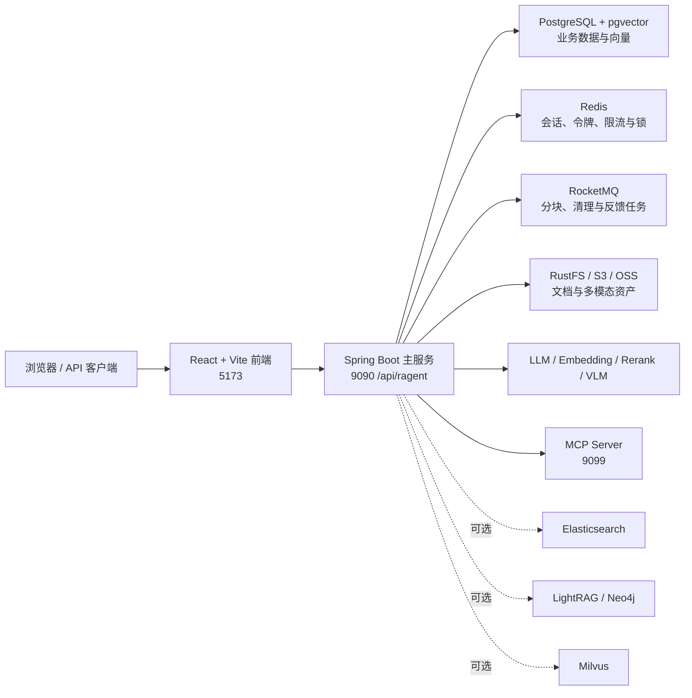

# Ragent Monster

Ragent Monster 是一个面向 Java 生态的企业级 Agentic RAG 平台，覆盖知识库管理、文档解析与分块、向量检索、多模型路由、MCP 工具调用、流式问答、会话记忆和全链路追踪，并提供 React 管理后台。

当前仓库默认采用 PostgreSQL + pgvector 作为向量存储、Redis 保存会话与分布式状态、RocketMQ 执行异步任务、RustFS 提供 S3 兼容对象存储。Elasticsearch、Milvus、LightRAG、Web Search 等能力均为可选项。

## 文档导航

- [完整使用手册](docs/USER_GUIDE.md)：安装、配置、功能操作、API、运维与排障
- [PDF 摄取流水线示例](docs/examples/pdf-ingestion-example.md)
- [版本发布记录](docs/releases/README.md)
- [本机中间件 Compose](resources/docker/ragent-local-middleware.compose.yaml)
- [应用主配置](bootstrap/src/main/resources/application.yaml)

## 核心能力

| 能力          | 说明                                                                       |
| ------------- | -------------------------------------------------------------------------- |
| 知识库管理    | 创建知识库、上传或拉取文档、定时刷新、启停文档、分块管理和文档预览         |
| 文档解析      | 支持 PDF、Markdown、文本、CSV、Excel、图片、URL 等来源，可接入 MinerU      |
| 向量检索      | 默认使用 PostgreSQL + pgvector 0.8.2 和 HNSW 索引，也可切换到 Milvus       |
| 多路召回      | 向量、关键词、图谱、Web Search 通道可组合，通过 RRF 融合与 Rerank 收敛结果 |
| 意图路由      | 使用意图树识别知识库范围，低置信度时自动回退到全局检索                     |
| 模型路由      | 支持百炼、SiliconFlow、AIHubMix、Ollama，并提供故障熔断与候选模型降级      |
| Agentic / MCP | 自动发现 MCP Server 工具，内置销售、工单和天气示例工具                     |
| 流式问答      | 基于 SSE 输出回答、排队状态、引用来源和推荐问题，支持主动停止任务          |
| 会话记忆      | 保存历史消息，自动摘要长会话并生成会话标题                                 |
| 可观测性      | 记录 RAG 运行与节点级 Trace，可在管理后台查看耗时、输入输出和异常          |
| 管理后台      | 提供仪表盘、知识库、意图树、摄取流水线、Trace、审计日志、用户等页面        |

## 系统架构



一次典型问答会依次经过：身份校验 → 会话记忆 → 问题改写 → 意图识别 → 多路检索 → RRF 融合 → Rerank → 模型生成 → SSE 输出 → Trace 落库。

## 技术栈

### 后端

- Java 17，当前本机已使用 JDK 21 验证
- Spring Boot 3.5.7
- MyBatis-Plus 3.5.14
- PostgreSQL 15 + pgvector 0.8.2
- Redis 6.2、Redisson 4.0.0
- RocketMQ 5.x
- Sa-Token 1.43.0
- Apache Tika、CommonMark、Apache Batik
- MCP Java SDK 1.1.2

### 前端

- React 18、TypeScript 5
- Vite 5
- Tailwind CSS、Radix UI
- Zustand、Axios、React Router
- Recharts、AntV G6

## 项目结构

```text
ragent_monster/
├─ bootstrap/                 # Spring Boot 主应用、业务接口与 RAG 核心链路
│  └─ src/main/resources/
│     ├─ application.yaml     # 主配置
│     ├─ prompt/              # LLM Prompt 模板
│     └─ lua/                 # Redis 原子脚本
├─ framework/                 # 通用响应、异常、上下文、鉴权、幂等、MQ 等基础设施
├─ infra-ai/                  # LLM、Embedding、Rerank、VLM 和模型路由适配层
├─ mcp-server/                # 独立 MCP 示例服务
├─ frontend/                  # React 管理端与问答界面
├─ resources/
│  ├─ database/               # PostgreSQL 建表、初始化和升级脚本
│  ├─ docker/                 # 本地与可选中间件 Compose
│  └─ docs/knowledge/         # 示例知识语料
├─ docs/                      # 使用、示例与版本文档
├─ scripts/                   # 测试辅助脚本
├─ pom.xml                    # Maven 聚合工程
└─ mvnw / mvnw.cmd            # Maven Wrapper
```

Maven 聚合工程包含四个模块：

| 模块         | 作用                          |
| ------------ | ----------------------------- |
| `framework`  | 项目通用基础能力              |
| `infra-ai`   | AI 模型与供应商适配           |
| `bootstrap`  | Ragent 主业务服务，可执行 JAR |
| `mcp-server` | MCP 示例工具服务，可执行 JAR  |

## 环境要求

| 组件    | 建议版本  | 说明                                |
| ------- | --------- | ----------------------------------- |
| JDK     | 17 或更高 | 已使用 Temurin JDK 21 验证          |
| Docker  | 24+       | 需要 Docker Compose v2              |
| Node.js | 18+       | 已使用 Node.js 22 验证              |
| npm     | 9+        | 已使用 npm 10 验证                  |
| 内存    | 至少 8 GB | 若同时运行本地模型，建议 16 GB 以上 |

## 快速启动

以下命令适用于仓库当前已验证的本机环境。首次部署、容器不存在或需要 Linux 命令时，请阅读[完整使用手册](docs/USER_GUIDE.md)。

### 1. 启动中间件

当前本机复用已有 Redis 和 RocketMQ，并由项目 Compose 管理 PostgreSQL/pgvector 与 RustFS：

```powershell
docker start redis
docker start rocketmq-learning-namesrv
docker start rocketmq-learning-broker

docker compose -f resources/docker/ragent-local-middleware.compose.yaml up -d
```

首次使用 RocketMQ 时创建三个业务 Topic：

```powershell
docker exec rocketmq-learning-broker sh /home/rocketmq/rocketmq-5.5.0/bin/mqadmin updateTopic -n rocketmq-learning-namesrv:9876 -c DefaultCluster -t knowledge-document-chunk_topic
docker exec rocketmq-learning-broker sh /home/rocketmq/rocketmq-5.5.0/bin/mqadmin updateTopic -n rocketmq-learning-namesrv:9876 -c DefaultCluster -t knowledge-base-cleanup_topic
docker exec rocketmq-learning-broker sh /home/rocketmq/rocketmq-5.5.0/bin/mqadmin updateTopic -n rocketmq-learning-namesrv:9876 -c DefaultCluster -t message-feedback_topic
```

### 2. 配置模型

至少需要可用的聊天模型和 Embedding 模型。推荐本地开发设置：

```powershell
$env:BAILIAN_API_KEY="你的百炼 API Key"
$env:SILICONFLOW_API_KEY="你的 SiliconFlow API Key"
```

也可以运行 Ollama，并准备 `qwen3:8b-fp16` 与 `qwen3-embedding:8b-fp16`。外部密钥均通过环境变量读取，不要直接提交到 `application.yaml`。

### 3. 构建后端

Windows：

```powershell
.\mvnw.cmd -DskipTests package
```

macOS / Linux：

```bash
./mvnw -DskipTests package
```

### 4. 启动 MCP 与后端

分别打开两个终端，并按顺序启动：

```powershell
java -jar mcp-server/target/mcp-server-1.0-SNAPSHOT.jar
```

```powershell
java -jar bootstrap/target/bootstrap-1.0-SNAPSHOT.jar
```

MCP Server 监听 `9099`，主服务监听 `9090`，接口上下文为 `/api/ragent`。

### 5. 启动前端

```powershell
cd frontend
npm install
npm run dev
```

打开 [http://127.0.0.1:5173](http://127.0.0.1:5173)，使用初始化账号登录：

```text
用户名：admin
密码：admin
```

首次登录后请立即修改默认密码。

## 默认本机端口

| 服务                | 地址                               | 默认用途           |
| ------------------- | ---------------------------------- | ------------------ |
| 前端                | `http://127.0.0.1:5173`            | 用户问答与管理后台 |
| 后端                | `http://127.0.0.1:9090/api/ragent` | REST 与 SSE API    |
| MCP Server          | `http://127.0.0.1:9099`            | 示例 MCP 工具      |
| PostgreSQL          | `127.0.0.1:5432`                   | 数据库 `ragent`    |
| Redis               | `127.0.0.1:16379`                  | 使用 database `15` |
| RocketMQ NameServer | `127.0.0.1:9876`                   | 消息路由           |
| RustFS S3 API       | `http://127.0.0.1:9000`            | 对象存储           |
| RustFS Console      | `http://127.0.0.1:9001`            | 对象存储控制台     |

数据库和对象存储的默认本地开发凭据可在 `application.yaml` 与本机 Compose 中查看。它们仅适用于本地开发，生产部署必须替换。

## 默认检索配置

仓库当前采用轻量本地方案：

```yaml
rag:
  vector:
    type: pg
  keyword:
    type: none
  graph:
    type: none
  search:
    channels:
      vector:
        enabled: true
      keyword:
        enabled: false
      graph:
        enabled: false
      web-search:
        enabled: false
```

因此只启动 PostgreSQL/pgvector、Redis、RocketMQ 和 RustFS 即可运行主链路，无需启动 Milvus、Elasticsearch、Neo4j 或 LightRAG。

## 构建与检查

```powershell
# 完整执行测试
.\mvnw.cmd test

# 仅构建，不运行测试
.\mvnw.cmd -DskipTests package

# 前端生产构建
cd frontend
npm run build

# 前端静态检查
npm run lint
```

Maven 在编译阶段会运行 Spotless，并可能自动补充 Java 版权头。执行构建前请确认工作区没有不希望被格式化的临时修改。

## 常用 Docker 命令

```powershell
# 查看项目中间件状态
docker compose -f resources/docker/ragent-local-middleware.compose.yaml ps

# 查看 PostgreSQL 或 RustFS 日志
docker logs -f ragent-postgres
docker logs -f ragent-rustfs

# 停止 PostgreSQL 与 RustFS，但保留数据卷
docker compose -f resources/docker/ragent-local-middleware.compose.yaml stop

# 再次启动
docker compose -f resources/docker/ragent-local-middleware.compose.yaml up -d
```

不要随意执行带 `-v` 的 `docker compose down`，否则可能删除数据库和对象存储数据卷。

## 安全提示

- 默认管理员密码、PostgreSQL 密码和 RustFS 密钥仅供本地开发。
- 不要将模型 API Key、生产数据库密码或对象存储密钥提交到 Git。
- 生产环境应限制 PostgreSQL、Redis、RocketMQ 和对象存储的网络暴露范围。
- 应使用独立的生产配置或环境变量覆盖 `application.yaml`。
- 上传文件和模型输出都应按业务安全规范进行校验与审计。

## License

本项目使用 [Apache License 2.0](LICENSE)。
