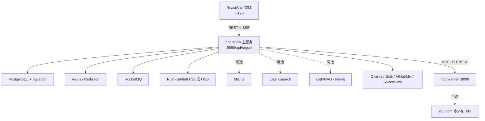
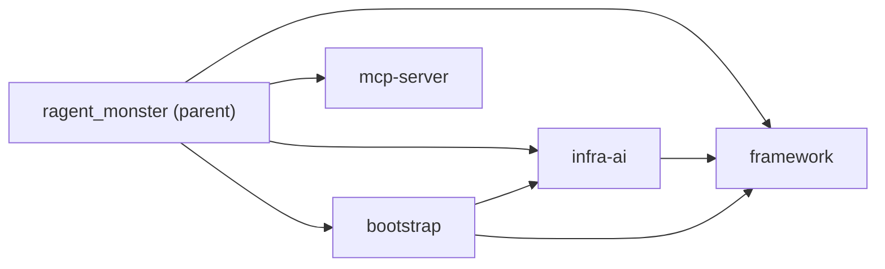
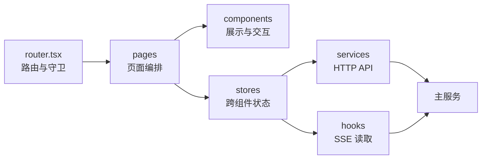
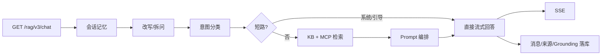
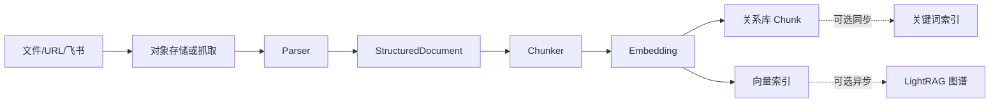
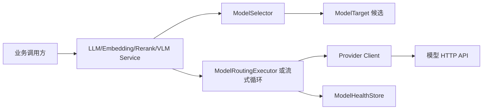

# 项目全景

## 1. 项目解决什么问题

Ragent Monster 是一套前后端分离的企业知识问答系统。它的核心不只是“向量检索 + 大模型”，还包括：

- 文档上传、URL/飞书抓取、定时刷新、解析、结构化分块和索引；
- 查询改写、多问题拆分、意图树分类和歧义引导；
- 向量、关键词、知识图谱、互联网搜索四类检索通道；
- RRF 融合、Rerank 精排、来源引用与 Grounding 保存；
- MCP 工具发现、参数提取、远程执行和 KB/MCP 混合回答；
- 多模型档位、厂商故障转移、熔断、流式首包探测；
- 会话历史、异步摘要、标题、反馈、推荐追问和 RAG Trace；
- 用户端聊天与管理后台。

系统有两个可独立启动的 Java 进程：

1. 主服务：[RagentApplication](../../bootstrap/src/main/java/com/hjs/study/ragent/RagentApplication.java)，默认端口 `9090`，上下文路径 `/api/ragent`。
2. MCP 示例服务：[McpServerApplication](../../mcp-server/src/main/java/com/hjs/study/ragent/mcp/McpServerApplication.java)，默认端口 `9099`。

前端由 Vite 启动，默认端口 `5173`。

## 2. 运行拓扑

主服务本身是一个模块化单体：知识库、聊天、用户、审计和管理后台都在同一个 Spring ApplicationContext 中；MCP 示例服务才是独立部署边界。

## 3. Maven 模块

根 [pom.xml](../../pom.xml) 聚合四个 Java 模块：

| 模块 | 责任 | 不应承担的责任 |
| --- | --- | --- |
| `framework` | Web 约定、异常、上下文、数据库配置、分布式 ID、幂等、MQ 适配、Trace 契约 | RAG 业务编排、厂商模型协议 |
| `infra-ai` | Chat/Embedding/Rerank/VLM 客户端、模型选择、熔断与故障转移 | 知识库、意图、Prompt 的业务规则 |
| `bootstrap` | 主应用入口与全部业务域；组合 `framework`、`infra-ai` | 可独立复用的模型厂商细节 |
| `mcp-server` | 零内部模块依赖的示例 MCP 服务及工具 | 主服务数据库或 RAG 内部实现 |

`bootstrap` 是可执行 Spring Boot Jar。`framework` 和 `infra-ai` 是被它加载的库。`mcp-server` 也可执行，但不依赖其余三个子模块。

## 4. 前端分层

前端不是严格的领域分层：大部分后台页面直接调用 Service 并维护局部状态，聊天域则集中在 `chatStore`。这使聊天状态统一，但也让单个 Store 体积和职责较大。

## 5. 目录职责

| 目录 | 内容 |
| --- | --- |
| `bootstrap/src/main/java/.../rag` | 聊天、会话、意图、检索、MCP、Prompt、Trace |
| `bootstrap/src/main/java/.../knowledge` | 知识库、文档、Chunk、定时刷新与 MQ |
| `bootstrap/src/main/java/.../ingestion` | 可配置摄取流水线及六类节点 |
| `bootstrap/src/main/java/.../core` | 文档解析、结构化模型、分块和 Embedding 编排 |
| `bootstrap/src/main/java/.../user` | 登录、用户、角色和请求上下文 |
| `bootstrap/src/main/java/.../audit` | 业务变更审计 |
| `bootstrap/src/main/java/.../admin` | Dashboard 聚合查询 |
| `bootstrap/src/main/resources/prompt` | StringTemplate Prompt 与片段模板 |
| `framework` | 通用基础设施 |
| `infra-ai` | 模型厂商与路由层 |
| `frontend/src` | React 应用 |
| `resources/database` | PostgreSQL schema、初始化与升级脚本 |
| `resources/docker` | 中间件 Compose 与 GraphRAG 资源 |
| `docs` | 使用手册、示例、版本和本学习文档 |

## 6. 三条主数据流

### 6.1 在线问答

入口是 [RAGChatController](../../bootstrap/src/main/java/com/hjs/study/ragent/rag/controller/RAGChatController.java)，业务骨架在 [StreamChatPipeline](../../bootstrap/src/main/java/com/hjs/study/ragent/rag/service/pipeline/StreamChatPipeline.java)。

### 6.2 知识入库

知识库常规入口由 [KnowledgeDocumentServiceImpl](../../bootstrap/src/main/java/com/hjs/study/ragent/knowledge/service/impl/KnowledgeDocumentServiceImpl.java) 负责；通用可配置入口由 [IngestionEngine](../../bootstrap/src/main/java/com/hjs/study/ragent/ingestion/engine/IngestionEngine.java) 执行。常规入口会构造默认流水线，因此两者不是完全独立的重复实现。

### 6.3 模型调用

统一模型抽象位于 `infra-ai`，业务代码只依赖 `LLMService`、`EmbeddingService` 等接口。

## 7. 主要技术选择

| 领域 | 技术 |
| --- | --- |
| Java | JDK 17 |
| 应用框架 | Spring Boot 3.5.7 |
| Web | Spring MVC、SSE |
| ORM | MyBatis-Plus |
| 认证 | Sa-Token，Redis 会话 |
| 并发/分布式 | CompletableFuture、TTL、Redisson、RocketMQ |
| 文档解析 | Apache Tika、CommonMark、自定义 CSV/Excel/Image/MinerU |
| 向量 | pgvector（默认）或 Milvus |
| 关键词 | Elasticsearch（可选） |
| 图谱 | LightRAG + Neo4j（可选） |
| 对象存储 | S3 兼容存储或阿里云 OSS |
| AI 访问 | OkHttp + OpenAI 兼容协议及百炼 Rerank |
| 前端 | React 18、TypeScript、Vite、Zustand、Axios、Tailwind、Radix UI |

## 8. 设计主题

### 8.1 Spring 列表注入实现插件链

`List<SearchChannel>`、`List<SearchResultPostProcessor>`、`List<IngestionNode>`、`List<ChatClient>` 等由 Spring 自动收集实现。新增实现类并成为 Bean 后即可进入注册或调度流程。

### 8.2 策略与路由分离

“选择谁”与“怎么调用”通常分开：

- `ModelSelector` 选择候选，Client 处理厂商协议；
- `SearchChannel.isEnabled` 决定通道是否参与，Engine 负责并行与后处理；
- `DocumentParserSelector` 选择解析器，Parser 只解析；
- `ChunkingStrategyFactory` 选择分块策略，Strategy 只分块。

### 8.3 可选能力以降级为主

联网、图谱、关键词和 Rerank 都可关闭。单个检索通道异常通常返回空结果而不终止全链；模型路由则尝试下一个候选。学习代码时必须区分：

- 可选能力失败后继续；
- 核心能力全部失败后终止；
- 异常被记录但没有上抛的“软失败”。

### 8.4 跨线程上下文

聊天、检索、模型流、摘要和入库大量使用线程池。项目用 Transmittable ThreadLocal 传播用户与 Trace 上下文；流式 Trace 还显式拆分 `detach` 与异步 `finish`。

## 9. 先记住的边界

- PostgreSQL 是业务事实来源；向量、关键词和图谱索引是可重建的派生数据。
- 前端的 `RequireAdmin` 只是体验层守卫，不构成后端授权。
- 文档级 `SourceRef` 用于 UI；Chunk 级 Grounding 用于推荐追问和证据复用。
- `mcp-server` 中的 You.com 实现与主服务联网检索通道有意重复，因为二者是独立进程。
- 根 POM 在 `compile` 阶段绑定 `spotless:apply`，普通构建可能改写 Java 源码；详见[审查报告](12-code-review-report.md)。
