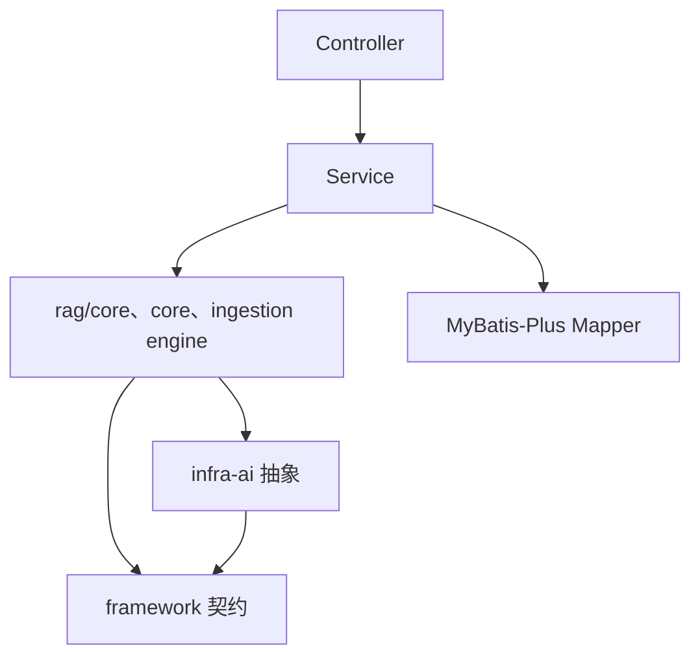
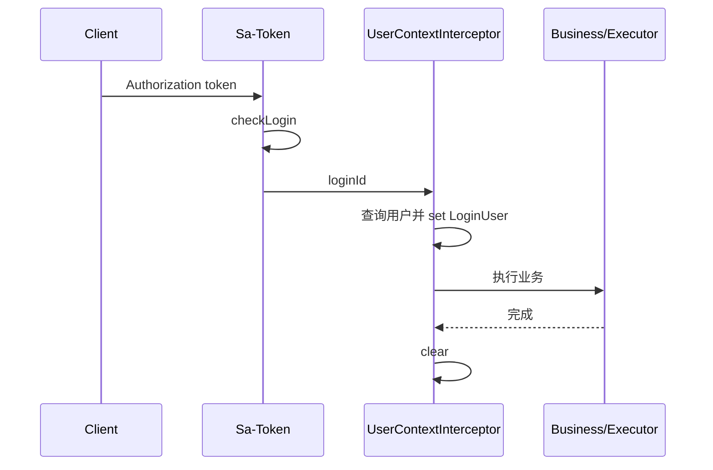

# 后端架构

## 1. 启动与装配

主服务入口 [RagentApplication](../../bootstrap/src/main/java/com/hjs/study/ragent/RagentApplication.java) 位于根包 `com.hjs.study.ragent`，因此会扫描 `bootstrap` 以及依赖模块中相同根包下的 Spring Bean。数据库 Mapper、配置属性、定时任务和异步基础设施也从这里进入同一个 ApplicationContext。

`bootstrap` 依赖 `framework` 与 `infra-ai`：



包名表达的是主要责任，但当前项目并非严格的领域驱动四层架构。例如 `rag/core` 中既有领域算法，也有 Spring Service 和外部 HTTP 客户端；`knowledge/service/impl` 同时编排数据库、对象存储、MQ 和索引。

## 2. Web 请求骨架

普通 JSON 接口返回 [Result](../../framework/src/main/java/com/hjs/study/ragent/framework/convention/Result.java)，控制器通过 [Results](../../framework/src/main/java/com/hjs/study/ragent/framework/web/Results.java) 构造成功响应：

```text
HTTP 请求
  → Sa-Token 登录检查
  → DemoModeInterceptor（可选）
  → UserContextInterceptor
  → Controller
  → Service / Core / Mapper
  → Result{code,message,data}
  → 前端 Axios 拆包
```

[GlobalExceptionHandler](../../framework/src/main/java/com/hjs/study/ragent/framework/web/GlobalExceptionHandler.java) 将业务异常、参数校验异常、认证/角色异常和未知异常映射为统一结构。异常体系包括：

| 类型 | 用途 |
| --- | --- |
| `ClientException` | 调用方输入、状态或资源不符合业务要求 |
| `RemoteException` | 模型、MCP、对象存储等远程依赖失败 |
| `ServiceException` | 服务端业务处理异常 |
| `AbstractException` | 携带统一错误码的基类 |

SSE 已经开始写响应后，不能再安全地切回 JSON 异常体，所以 [SseEmitterSender](../../framework/src/main/java/com/hjs/study/ragent/framework/web/SseEmitterSender.java) 使用原子关闭标记，在流内完成或以错误关闭。

## 3. 认证与用户上下文

### 3.1 Sa-Token

[SaTokenConfig](../../bootstrap/src/main/java/com/hjs/study/ragent/user/config/SaTokenConfig.java) 注册三个拦截环节：

1. 除 `/auth/**` 和 `/error` 外检查登录；
2. Demo 模式下限制写操作；
3. 将登录用户装入线程上下文并在请求结束清理。

登录与退出由 [AuthController](../../bootstrap/src/main/java/com/hjs/study/ragent/user/controller/AuthController.java) 和 [AuthServiceImpl](../../bootstrap/src/main/java/com/hjs/study/ragent/user/service/impl/AuthServiceImpl.java) 完成。Token 存入 Redis，前端把 Token 放在 `Authorization` 请求头中。

### 3.2 UserContext

[UserContext](../../framework/src/main/java/com/hjs/study/ragent/framework/context/UserContext.java) 保存 `LoginUser`，业务代码通过它读取 `userId`、用户名和角色。它使用可传递线程上下文，使异步任务可以继承请求线程的身份信息。



定时刷新和 MQ 消费没有 HTTP 用户，会显式设置“系统用户”或消息中的操作人，完成后同样清理。

### 3.3 登录与授权不是一回事

全局拦截器只保证“已登录”。后端当前只在 [UserController](../../bootstrap/src/main/java/com/hjs/study/ragent/user/controller/UserController.java) 的用户管理操作中调用 `StpUtil.checkRole("admin")`。知识库、意图树、流水线、Trace、Dashboard 等管理接口没有同等的后端角色检查。前端 `RequireAdmin` 不能替代服务端授权；这是审查报告中的高优先级问题。

## 4. 数据访问与 ID

[DataBaseConfiguration](../../framework/src/main/java/com/hjs/study/ragent/framework/config/DataBaseConfiguration.java) 配置 MyBatis-Plus 分页等能力；[MyMetaObjectHandler](../../framework/src/main/java/com/hjs/study/ragent/framework/database/MyMetaObjectHandler.java) 处理通用时间字段。

实体类通常以 `DO` 结尾，Mapper 继承 MyBatis-Plus `BaseMapper`。请求与响应模型分别放在 `controller/request`、`controller/vo`，服务层还有少量 `BO`/`DTO`。

分布式 ID 由：

- [SnowflakeIdInitializer](../../framework/src/main/java/com/hjs/study/ragent/framework/distributedid/SnowflakeIdInitializer.java) 初始化；
- [CustomIdentifierGenerator](../../framework/src/main/java/com/hjs/study/ragent/framework/distributedid/CustomIdentifierGenerator.java) 接入 MyBatis-Plus；
- 部分业务直接调用 Hutool `IdUtil.getSnowflakeNextIdStr()`。

数据库主键和业务 ID 大多使用 `VARCHAR(20)` 保存 Snowflake 字符串。

## 5. 幂等

`framework/idempotent` 提供两组 AOP：

| 注解 | 场景 |
| --- | --- |
| `@IdempotentSubmit` | HTTP 重复提交，Redis key 区分用户、方法和参数 |
| `@IdempotentConsume` | MQ 重复消费，记录消费状态 |

[IdempotentSubmitAspect](../../framework/src/main/java/com/hjs/study/ragent/framework/idempotent/IdempotentSubmitAspect.java) 默认对参数 JSON 计算 MD5 以缩短 Redis key；MD5 在这里仅用于区分请求，不承担密码或签名安全。聊天入口覆盖 key 为当前用户 ID，因此同一用户只能同时发起一个受保护的聊天请求。

幂等与业务事务解决不同问题：

- 幂等避免同一操作重复执行；
- 事务保证一次执行中的关系库变更原子性；
- 对象存储、向量库和 MQ 跨资源一致性仍需补偿或可重建策略。

## 6. MQ 适配

[MessageQueueProducer](../../framework/src/main/java/com/hjs/study/ragent/framework/mq/producer/MessageQueueProducer.java) 隔离业务层与 RocketMQTemplate；[RocketMQProducerAdapter](../../framework/src/main/java/com/hjs/study/ragent/framework/mq/producer/RocketMQProducerAdapter.java) 实现普通消息和事务消息。

当前消费者：

| 消费者 | 主题 | 作用 |
| --- | --- | --- |
| `KnowledgeDocumentChunkConsumer` | `knowledge-document-chunk_topic...` | 异步执行文档分块 |
| `KnowledgeBaseCleanupConsumer` | `knowledge-base-cleanup_topic...` | 删除知识库派生数据 |
| `MessageFeedbackConsumer` | `message-feedback_topic...` | 处理消息反馈事件 |

[DelegatingTransactionListener](../../framework/src/main/java/com/hjs/study/ragent/framework/mq/producer/DelegatingTransactionListener.java) 按 topic 委托 `TransactionChecker` 做事务消息回查；找不到 checker 时默认回滚。

## 7. Trace

### 7.1 普通 AOP 节点

方法标注 [RagTraceNode](../../framework/src/main/java/com/hjs/study/ragent/framework/trace/RagTraceNode.java) 后，[RagTraceAspect](../../bootstrap/src/main/java/com/hjs/study/ragent/rag/aop/RagTraceAspect.java) 从 [RagTraceContext](../../framework/src/main/java/com/hjs/study/ragent/framework/trace/RagTraceContext.java) 读取当前运行和父节点，记录开始、成功或失败。

### 7.2 流式节点

普通 AOP 只能测到“异步任务已提交”，不能覆盖后台 SSE 读取循环。[RagStreamTraceSupport](../../framework/src/main/java/com/hjs/study/ragent/framework/trace/RagStreamTraceSupport.java) 因此把生命周期拆为：

1. 调用线程 `beginStreamNode`；
2. 同步部分结束时 `detach`，从节点栈弹出但不结束；
3. 异步回调 `finishSuccess`、`finishError` 或 `finishCancelledIfRunning`。

[StreamChatTraceRunner](../../bootstrap/src/main/java/com/hjs/study/ragent/rag/trace/StreamChatTraceRunner.java) 创建一次运行，记录用户感知 TTFT，并用回调终态结束运行。

## 8. 线程池与上下文传播

[ThreadPoolExecutorConfig](../../bootstrap/src/main/java/com/hjs/study/ragent/rag/config/ThreadPoolExecutorConfig.java) 为不同阶段隔离线程池：

| Bean | 用途 |
| --- | --- |
| `mcpBatchExecutor` | 并行 MCP 工具 |
| `ragContextExecutor` | 并行处理子问题 |
| `ragRetrievalExecutor` | 并行检索通道 |
| `innerRetrievalExecutor` | 意图/知识库范围内并行向量检索 |
| `intentClassifyExecutor` | 子问题意图分类 |
| `memorySummaryExecutor` | 异步会话摘要 |
| `memoryLoadExecutor` | 并行加载摘要与近期历史 |
| `modelStreamExecutor` | 模型流式 HTTP 读取 |
| `chatEntryExecutor` | 排队后进入聊天流水线 |
| `knowledgeChunkExecutor` | 文档分块与定时刷新 |

除明确使用 `AbortPolicy` 的入口/流式池外，多数使用 `CallerRunsPolicy` 提供反压。线程池通过 TTL 包装传播 `UserContext` 和 `RagTraceContext`。

## 9. 配置与启动期校验

配置不只由 `application.yaml` 承载，还通过 `@ConfigurationProperties` 绑定为类型：

- `AIModelProperties`：Provider、模型注册表、档位和熔断参数；
- `SearchChannelProperties`：检索通道、预算、RRF 和权重；
- `MemoryProperties`：历史与摘要；
- `RagStorageProperties`：S3/OSS；
- `GraphProperties`、`KeywordProperties`：可选检索后端；
- `MinerUProperties`、`ImageParseProperties`：解析能力。

检索和记忆配置有 Validator/EnvironmentPostProcessor，在 Bean 完成装配前拒绝不满足单调预算或历史规则的配置。模型档位由 `ChatTierConfigValidator` 校验引用的候选 ID、超时和思考能力。

## 10. 后端扩展边界

| 扩展接口 | 注册方式 | 主要约束 |
| --- | --- | --- |
| `SearchChannel` | Spring Bean，列表注入 | 明确 `isEnabled`，失败不应拖垮其他通道 |
| `SearchResultPostProcessor` | Spring Bean，按 `getOrder` 排序 | 不能直接比较异构原始分数 |
| `IngestionNode` | Spring Bean，以 `nodeType` 注册 | 输入/输出写入 `IngestionContext`，返回 `NodeResult` |
| `DocumentParser` | Spring Bean，Selector 选择 | 输出统一 `StructuredDocument` |
| `ChunkingStrategy` | Spring Bean，Factory 选择 | 保持结构元数据和可复现顺序 |
| `VectorStoreService/Admin` | 条件配置 Bean | 业务代码不应依赖 Milvus/pgvector 私有 API |
| `McpToolExecutor` | 自动发现或远端工具动态注册 | 工具 ID 唯一，错误转为标准 CallToolResult |

这些是当前代码中的真实接口，不是承诺长期不变的外部公共 API。
