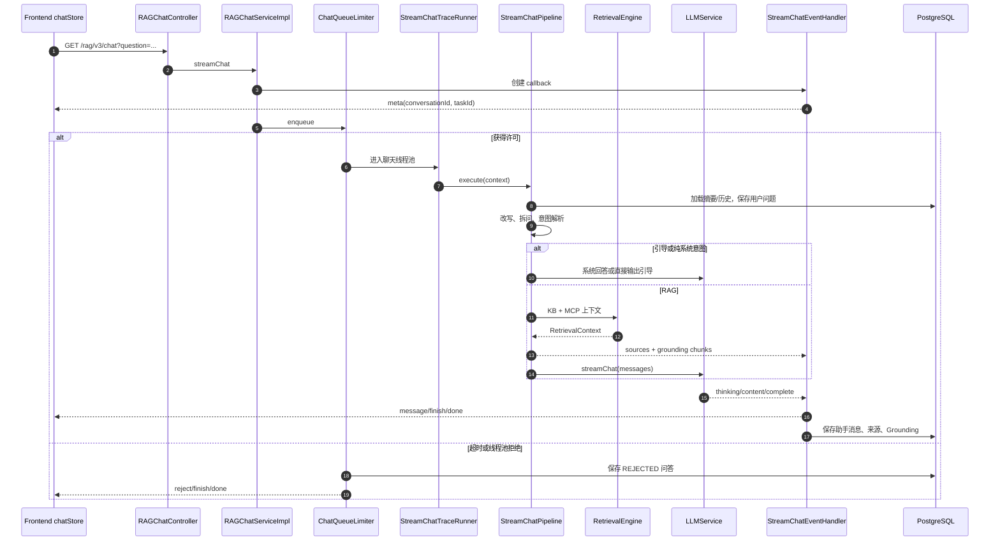
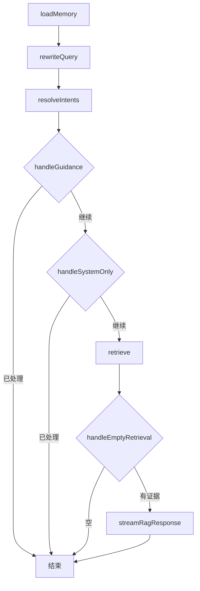

# RAG 聊天流水线

## 1. 入口不是“直接调用大模型”

聊天入口 [RAGChatController](../../bootstrap/src/main/java/com/hjs/study/ragent/rag/controller/RAGChatController.java) 暴露：

- `GET /rag/v3/chat`：SSE 流式问答；
- `POST /rag/v3/stop`：按 `taskId` 停止生成。

请求参数包含 `question`、可选 `conversationId` 和 `deepThinking`。控制器创建带全局超时的 `SseEmitter` 后立刻交给 [RAGChatServiceImpl](../../bootstrap/src/main/java/com/hjs/study/ragent/rag/service/impl/RAGChatServiceImpl.java)，真正业务在后台线程继续。

`@IdempotentSubmit` 的 key 被覆盖为当前用户 ID，因此一个用户在锁有效期间不能重复进入同一聊天入口。

## 2. 全链路时序



## 3. 会话和任务 ID

[RAGChatServiceImpl](../../bootstrap/src/main/java/com/hjs/study/ragent/rag/service/impl/RAGChatServiceImpl.java) 在入口生成：

- 没有 `conversationId` 时生成新的会话 ID；
- 每次请求都生成新的 `taskId`；
- 创建 `StreamChatEventHandler`，后者构造时立即发送 `meta` 事件并注册任务；
- 进入全局聊天限流器；
- 获得许可后，在 Trace 上下文中创建 [StreamChatContext](../../bootstrap/src/main/java/com/hjs/study/ragent/rag/service/pipeline/StreamChatContext.java)。

`StreamChatContext` 的不可变输入是问题、会话、任务、用户、深度思考和回调；流水线逐步填入历史、改写结果和子问题意图。

## 4. 全局公平限流

[ChatQueueLimiter](../../bootstrap/src/main/java/com/hjs/study/ragent/rag/service/ratelimit/ChatQueueLimiter.java) 是业务适配层，[FairDistributedRateLimiter](../../bootstrap/src/main/java/com/hjs/study/ragent/rag/service/ratelimit/FairDistributedRateLimiter.java) 才是分布式算法：

- 用 Redisson 可过期信号量限制全局并发；
- 用 Redis 有序队列保存等待票据；
- Lua 原子 claim，避免多个实例拿到同一排队项；
- Pub/Sub 在许可释放后唤醒等待者；
- 等待超时、请求取消、线程池拒绝都会清理票据或释放许可；
- 获得许可后把任务提交给 `chatEntryExecutor`。

限流关闭时仍经 `chatEntryExecutor`，以免在 Servlet 线程执行完整 RAG。

如果没有及时获得许可，系统不是只返回 HTTP 错误，而是：

1. 保存用户问题；
2. 保存状态为 `REJECTED` 的助手消息；
3. 发送 `meta → reject → finish → done`；
4. 正常关闭 SSE。

因此前端和会话历史都能看到一次有语义的拒绝。

## 5. StreamChatPipeline 的阶段

[StreamChatPipeline](../../bootstrap/src/main/java/com/hjs/study/ragent/rag/service/pipeline/StreamChatPipeline.java) 是在线问答最重要的阅读入口：



### 5.1 加载记忆

[DefaultConversationMemoryService](../../bootstrap/src/main/java/com/hjs/study/ragent/rag/core/memory/DefaultConversationMemoryService.java) 并行加载：

- 最新摘要；
-最近若干轮原始消息。

摘要作为一条经过模板包装的 system message 放在历史最前面。随后当前用户问题立即写入 `t_message`，并把其 ID 作为 `replyToMessageId` 传给回调，保证助手消息可以回指本轮问题。

### 5.2 改写与拆问

[MultiQuestionRewriteService](../../bootstrap/src/main/java/com/hjs/study/ragent/rag/core/rewrite/MultiQuestionRewriteService.java) 先应用 Query Term Mapping，再用快速档模型结合历史进行补全、改写和多问题拆分。模型调用或 JSON 解析失败时回退到归一化问题；关闭改写开关时使用规则拆分。

### 5.3 意图解析

[IntentResolver](../../bootstrap/src/main/java/com/hjs/study/ragent/rag/core/intent/IntentResolver.java) 为每个子问题并行分类，过滤低分意图，并限制全部子问题的意图总量。超限时先保证每个子问题至少保留一个最高分意图，再按全局分数补剩余名额。

### 5.4 引导短路

[IntentGuidanceService](../../bootstrap/src/main/java/com/hjs/study/ragent/rag/core/guidance/IntentGuidanceService.java) 检查改写问题与命中意图是否存在需要澄清的歧义。若需引导，直接输出提示并完成，不进入检索。

### 5.5 系统意图短路

若所有子问题都只命中一个 `SYSTEM` 节点，流水线不检索知识库。它选取节点自定义 Prompt，或回退系统回答模板，加上历史与问题后直接调用 LLM。

### 5.6 检索与空结果

其他场景进入 [RetrievalEngine](../../bootstrap/src/main/java/com/hjs/study/ragent/rag/core/retrieval/RetrievalEngine.java)。如果 KB 和 MCP 都没有形成上下文，系统输出固定的“未检索到”提示并完成；当前实现不会在空证据时让模型自由回答。

### 5.7 RAG 回答

有证据时：

1. 合并所有子问题的 KB/MCP 意图；
2. [SourcesAssembler](../../bootstrap/src/main/java/com/hjs/study/ragent/rag/core/source/SourcesAssembler.java) 生成文档级来源给前端；
3. [GroundingChunksAssembler](../../bootstrap/src/main/java/com/hjs/study/ragent/rag/core/source/GroundingChunksAssembler.java) 生成片段级证据供落库与推荐问题；
4. [RAGPromptService](../../bootstrap/src/main/java/com/hjs/study/ragent/rag/core/prompt/RAGPromptService.java) 选择 KB、MCP 或混合模板并组装消息；
5. `deepThinking` 写入 `ChatRequest.thinking`，由模型路由选择深度档；
6. MCP 场景使用稍高的 temperature 和较低 topP，KB-only 使用确定性更强的参数。

## 6. Prompt 消息顺序

最终消息不是简单字符串拼接，而是：

```text
system: 场景模板或意图节点自定义模板
system: 会话摘要（如存在，来自历史列表首项）
user/assistant: 最近若干轮历史
user: MCP/KB 证据 + 当前单问题或编号子问题
```

证据和问题合并为最后一条 user message，避免额外 role 影响模型理解。Prompt 细节见[检索、意图与 MCP](04-retrieval-intent-mcp.md)。

## 7. SSE 事件协议

[SSEEventType](../../bootstrap/src/main/java/com/hjs/study/ragent/rag/enums/SSEEventType.java) 与前端 [useStreamResponse](../../frontend/src/hooks/useStreamResponse.ts) 共同定义协议：

| 事件 | 载荷 | 含义 |
| --- | --- | --- |
| `meta` | `conversationId`、`taskId` | 首个业务事件，建立前端会话与取消句柄 |
| `message` | `{type: think/response, delta}` | 思考或回答增量 |
| `finish` | `messageId`、`title`、`sources`、`messageStatus` | 答案已持久化或完成语义已确定 |
| `done` | `[DONE]` | 流生命周期结束 |
| `cancel` | 与 completion 相似 | 用户停止，可能带已保存的部分答案 |
| `reject` | 回答增量 | 排队超时或执行器拒绝 |
| `title` | 标题 | 前端支持，当前主要标题也可随 `finish` 返回 |
| `error` | 错误 | 前端协议支持；后端常通过 `completeWithError` 结束 |

[StreamChatEventHandler](../../bootstrap/src/main/java/com/hjs/study/ragent/rag/service/handler/StreamChatEventHandler.java) 按 Unicode code point 分块，避免把代理对拆开。`messageChunkSize` 是字符数量，不是模型 token 数。

## 8. 正常完成、取消与异常

### 8.1 正常完成

回调累积回答和思考内容。`onComplete`：

- 保存助手消息；
- 保存思考时长、来源、Grounding、回复关系和 `NORMAL` 状态；
- 发送 `finish`、`done`；
- 注销任务并删除 Redis 取消标记；
- 关闭 SSE。

### 8.2 取消

[StreamTaskManager](../../bootstrap/src/main/java/com/hjs/study/ragent/rag/service/handler/StreamTaskManager.java) 同时使用：

- 本地 Guava Cache 保存 sender、模型取消句柄和回调；
- Redis Bucket 保存 30 分钟取消标记；
- Redisson Topic 广播到所有应用实例。

收到取消后用 CAS 保证只处理一次，取消底层模型 Call，把已有回答按 `INTERRUPTED` 状态落库，发送 `cancel → done`。如果取消发生在模型句柄绑定前，状态会在绑定时再次检查并立即取消。

### 8.3 异常

同步阶段异常由 `StreamChatTraceRunner` 捕获并转给 callback；流式阶段异常由模型 Client/Trace callback 传播。`SseEmitterSender` 用原子状态防止完成、错误、超时和取消重复结束连接。

## 9. 会话摘要与标题

[JdbcConversationMemorySummaryService](../../bootstrap/src/main/java/com/hjs/study/ragent/rag/core/memory/JdbcConversationMemorySummaryService.java) 在追加消息后异步判断是否需要压缩：

- 达到 `summary-start-turns` 后触发；
- 用 Redis 锁避免同一会话重复摘要；
- 保留最近 `history-keep-turns`，更早消息与旧摘要合并为新摘要；
- 摘要使用快速模型且限制最大字符数。

会话标题由 [ConversationTitleGenerator](../../bootstrap/src/main/java/com/hjs/study/ragent/rag/service/impl/ConversationTitleGenerator.java) 生成。回调完成时查询当前标题并随 `finish` 返回；标题生成与答案流并非同一个模型请求。

## 10. 调试断点

按以下顺序设置断点最容易还原一次请求：

1. `RAGChatServiceImpl.streamChat`
2. `ChatQueueLimiter.enqueue`
3. `StreamChatTraceRunner.run`
4. `StreamChatPipeline.execute`
5. `RetrievalEngine.retrieve`
6. `RAGPromptService.buildStructuredMessages`
7. `RoutingLLMService.streamChat`
8. `StreamChatEventHandler.onContent/onComplete`

同时记录 `conversationId`、`taskId`、`traceId`，即可把日志、Trace 表和会话消息串起来。
