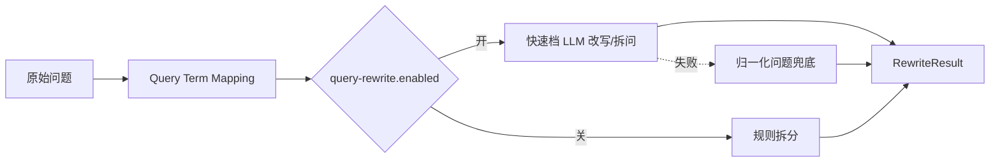
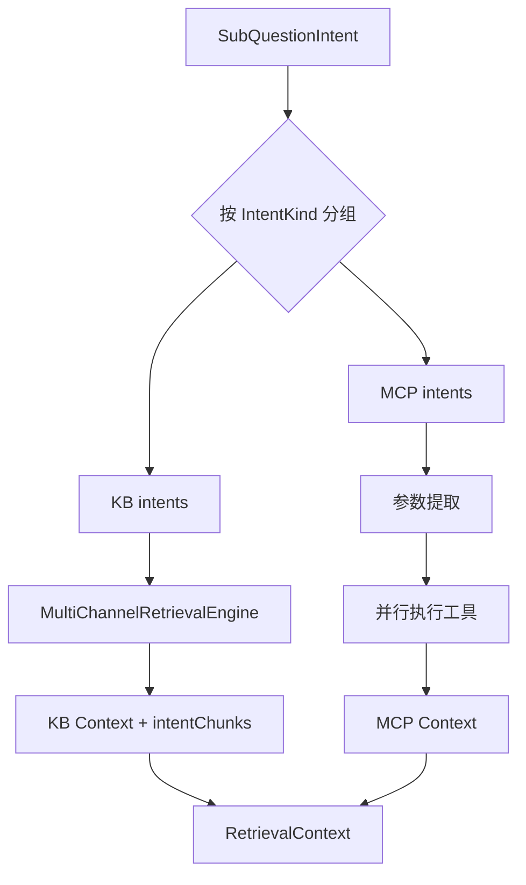
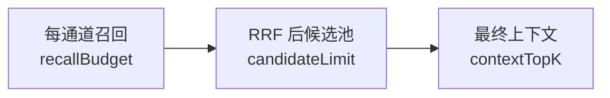

# 检索、意图与 MCP

## 1. 查询先被转换为“可执行问题”

原始自然语言问题可能包含代词、企业简称、多个问句和工具所需参数。检索前处理分两步：

1. [QueryTermMappingService](../../bootstrap/src/main/java/com/hjs/study/ragent/rag/core/rewrite/QueryTermMappingService.java) 按数据库映射做术语归一化；
2. [MultiQuestionRewriteService](../../bootstrap/src/main/java/com/hjs/study/ragent/rag/core/rewrite/MultiQuestionRewriteService.java) 结合会话历史，输出 `RewriteResult(rewrittenQuestion, subQuestions)`。



多问题拆分决定后续并行粒度：每个子问题独立分类、独立构建 KB/MCP 上下文，最终再合并为一次回答。

## 2. 意图树

意图数据保存在 `t_intent_node`。运行时模型 [IntentNode](../../bootstrap/src/main/java/com/hjs/study/ragent/rag/core/intent/IntentNode.java) 具有：

- `id/name/description/examples/fullPath`：分类语义；
- `level/parentId/children`：树结构；
- `kind`：`KB`、`MCP` 或 `SYSTEM`；
- `kbId/collectionName/topK`：知识检索目标；
- `mcpToolId/paramPromptTemplate`：工具调用目标；
- `promptSnippet/promptTemplate`：回答约束。

[DefaultIntentClassifier](../../bootstrap/src/main/java/com/hjs/study/ragent/rag/core/intent/DefaultIntentClassifier.java) 从 Redis 缓存加载树，缓存缺失时查数据库；只把叶子节点列入 LLM 分类候选。LLM 返回节点 ID 与分数，未知 ID、非法 JSON或调用失败均降级为空意图。

[IntentResolver](../../bootstrap/src/main/java/com/hjs/study/ragent/rag/core/intent/IntentResolver.java) 进一步完成：

- 子问题并行分类；
- 分数阈值过滤；
- 单问题候选数量限制；
- 跨子问题总意图上限；
- KB、MCP 意图分组；
- SYSTEM-only 判断。

空意图不是终止条件。向量检索可以走全局知识库兜底。

## 3. 歧义引导

[IntentGuidanceService](../../bootstrap/src/main/java/com/hjs/study/ragent/rag/core/guidance/IntentGuidanceService.java) 位于意图识别之后、检索之前。它根据 Guidance 配置、命中节点和 LLM 歧义检查决定是否提示用户补充信息。

引导与 MCP 缺参是两个层次：

- Guidance 处理“问题语义或意图方向不清”；
- `McpParameterExtractor` 处理“工具已确定，但必填参数缺失”。

## 4. RetrievalContext

[RetrievalEngine](../../bootstrap/src/main/java/com/hjs/study/ragent/rag/core/retrieval/RetrievalEngine.java) 对每个 `SubQuestionIntent` 并行执行：



最终 `RetrievalContext` 包含：

- `kbContext`：已格式化、可放进 Prompt 的知识证据；
- `mcpContext`：工具结果或澄清提示；
- `intentChunks`：按意图 key 组织的原始 Chunk，用于来源、Grounding 和 Prompt 规划。

多个子问题时，KB 与 MCP 上下文分别按编号包装，保留“哪个证据回答哪个子问题”的结构。

## 5. 三段检索预算

[RetrievalBudget](../../bootstrap/src/main/java/com/hjs/study/ragent/rag/core/retrieval/RetrievalBudget.java) 表示单调收窄的漏斗：



默认配置中：

- `recall-budget` 控制每个检索通道的粗召回；
- `fusion.rerank-candidate-limit` 控制进入 Rerank 的候选；
- `default-top-k` 控制最终送入 LLM 的片段数量。

启动校验要求粗召回和候选池不能小于最终 TopK。意图节点 `topK` 只影响该意图向量召回深度，不再扩大最终上下文。

## 6. 四类检索通道

所有通道实现 [SearchChannel](../../bootstrap/src/main/java/com/hjs/study/ragent/rag/core/retrieval/channel/SearchChannel.java)。[MultiChannelRetrievalEngine](../../bootstrap/src/main/java/com/hjs/study/ragent/rag/core/retrieval/MultiChannelRetrievalEngine.java) 过滤启用通道并行执行；单个通道异常转为空结果。

### 6.1 向量通道

[VectorSearchChannel](../../bootstrap/src/main/java/com/hjs/study/ragent/rag/core/retrieval/channel/VectorSearchChannel.java) 有两种作用域：

- 意图置信度足够时，用 `IntentParallelRetriever` 只查命中知识库；
- 无意图、低置信或需补充时，用 `CollectionParallelRetriever` 跨集合全局检索。

底层 [VectorRetrieverService](../../bootstrap/src/main/java/com/hjs/study/ragent/rag/core/vector/VectorRetrieverService.java) 由 pgvector 或 Milvus 实现。

### 6.2 关键词通道

[KeywordSearchChannel](../../bootstrap/src/main/java/com/hjs/study/ragent/rag/core/retrieval/channel/KeywordSearchChannel.java) 使用 [KeywordRetrieverService](../../bootstrap/src/main/java/com/hjs/study/ragent/rag/core/keyword/KeywordRetrieverService.java)。配置为 `none` 时不注册关键词服务与通道，配置为 `es` 时由 [EsKeywordRetrieverService](../../bootstrap/src/main/java/com/hjs/study/ragent/rag/core/keyword/EsKeywordRetrieverService.java) 接入 Elasticsearch。它同样按意图知识库收窄，或在无意图时全局兜底。

### 6.3 图谱通道

[GraphSearchChannel](../../bootstrap/src/main/java/com/hjs/study/ragent/rag/core/retrieval/channel/GraphSearchChannel.java) 调用 [LightRagClient](../../bootstrap/src/main/java/com/hjs/study/ragent/rag/core/graph/LightRagClient.java)。图谱后端、图谱检索参与开关和图谱入库开关彼此独立：

- `rag.graph.type=lightrag`：存在 LightRAG 后端；
- `rag.search.channels.graph.enabled=true`：参与在线召回；
- `rag.graph.ingestion.enabled=true`：知识变化时重建图谱。

### 6.4 联网通道

[WebSearchChannel](../../bootstrap/src/main/java/com/hjs/study/ragent/rag/core/retrieval/channel/WebSearchChannel.java) 调用 You.com Search API，将 web/news 合并为 `RetrievedChunk`。网络、鉴权、限流、超时和响应解析异常都降级为空结果，不影响本地知识检索。

## 7. 后处理链

后处理器实现 [SearchResultPostProcessor](../../bootstrap/src/main/java/com/hjs/study/ragent/rag/core/retrieval/postprocessor/SearchResultPostProcessor.java)，按 `getOrder()` 排序：


具体顺序以各实现的 `getOrder` 为准；学习时不要只依赖类名。

### 7.1 去重

[DeduplicationPostProcessor](../../bootstrap/src/main/java/com/hjs/study/ragent/rag/core/retrieval/postprocessor/DeduplicationPostProcessor.java) 优先使用 Chunk ID，否则使用正文 SHA-256。它保留首次出现的实例，不比较余弦、BM25、图谱等不同量纲分数。

### 7.2 RRF

[FusionPostProcessor](../../bootstrap/src/main/java/com/hjs/study/ragent/rag/core/retrieval/postprocessor/FusionPostProcessor.java) 使用：

```text
score(chunk) = Σ channelWeight / (rrfK + rank)
```

分数只来自每个通道的名次。多路命中会累加贡献；通道权重可降低噪声较高的新通道影响。融合后截断候选池再交给 Rerank。

### 7.3 Rerank

[RerankPostProcessor](../../bootstrap/src/main/java/com/hjs/study/ragent/rag/core/retrieval/postprocessor/RerankPostProcessor.java) 调用 `RerankService`，输出最终 TopK，并记录 Rerank 前后各通道候选存活情况。

### 7.4 元数据

[MetadataEnrichmentPostProcessor](../../bootstrap/src/main/java/com/hjs/study/ragent/rag/core/retrieval/postprocessor/MetadataEnrichmentPostProcessor.java) 回查关系库补充 `docId`、`docName`、Chunk 序号等；联网结果没有本地记录时会保持部分字段为空。

## 8. MCP 工具发现

[McpClientAutoConfiguration](../../bootstrap/src/main/java/com/hjs/study/ragent/rag/core/mcp/McpClientAutoConfiguration.java) 读取 `rag.mcp.servers`：

1. 为每个远端 Server 创建同步 MCP Client；
2. 初始化连接并调用 `tools/list`；
3. 每个工具包装为 [McpClientToolExecutor](../../bootstrap/src/main/java/com/hjs/study/ragent/rag/core/mcp/McpClientToolExecutor.java)；
4. [DefaultMcpToolRegistry](../../bootstrap/src/main/java/com/hjs/study/ragent/rag/core/mcp/DefaultMcpToolRegistry.java) 按工具 ID 注册。

注册表还会自动收集本地 `McpToolExecutor` Bean。工具 ID 冲突时后注册实现覆盖前者并记录警告。

## 9. MCP 参数提取与三种结局

[LLMMcpParameterExtractor](../../bootstrap/src/main/java/com/hjs/study/ragent/rag/core/mcp/LLMMcpParameterExtractor.java) 把问题、工具 JSON Schema 和可选节点自定义 Prompt 交给 LLM，得到 [McpExtractionResult](../../bootstrap/src/main/java/com/hjs/study/ragent/rag/core/mcp/McpExtractionResult.java)：

| 状态 | 行为 |
| --- | --- |
| `SUCCESS` | 调用远端工具 |
| `NEED_CLARIFICATION` | 不调用工具，把缺少参数的提示作为正常上下文，让最终 LLM 追问 |
| `FAILED` | 不调用工具，把提取失败作为错误工具结果写入上下文 |

多个 MCP 意图在 `mcpBatchExecutor` 中并行；异常被转成标准 `CallToolResult`，再由 `ContextFormatter` 格式化。

## 10. Prompt 场景规划

[RAGPromptService](../../bootstrap/src/main/java/com/hjs/study/ragent/rag/core/prompt/RAGPromptService.java) 根据上下文选择：

| 场景 | 默认模板 |
| --- | --- |
| KB only | `answer-chat-kb.st` |
| MCP only | `answer-chat-mcp.st` |
| KB + MCP | `answer-chat-mcp-kb-mixed.st` |

单意图且节点配置了完整 `promptTemplate` 时可覆盖默认模板；多意图统一使用默认场景模板。没有实际检索结果的 KB 意图会在 Prompt 规划时剔除。

证据段、摘要段、单问题、多问题和子问题 wrapper 统一由 `context-format.st` 的命名 section 渲染，避免在 Java 中散落 Markdown 拼接规则。

## 11. 扩展约束

新增检索通道时至少要保持：

- `getType()` 稳定且能映射 RRF 权重；
- `isEnabled()` 同时考虑配置和依赖可用性；
- 返回的列表已按通道内部相关性排序；
- 异常降级不污染其他通道；
- ID 或文本可稳定用于跨通道去重；
- 结果能被元数据富化和来源装配安全处理。

新增 MCP 工具时必须保证工具 ID 与意图节点的 `mcpToolId` 一致，JSON Schema 的 required 字段准确，否则参数提取与澄清逻辑都会失真。
