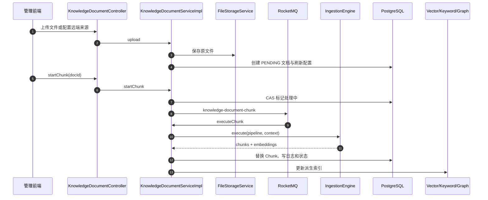
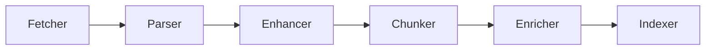
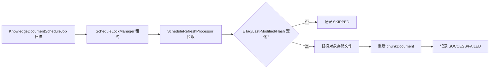

# 知识库与摄取

## 1. 两个入口、一套核心能力

仓库有两类入库入口：

1. 知识库入口：`/knowledge-base/...`，面向产品 UI，管理知识库、文档和 Chunk；
2. 摄取流水线入口：`/ingestion/...`，面向可配置节点链。

[KnowledgeDocumentServiceImpl](../../bootstrap/src/main/java/com/hjs/study/ragent/knowledge/service/impl/KnowledgeDocumentServiceImpl.java) 在处理知识库文档时构造或加载 `PipelineDefinition`，再调用 [IngestionEngine](../../bootstrap/src/main/java/com/hjs/study/ragent/ingestion/engine/IngestionEngine.java)。因此推荐的心智模型是：

```text
knowledge = 产品领域与持久化外壳
ingestion = 文档处理执行内核
core/parser + core/chunk = 可复用算法
rag/core/vector + keyword + graph = 索引后端
```

## 2. 常规知识库流程



上传与分块是分开的操作。`startChunk` 通过状态控制防止同一文档重复处理，再发送 MQ；消费者 [KnowledgeDocumentChunkConsumer](../../bootstrap/src/main/java/com/hjs/study/ragent/knowledge/mq/KnowledgeDocumentChunkConsumer.java) 恢复操作人上下文后执行。

## 3. IngestionContext

[IngestionContext](../../bootstrap/src/main/java/com/hjs/study/ragent/ingestion/domain/context/IngestionContext.java) 是节点间共享的可变工作区，典型内容包括：

- `taskId`、`pipelineId`、`source`、`vectorSpaceId`；
- 原始字节、MIME、原文、增强后文本；
- `StructuredDocument`；
- `VectorChunk` 列表与 Embedding；
- 文档/Chunk 元数据、关键词、问题；
- 节点日志、状态和错误；
- `skipIndexerWrite` 等由产品外壳控制的行为。

节点之间不是通过强类型输出端口连接，而是约定读写 Context 字段。优点是编排简单，代价是节点顺序错误可能到运行时才暴露。

## 4. 流水线结构与校验

[PipelineDefinition](../../bootstrap/src/main/java/com/hjs/study/ragent/ingestion/domain/pipeline/PipelineDefinition.java) 包含 `NodeConfig` 列表。每个节点记录：

- `nodeId`、`nodeType`；
- `nextNodeId`；
- JSON `settings`；
- JSON `condition`。

[IngestionEngine](../../bootstrap/src/main/java/com/hjs/study/ragent/ingestion/engine/IngestionEngine.java)：

1. 把 Spring 中所有 `IngestionNode` 按 `nodeType` 注册；
2. 验证 `nextNodeId` 引用和环；
3. 寻找没有被其他节点引用的起点；
4. 逐节点判断 condition；
5. 执行节点并记录 `NodeLog`；
6. 根据 `NodeResult` 继续、停止或失败。

当前模型是单链，不是通用 DAG：每个节点只有一个 `nextNodeId`，引擎也只选择一个起点。

## 5. 六类节点



节点可以省略或调整，但后置节点需要的 Context 字段必须已产生。

### 5.1 Fetcher

[FetcherNode](../../bootstrap/src/main/java/com/hjs/study/ragent/ingestion/node/FetcherNode.java) 根据 `SourceType` 选择 [DocumentFetcher](../../bootstrap/src/main/java/com/hjs/study/ragent/ingestion/strategy/fetcher/DocumentFetcher.java)：

- `HttpUrlFetcher`：HTTP/HTTPS；
- `FeishuFetcher`：飞书文档；
- 上传文件可以已经在 Context 中，不必再次远程抓取。

抓取结果统一为字节、MIME、文件名和来源元数据。

### 5.2 Parser

[ParserNode](../../bootstrap/src/main/java/com/hjs/study/ragent/ingestion/node/ParserNode.java) 用 [DocumentParserSelector](../../bootstrap/src/main/java/com/hjs/study/ragent/core/parser/DocumentParserSelector.java) 按 MIME/规则选择解析器：

| Parser | 主要格式与特点 |
| --- | --- |
| `MarkdownDocumentParser` | 保留标题、段落、列表、代码、表格等结构 |
| `CsvDocumentParser` | 表格行列 |
| `ExcelDocumentParser` | 工作表与单元格结构 |
| `ImageDocumentParser` | VLM 图生文，保留原图引用 |
| `MinerUDocumentParser` | PDF 上传、轮询、下载解包，多模态资产 |
| `TikaDocumentParser` | 基础文本、JSON、XML、XHTML、RTF 的平文本兜底 |

解析统一输出 [StructuredDocument](../../bootstrap/src/main/java/com/hjs/study/ragent/ingestion/domain/context/StructuredDocument.java) 或核心 parser model 中的 Block 列表。MinerU 路径包含远程异步任务、超时、压缩包解包和图片上传，是解析子系统中最复杂的一支。

解析器选择顺序、Block 中间模型以及各格式的实现细节见 [Parser 文档解析模块源码学习指南](13-parser-module.md)。

### 5.3 Enhancer

[EnhancerNode](../../bootstrap/src/main/java/com/hjs/study/ragent/ingestion/node/EnhancerNode.java) 在分块前处理整篇文本，可执行：

- 上下文增强；
- 关键词提取；
- 问题生成；
- 元数据提取。

每项任务可覆盖 system/user Prompt 和模型 ID；默认用快速档模型。

### 5.4 Chunker

[ChunkerNode](../../bootstrap/src/main/java/com/hjs/study/ragent/ingestion/node/ChunkerNode.java) 读取 `ChunkerSettings`：

- `strategy`；
- `chunkSize`、`overlapSize`、`separator`；
- 表格专用 `rowsPerChunk`。

[ChunkingStrategyFactory](../../bootstrap/src/main/java/com/hjs/study/ragent/core/chunk/ChunkingStrategyFactory.java) 提供：

- [FixedSizeTextChunker](../../bootstrap/src/main/java/com/hjs/study/ragent/core/chunk/strategy/FixedSizeTextChunker.java)：固定字符/边界；
- [StructureAwareTextChunker](../../bootstrap/src/main/java/com/hjs/study/ragent/core/chunk/strategy/StructureAwareTextChunker.java)：在纯文本上识别 Markdown 边界。

结构化路径由 `BlockAwareChunkerDispatcher` 分发到段落、代码、列表、表格和图片 Chunker，再由 [ChunkPacker](../../bootstrap/src/main/java/com/hjs/study/ragent/core/chunk/blockaware/ChunkPacker.java) 在大小约束下组合，尽量避免破坏语义块。

三条分块路由、字符预算、`VectorChunk` 字段和各专用 Chunker 的详细说明见 [Chunk 文档分块模块源码学习指南](14-chunk-module.md)。

### 5.5 Enricher

[EnricherNode](../../bootstrap/src/main/java/com/hjs/study/ragent/ingestion/node/EnricherNode.java) 在分块后逐 Chunk 增强，可附加文档元数据，并生成 Chunk 关键词、摘要和结构化元数据。它与 Enhancer 的区别是作用粒度：

- Enhancer：文档级；
- Enricher：Chunk 级。

### 5.6 Indexer

[IndexerNode](../../bootstrap/src/main/java/com/hjs/study/ragent/ingestion/node/IndexerNode.java) 校验：

- 有 Chunk；
- 有集合名；
- 所有向量存在且维度一致；
- 目标向量空间存在或可创建。

随后补充 Chunk ID、Embedding 和选定元数据，调用 [VectorStoreService](../../bootstrap/src/main/java/com/hjs/study/ragent/rag/core/vector/VectorStoreService.java) 写入。

知识库产品流程会设置 `skipIndexerWrite`，使节点只准备 ID/向量，外层服务再在自己的事务/补偿顺序中统一保存关系库 Chunk 和向量索引。

## 6. Embedding

[ChunkEmbeddingService](../../bootstrap/src/main/java/com/hjs/study/ragent/core/chunk/ChunkEmbeddingService.java) 把 Chunk 文本交给 `EmbeddingService`。实际模型由知识库 `embedding_model` 或默认配置决定。

Embedding 维度必须同时满足：

- 模型候选配置的 `dimension`；
- `rag.default.dimension`；
- pgvector 列或 Milvus collection schema；
- LightRAG 使用的 Embedding 模型。

维度变更不是普通配置切换，通常需要新向量空间与全量重建。

## 7. 业务表与派生索引

一次成功入库可能涉及：

- `t_knowledge_document`：文档元数据和状态；
- `t_knowledge_chunk`：可编辑的关系库 Chunk；
- `t_knowledge_document_chunk_log`：阶段耗时与错误；
- `t_knowledge_vector` 或 Milvus collection：Embedding；
- Elasticsearch：关键词文档；
- LightRAG：实体关系图；
- 对象存储：原文件与图片资产。

关系库 Chunk 是管理 UI 的事实来源；其他索引应视为派生视图。修改、禁用、删除 Chunk 时，[KnowledgeChunkServiceImpl](../../bootstrap/src/main/java/com/hjs/study/ragent/knowledge/service/impl/KnowledgeChunkServiceImpl.java) 同步更新相关索引。

## 8. 定时刷新

远端来源可以启用 cron：



关键类：

- [KnowledgeDocumentScheduleJob](../../bootstrap/src/main/java/com/hjs/study/ragent/knowledge/schedule/KnowledgeDocumentScheduleJob.java)：扫描到期任务与恢复卡死文档；
- [ScheduleLockManager](../../bootstrap/src/main/java/com/hjs/study/ragent/knowledge/schedule/ScheduleLockManager.java)：数据库租约与心跳；
- [ScheduleRefreshProcessor](../../bootstrap/src/main/java/com/hjs/study/ragent/knowledge/schedule/ScheduleRefreshProcessor.java)：抓取、比较、存储和重新入库；
- `ScheduleStateManager`：仅在仍持有租约时更新最终状态。

## 9. 一致性边界

关系库事务不能自动回滚对象存储、Milvus、Elasticsearch、LightRAG 或已发出的消息。当前代码采用混合策略：

- 数据库事务保护同库多表；
- 状态字段与 Chunk 日志暴露失败；
- MQ 将耗时任务移出请求；
- 索引可以按文档删除并重建；
- 图谱支持异步标脏与防抖重建；
- 定时任务使用租约、执行记录和卡死恢复。

阅读事务注解时要继续追踪外部调用，不能把 `@Transactional` 误解为全链路原子性。

## 10. 扩展约束

新增 Parser 时：

- 明确支持 MIME 和优先级；
- 输出稳定的结构模型；
- 限制输入大小与远程下载；
- 对临时文件、图片资产和异常做清理。

新增 Chunker 时：

- 输出顺序与 `chunkIndex` 可复现；
- 保留标题路径、表格、代码和图片等元数据；
- 控制 Chunk 上限、重叠和空片段；
- 使写入内容与 Embedding 输入的差异可解释。

新增 IngestionNode 时：

- 使用唯一 `nodeType`；
- 清楚声明读取和写入哪些 Context 字段；
- 失败返回 `NodeResult.fail`，不要留下半成品并伪装成功；
- 对可跳过和终止语义使用 `shouldContinue`；
- 把诊断信息写入节点日志，但避免凭据和完整敏感文档。
