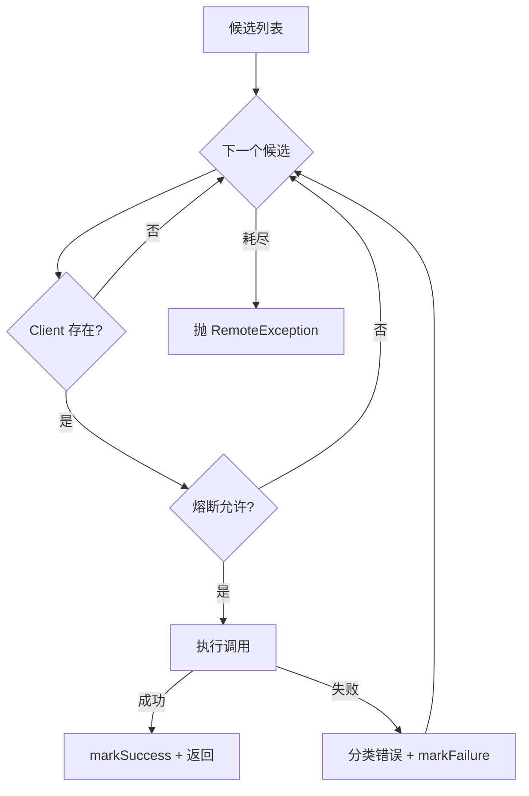
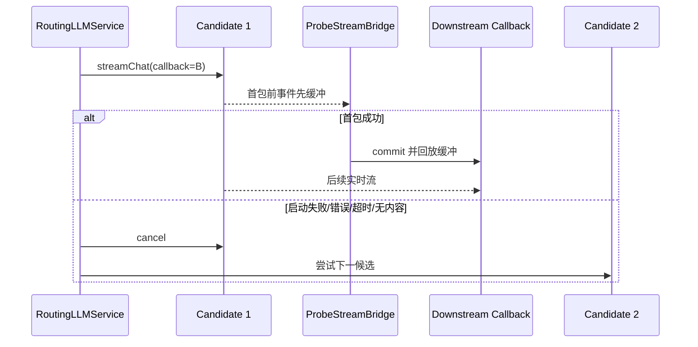

# AI 基础设施

## 1. 为什么单独拆出 infra-ai

业务层需要四类模型能力：

| 能力 | 业务用途 | 接口 |
| --- | --- | --- |
| Chat | 回答、改写、意图、摘要、标题、推荐问题、增强 | `LLMService` |
| Embedding | 意图与知识 Chunk 向量化、查询向量 | `EmbeddingService` |
| Rerank | 对召回候选精排 | `RerankService` |
| VLM | 图片转自包含文本 | `VlmService` |

`infra-ai` 把“业务想做什么”与“厂商 HTTP 协议、API Key、URL、错误、流式解析”分开。业务代码不直接依赖百炼或 SiliconFlow Client。

## 2. 统一模型配置

[AIModelProperties](../../infra-ai/src/main/java/com/hjs/study/ragent/infra/config/AIModelProperties.java) 将 `ai` 配置拆为：

- `providers`：厂商 base URL、API Key 和不同能力 endpoint；
- `chat/embedding/rerank/vlm.candidates`：物理模型注册表；
- Chat `tiers`：有序候选 ID 与超时预算；
- 非 Chat `default-model`、priority；
- `selection`：失败阈值和熔断打开时间；
- `stream.message-chunk-size`：业务 SSE 再分块大小。

[ModelTarget](../../infra-ai/src/main/java/com/hjs/study/ragent/infra/model/ModelTarget.java) 是解析后的调用目标，携带候选配置和本次超时。

## 3. 模型选择

[ModelSelector](../../infra-ai/src/main/java/com/hjs/study/ragent/infra/model/ModelSelector.java) 负责：

- 按 Chat 默认档、显式档或深度思考档解析候选；
- 将 preferred model 放在同档候选前面；
- 过滤禁用、缺失或能力不匹配的候选；
- 为 Embedding/Rerank/VLM 按默认模型和优先级排序；
- 生成 Provider + Model 的稳定目标 ID。

`deepThinking=true` 优先于调用点传入的 Tier：用户开启深度思考时选择 `deep-thinking-tier`。

[ChatTierConfigValidator](../../infra-ai/src/main/java/com/hjs/study/ragent/infra/model/ChatTierConfigValidator.java) 在启动时检查档位引用、重复模型、正数超时和思考能力，避免请求到来后才发现配置错误。

## 4. 同步故障转移

[ModelRoutingExecutor](../../infra-ai/src/main/java/com/hjs/study/ragent/infra/model/ModelRoutingExecutor.java) 被 Chat、Embedding 和 Rerank 共用：

[ModelHealthStore](../../infra-ai/src/main/java/com/hjs/study/ragent/infra/model/ModelHealthStore.java) 是进程内轻量熔断状态：

- 连续失败达到阈值后在一段时间内拒绝调用；
- 打开时间结束后允许试探；
- 成功清零失败状态。

它不是跨实例熔断器，也没有持久化。

## 5. Chat Client

[ChatClient](../../infra-ai/src/main/java/com/hjs/study/ragent/infra/chat/ChatClient.java) 定义同步与流式调用。主要实现：

- `OllamaChatClient`
- `BaiLianChatClient`
- `AIHubMixChatClient`
- `SiliconFlowChatClient`

它们复用 [AbstractOpenAIStyleChatClient](../../infra-ai/src/main/java/com/hjs/study/ragent/infra/chat/AbstractOpenAIStyleChatClient.java)，后者负责：

- 把 `ChatRequest` 转为 OpenAI 兼容 JSON；
- 解析 Provider URL 和 endpoint；
- 加 Authorization；
- 同步响应抽取；
- 把流式 HTTP Call 提交给 `modelStreamExecutor`；
- 用 [OpenAIStyleSseParser](../../infra-ai/src/main/java/com/hjs/study/ragent/infra/chat/OpenAIStyleSseParser.java) 解析 content、reasoning 和 `[DONE]`；
- 返回可取消句柄。

厂商子类主要覆盖 Provider 名称、thinking 字段或少量协议差异。

## 6. 流式首包故障转移

同步调用可等结果后决定是否换模型；流式调用一旦把内容推给用户，就不能切换模型并重放。因此 [RoutingLLMService](../../infra-ai/src/main/java/com/hjs/study/ragent/infra/chat/RoutingLLMService.java) 使用“首包提交点”：

[ProbeStreamBridge](../../infra-ai/src/main/java/com/hjs/study/ragent/infra/chat/ProbeStreamBridge.java) 在首个内容或终态到达前缓存回调动作。[LlmFirstPacketProbe](../../infra-ai/src/main/java/com/hjs/study/ragent/infra/chat/LlmFirstPacketProbe.java) 在档位超时预算内等待：

- `SUCCESS`：commit，之后不再允许换模型；
- `ERROR`：取消当前 Call，尝试下一个；
- `TIMEOUT`：取消并切换；
- `NO_CONTENT`：完成但没有内容，视为失败。

如果等待线程被中断，系统取消当前请求并终止整个候选循环，不继续切换。

## 7. StreamCallback 与取消

[StreamCallback](../../infra-ai/src/main/java/com/hjs/study/ragent/infra/chat/StreamCallback.java) 将模型事件抽象为：

- `onThinking`
- `onContent`
- `onComplete`
- `onError`
- 来源、Grounding 和回复关系等业务扩展回调

[StreamCancellationHandle](../../infra-ai/src/main/java/com/hjs/study/ragent/infra/chat/StreamCancellationHandle.java) 隔离底层 OkHttp Call/异步任务。`StreamTaskManager` 只依赖这个接口，因此取消链不需要知道模型厂商。

[ForwardingStreamCallback](../../infra-ai/src/main/java/com/hjs/study/ragent/infra/chat/ForwardingStreamCallback.java) 和 `StreamSpanCallback` 用装饰器方式添加首包、Trace 和终态逻辑。

## 8. Embedding

[RoutingEmbeddingService](../../infra-ai/src/main/java/com/hjs/study/ragent/infra/embedding/RoutingEmbeddingService.java) 支持：

- 单文本、批量；
- 自动候选故障转移；
- 指定模型 ID。

客户端包括 Ollama、AIHubMix、SiliconFlow。OpenAI 兼容实现复用 [AbstractOpenAIStyleEmbeddingClient](../../infra-ai/src/main/java/com/hjs/study/ragent/infra/embedding/AbstractOpenAIStyleEmbeddingClient.java)，按厂商批量上限串行分片，并校验响应数量和向量。

指定模型 ID 的重载只尝试该目标，不回退其他 Embedding 模型。这能避免不同模型/维度混写同一向量空间。

更细的逐类讲解可参考仓库已有的 [Embedding 学习笔记](../../infra-ai/src/main/java/com/hjs/study/ragent/infra/embedding/LEARNING.md)。

## 9. Rerank

[RoutingRerankService](../../infra-ai/src/main/java/com/hjs/study/ragent/infra/rerank/RoutingRerankService.java) 复用同步路由器。实现包括：

- [BaiLianRerankClient](../../infra-ai/src/main/java/com/hjs/study/ragent/infra/rerank/BaiLianRerankClient.java)：调用百炼专有 Rerank API，把返回 index 映射回原 Chunk；
- [NoopRerankClient](../../infra-ai/src/main/java/com/hjs/study/ragent/infra/rerank/NoopRerankClient.java)：保持候选顺序并截断，可作为显式降级目标。

Rerank 输入已经经过跨通道去重、RRF 和候选池截断。它只负责精排，不应再承担融合职责。

详见已有的 [Rerank 学习笔记](../../infra-ai/src/main/java/com/hjs/study/ragent/infra/rerank/LEARNING.md)。

## 10. VLM

[RoutingVlmService](../../infra-ai/src/main/java/com/hjs/study/ragent/infra/vlm/RoutingVlmService.java) 用 OpenAI 多模态消息格式把图片作为 base64 data URL 内联，抽取 `choices[0].message.content`。

它当前选择首个可用 VLM 候选，不复用 `ModelRoutingExecutor` 做 fallback。原因是入库期调用频率和实现复杂度较低，但这也意味着 VLM 可用性语义与 Chat/Embedding/Rerank 不完全一致。

## 11. HTTP 与错误分类

`infra-ai/http` 提供：

- `ModelUrlResolver`：Provider base URL、候选 URL、能力 endpoint 的组合；
- `HttpResponseHelper`：Provider/API Key/模型检查、body 读取和 JSON 解析；
- `ModelClientException` 与 `ModelClientErrorType`：网络、超时、限流、认证、服务端、非法响应等错误类型；
- `HttpMediaTypes`：共享媒体类型。

路由器根据错误判断是否值得尝试下一个候选。配置错误与某些不可恢复输入错误不应无限切换。

## 12. 扩展 Provider 的边界

增加一个模型 Provider 通常需要：

1. 在配置中声明 Provider URL、凭据和 endpoint；
2. 增加相应 `ChatClient`/`EmbeddingClient`/`RerankClient` Bean；
3. 让 `provider()` 与配置字符串完全一致；
4. 把厂商错误映射到统一错误类型；
5. 确保流式回调只出现一个终态；
6. 正确实现取消和资源关闭；
7. 声明候选维度、thinking 能力与批量限制；
8. 增加 Client 级协议测试和 Router 级故障转移测试。

业务模块不应通过 `instanceof` 判断厂商；差异应留在 Client 或模型候选能力中。
