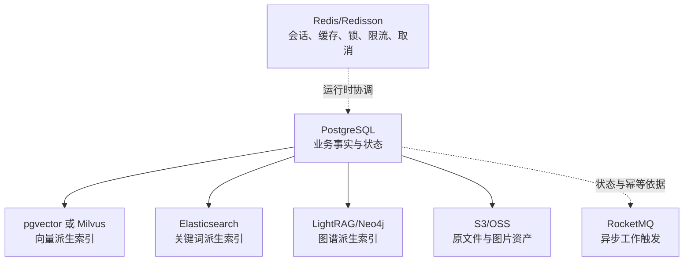
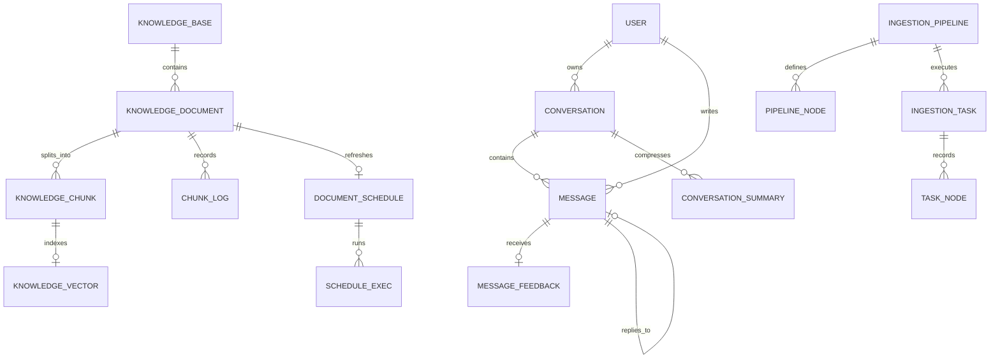
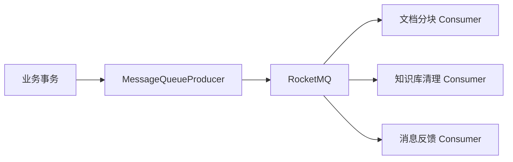

# 数据与中间件

## 1. 数据分层

项目使用多种存储，但它们并不具有同等地位：

PostgreSQL 保存业务事实、状态和可管理内容。向量、关键词、图谱是为了检索构建的派生数据；对象存储保存大文件；Redis 与 MQ 主要协调运行时行为。

## 2. 22 张 PostgreSQL 表

[schema_pg.sql](../../resources/database/schema_pg.sql) 创建 pgvector 扩展和 22 张表。

本章用于建立存储分层与一致性边界的整体认识。需要逐表查看全部字段、约束、索引、状态值、源码读写方和升级历史时，请阅读[数据库表完整参考](15-database-table-reference.md)。

### 2.1 用户、会话与反馈

| 表 | 责任 | 关键逻辑关系 |
| --- | --- | --- |
| `t_user` | 用户、角色、密码和头像 | `id → conversation/message.user_id` |
| `t_conversation` | 用户会话列表、标题与最后活动时间 | `(conversation_id,user_id)` 唯一 |
| `t_conversation_summary` | 历史压缩摘要及截止消息 | `conversation_id + user_id` |
| `t_message` | 用户/助手消息、思考、来源、Grounding、推荐问题 | `reply_to_message_id` 连接一轮问答 |
| `t_message_feedback` | 用户对助手消息的赞踩 | `(message_id,user_id)` 唯一 |
| `t_sample_question` | 欢迎页示例问题 | 独立配置 |

### 2.2 审计

| 表 | 责任 |
| --- | --- |
| `t_biz_change_log` | 记录业务类型、操作类型、变更前后快照、diff、操作人、请求信息和成功状态 |

### 2.3 知识库

| 表 | 责任 | 关键逻辑关系 |
| --- | --- | --- |
| `t_knowledge_base` | 知识库、Embedding 模型、collection | `collection_name` 唯一 |
| `t_knowledge_document` | 文件、来源、处理模式、状态、分块配置、流水线 | `kb_id → knowledge_base.id` |
| `t_knowledge_chunk` | 可编辑 Chunk 文本、哈希、计数和启用状态 | `doc_id`、`kb_id` |
| `t_knowledge_document_chunk_log` | 每次分块的阶段耗时、数量与错误 | `doc_id` |
| `t_knowledge_document_schedule` | 远端文档 cron、变化标记和数据库租约 | `doc_id` 唯一 |
| `t_knowledge_document_schedule_exec` | 每次刷新执行记录 | `schedule_id/doc_id/kb_id` |
| `t_knowledge_vector` | pgvector 模式的文本、metadata、1536 维向量 | `id` 与 Chunk ID 对齐 |

### 2.4 意图、归一化与 Trace

| 表 | 责任 |
| --- | --- |
| `t_intent_node` | 意图树、KB/MCP/SYSTEM 类型、检索和 Prompt 配置 |
| `t_query_term_mapping` | 源词到目标词的精确/模糊映射 |
| `t_rag_trace_run` | 一次问答运行的入口、状态、耗时与扩展数据 |
| `t_rag_trace_node` | Trace 树节点、父子关系、类型与耗时 |

### 2.5 摄取流水线

| 表 | 责任 |
| --- | --- |
| `t_ingestion_pipeline` | 流水线元数据 |
| `t_ingestion_pipeline_node` | 节点类型、下一节点、设置和条件 |
| `t_ingestion_task` | 一次执行的来源、状态、日志与元数据 |
| `t_ingestion_task_node` | 每个节点的顺序、状态、耗时、消息与输出 |

## 3. 逻辑 ER 图

Schema 没有声明这些外键；下图表示应用逻辑关系：

应用层关联的优点是删除/迁移灵活，缺点是数据库不能自动防止孤儿记录。删除服务和异步清理消费者因此是完整性的重要组成部分。

## 4. PostgreSQL 与 pgvector

默认 `rag.vector.type=pg`。相关实现：

- [PgVectorStoreService](../../bootstrap/src/main/java/com/hjs/study/ragent/rag/core/vector/PgVectorStoreService.java)：批量索引、删除和管理；
- [PgVectorRetrieverService](../../bootstrap/src/main/java/com/hjs/study/ragent/rag/core/vector/PgVectorRetrieverService.java)：余弦检索；
- [VectorStoreAdmin](../../bootstrap/src/main/java/com/hjs/study/ragent/rag/core/vector/VectorStoreAdmin.java)：抽象向量空间管理；
- [VectorSpaceInitializer](../../bootstrap/src/main/java/com/hjs/study/ragent/rag/config/VectorSpaceInitializer.java)：启动初始化。

`t_knowledge_vector.embedding` 固定为 `vector(1536)` 并建立 HNSW 索引。切换 Embedding 维度必须先迁移 schema 和重建向量。

业务通过 `collection_name` 在共享表中隔离知识库。metadata 使用 JSONB + GIN，保存 doc、Chunk 序号和来源等检索过滤字段。

## 5. Milvus

配置 `rag.vector.type=milvus` 时使用：

- [MilvusVectorStoreService](../../bootstrap/src/main/java/com/hjs/study/ragent/rag/core/vector/MilvusVectorStoreService.java)
- [MilvusVectorRetrieverService](../../bootstrap/src/main/java/com/hjs/study/ragent/rag/core/vector/MilvusVectorRetrieverService.java)

每个逻辑 collection 对应 Milvus collection。`MilvusConfig` 创建 Client，`VectorStoreAdmin` 负责检查/创建空间。Milvus 和 pgvector 实现同一业务接口，调用方不需要分支判断。

## 6. Redis 与 Redisson

Redis 不是单一“缓存”，至少承担：

| 能力 | 位置 |
| --- | --- |
| Sa-Token 登录会话 | 认证配置 |
| 意图树缓存 | `IntentTreeCacheManager` |
| HTTP/MQ 幂等 | `framework/idempotent` |
| 全局并发信号量与排队 | `FairDistributedRateLimiter` |
| 文档上传信号量 | `UploadRateLimitFilter` |
| 会话摘要锁 | `JdbcConversationMemorySummaryService` |
| 模型流取消标志与 Pub/Sub | `StreamTaskManager` |
| Snowflake worker 初始化协调 | `SnowflakeIdInitializer` |

Redis key 通过 [RedisKeySerializer](../../framework/src/main/java/com/hjs/study/ragent/framework/cache/RedisKeySerializer.java) 统一序列化。部署多实例时，Redis 是跨实例协调的关键单点；仅进程内 Cache 或 `ModelHealthStore` 不会跨实例同步。

## 7. RocketMQ

RocketMQ 将耗时或需要事务消息语义的操作与请求线程解耦：

消息 payload 由 [MessageWrapper](../../framework/src/main/java/com/hjs/study/ragent/framework/mq/MessageWrapper.java) 包装。Consumer 使用 `@IdempotentConsume` 时需提供稳定唯一键，避免 RocketMQ 重投导致重复副作用。

事务消息只能协调“本地事务是否提交”与“消息是否可见”，不能让向量库或对象存储加入数据库事务。

## 8. 对象存储

业务接口 [ObjectStorageClient](../../bootstrap/src/main/java/com/hjs/study/ragent/rag/core/storage/ObjectStorageClient.java) 有：

- [S3ObjectStorageClient](../../bootstrap/src/main/java/com/hjs/study/ragent/rag/core/storage/S3ObjectStorageClient.java)：RustFS、MinIO 等 S3 兼容服务；
- [OssObjectStorageClient](../../bootstrap/src/main/java/com/hjs/study/ragent/rag/core/storage/OssObjectStorageClient.java)：阿里云 OSS。

[DefaultFileStorageService](../../bootstrap/src/main/java/com/hjs/study/ragent/rag/service/impl/DefaultFileStorageService.java) 提供上传、下载、删除和 URL。默认分两个 bucket：

- 知识原文件 bucket：私有；
- 多模态资产 bucket：供文档预览/答案展示。

数据库保存对象 key/URL，而不是文件正文。删除数据库记录时必须同时考虑对象清理失败的补偿。

## 9. Elasticsearch

[KeywordIndexService](../../bootstrap/src/main/java/com/hjs/study/ragent/rag/core/keyword/KeywordIndexService.java) 与 [KeywordRetrieverService](../../bootstrap/src/main/java/com/hjs/study/ragent/rag/core/keyword/KeywordRetrieverService.java) 分别抽象写入和查询：

- `rag.keyword.type=none`：不注册关键词实现，写侧装饰器和关键词检索通道也不注册；
- `rag.keyword.type=es`：注册 [EsKeywordIndexService](../../bootstrap/src/main/java/com/hjs/study/ragent/rag/core/keyword/EsKeywordIndexService.java) 与 [EsKeywordRetrieverService](../../bootstrap/src/main/java/com/hjs/study/ragent/rag/core/keyword/EsKeywordRetrieverService.java)。

ES 使用一个共享索引，通过 `collection_name` 区分知识库。索引 analyzer 与 search analyzer 在配置中独立指定。关键词索引是派生数据，故障时向量等其他通道仍可工作。

## 10. LightRAG 与 Neo4j

[LightRagClient](../../bootstrap/src/main/java/com/hjs/study/ragent/rag/core/graph/LightRagClient.java) 通过 HTTP 访问 LightRAG。读路径提供：

- 图谱检索；
- 管理后台实体标签；
- 子图可视化。

写路径由 `GraphIngestionService`/同步器在知识变化后标脏或重建 workspace。仓库提供 [GraphRAG 部署说明](../../resources/docker/graphrag/README.md)。

图谱可以独立用于后台可视化，而不参与在线检索；这是三个开关分离的原因。

## 11. 一致性检查清单

排查“数据库有数据但问不到”时依次检查：

1. `t_knowledge_document.status` 是否成功、enabled 是否开启；
2. `t_knowledge_chunk` 是否存在且 enabled；
3. Chunk ID 是否存在于当前 vector backend；
4. collection name 是否与知识库和意图节点一致；
5. Embedding 维度与模型是否一致；
6. 当前 SearchChannel 是否启用；
7. ES/LightRAG 派生索引是否同步；
8. Trace 中召回、融合和 Rerank 节点是否把候选过滤掉。

数据库事务成功只说明关系库状态成功，不代表所有派生存储均已完成。
