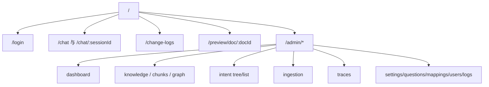
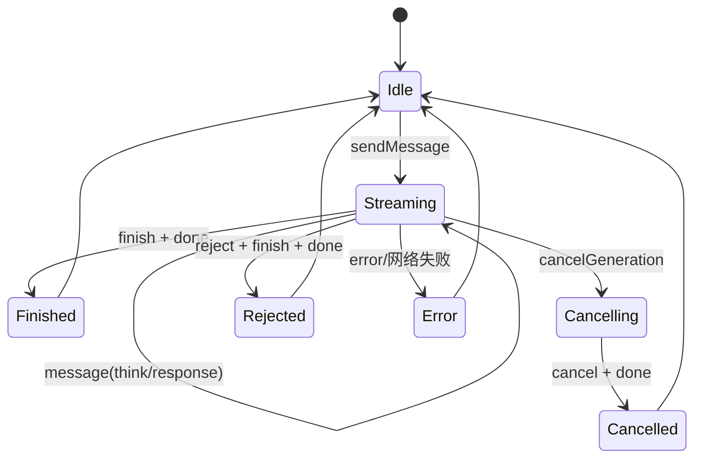

# 前端架构

## 1. 启动与技术栈

[main.tsx](../../frontend/src/main.tsx) 挂载 React 应用，[App.tsx](../../frontend/src/App.tsx) 提供 Router、错误边界和全局 Toast。Vite 配置见 [vite.config.ts](../../frontend/vite.config.ts)。

核心库：

- React 18、React Router 6；
- Zustand 状态管理；
- Axios 普通 HTTP、Fetch + ReadableStream 处理 SSE；
- Tailwind CSS、Radix UI、Lucide；
- React Markdown + GFM + sanitize；
- G6 知识图谱、Recharts 图表、Excel Preview；
- React Hook Form + Zod。

## 2. 路由和守卫

[router.tsx](../../frontend/src/router.tsx) 定义：

三个组件控制导航：

- `RequireAuth`：未认证跳转登录；
- `RequireAdmin`：非 admin 跳转聊天；
- `RedirectIfAuth`：已登录用户不再进入登录页。

这些判断基于本地 Zustand 状态，只是客户端体验控制。真正权限必须由后端再次验证。

## 3. HTTP Service 层

[api.ts](../../frontend/src/services/api.ts) 创建 Axios 实例：

- base URL 来自 `VITE_API_BASE_URL`；
- 每次请求从 localStorage 读取 Token；
- 统一拆解 `{code,message,data}`；
- `code !== "0"` 转为 Error；
- 401 或“未登录”清理本地认证并跳转；
- 网络错误通过 Sonner Toast 展示。

15 个 Service 按后端领域对应：

| Service | 领域 |
| --- | --- |
| `authService`、`userService` | 登录与用户 |
| `sessionService`、`chatService` | 会话、停止、反馈、推荐追问 |
| `knowledgeService`、`knowledgeGraphService` | 知识库、文档、Chunk、图谱 |
| `ingestionService` | 流水线与任务 |
| `intentTreeService`、`queryTermMappingService` | 意图与术语 |
| `ragTraceService`、`settingsService` | Trace 和只读配置 |
| `dashboardService`、`bizChangeLogService` | 管理统计与审计 |
| `sampleQuestionService` | 示例问题 |

Service 不保存状态，只定义协议转换。

## 4. Store

### 4.1 authStore

[authStore.ts](../../frontend/src/stores/authStore.ts) 保存用户、Token、认证状态和 loading：

- 初始化时读取 localStorage；
- 登录后保存 Token/User，并设置 Axios 默认头；
- 退出时停止流、清空聊天状态与存储；
- `fetchCurrentUser` 用 `/user/me` 刷新用户。

### 4.2 chatStore

[chatStore.ts](../../frontend/src/stores/chatStore.ts) 是前端最核心也最大的状态单元，负责：

- 会话列表、当前会话和消息；
- 新会话、选择、删除、重命名；
- 深度思考开关；
- SSE 启动、增量、完成、取消、拒绝和错误；
- `taskId`、AbortController 和当前流消息 ID；
- 来源面板；
- 反馈；
- 推荐追问的 idle/loading/ready/error 与展开状态。

### 4.3 themeStore

[themeStore.ts](../../frontend/src/stores/themeStore.ts) 保存主题偏好。它与业务 Store 独立。

## 5. 发送消息状态机

`sendMessage` 先乐观插入本地 user 和空 assistant 消息，再构造查询 URL。收到 `meta` 后才知道后端正式 `conversationId/taskId`：

- 新会话把 URL 替换为 `/chat/{conversationId}`；
- 如果用户在 `meta` 前点击停止，设置 `cancelRequested`；
- `meta` 到达后发现该标志就补发 stop 请求。

`streamingMessageId` 防止旧流的晚到事件修改已经切换的会话。

## 6. SSE 解析

[useStreamResponse.ts](../../frontend/src/hooks/useStreamResponse.ts) 没用浏览器 `EventSource`，而是 `fetch`：

- 可带 Authorization 请求头；
- 可用 AbortSignal；
- 手工处理 `event:`、多行 `data:`、注释和空行分隔；
- JSON 解析失败时保留原始字符串；
- 把命名事件分派到 handler；
- 连接失败可指数退避重试。

使用 fetch 也意味着将来可以把聊天改为 POST 流式请求，而不受 EventSource 只支持 GET 的限制。

需要注意：当前聊天 GET 会产生会话和消息副作用，而前端对网络错误默认重试一次。服务端幂等锁降低了重复处理概率，但 GET 重试语义仍需谨慎，详见审查报告。

## 7. 消息终态

前端 UI 状态：

- `streaming`
- `done`
- `cancelled`
- `error`

后端持久化状态：

- `NORMAL`
- `INTERRUPTED`
- `REJECTED`

`finish` 将临时 assistant ID 替换为数据库 `messageId`，以便后续反馈和推荐问题。`cancel` 追加“已停止生成”提示，并保留服务端保存的部分答案和来源。

## 8. 页面与组件

### 8.1 聊天

[ChatPage](../../frontend/src/pages/ChatPage.tsx) 负责路由会话与 Store 同步；`MessageList` 用虚拟列表；`MessageItem` 组合 Markdown、思考、来源、反馈和推荐追问；`ChatInput` 处理输入与深度思考；`SourcesPanel` 独立显示来源。

Markdown 渲染使用 [MarkdownRenderer](../../frontend/src/components/chat/MarkdownRenderer.tsx)，支持 GFM、CJK、代码高亮和受控 HTML sanitize。任何允许 `rehype-raw` 的调整都必须同步检查 sanitize schema。

### 8.2 管理后台

[AdminLayout](../../frontend/src/pages/admin/AdminLayout.tsx) 提供导航和 Outlet。页面按领域组织：

- Dashboard；
- 知识库、文档、Chunk；
- 知识图谱；
- 意图树与编辑；
- 摄取流水线；
- RAG Trace 列表与详情；
- 系统设置；
- 示例问题、术语映射、用户和变更日志。

后台页面大多使用局部 `useState/useEffect` 调用 Service，没有统一 Query Cache。

### 8.3 通用 UI

`src/components/ui` 是 Radix/shadcn 风格的基础组件；`common` 包含 Loading、Toast、Avatar、ErrorBoundary；`layout` 处理 Header、Sidebar 和主布局。

## 9. 类型与前后端契约

[types/index.ts](../../frontend/src/types/index.ts) 定义聊天核心类型：User、Session、Message、SourceRef、SSE payload。后台领域类型多数放在各 Service 文件中。

前端并未从后端 OpenAPI 自动生成类型，因此契约一致性依靠人工维护。最容易漂移的字段包括：

- `messageStatus` 枚举；
- SSE event payload；
- `SourceRef` 可空字段；
- 分页结构；
- Ingestion 节点 settings JSON；
- 系统设置中的模型/凭据掩码。

## 10. 前端扩展边界

- 新后台资源通常需要 `service + page + router + sidebar` 四处同步；
- 新 SSE 事件需同时更新后端枚举/发送方、`useStreamResponse` 和 `chatStore`；
- 新消息终态需同步后端数据库枚举、Completion payload、前端类型和渲染；
- 不要让页面直接绕过 `api.ts` 自行处理统一响应；
- 涉及权限的页面守卫必须有后端授权对应；
- 聊天 Store 已较大，新增无关域状态不应继续堆入。
