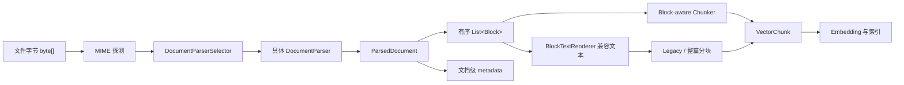
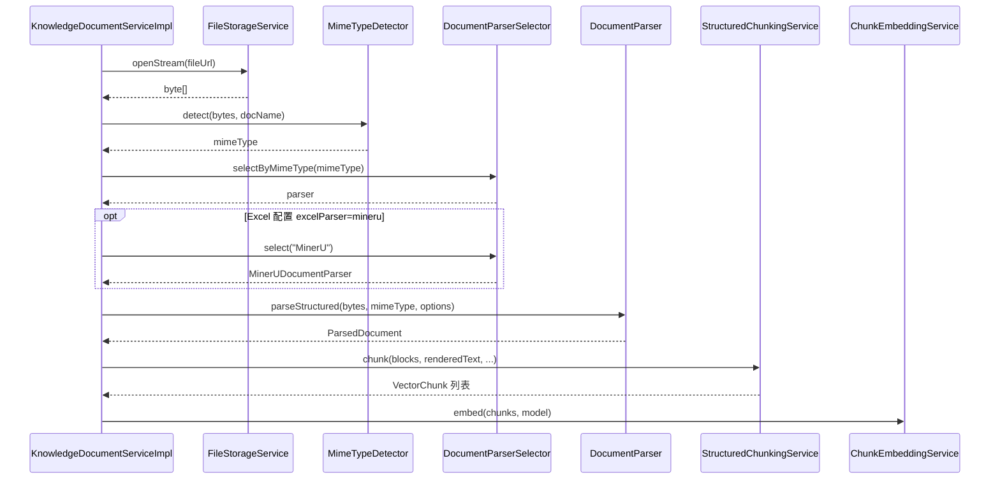
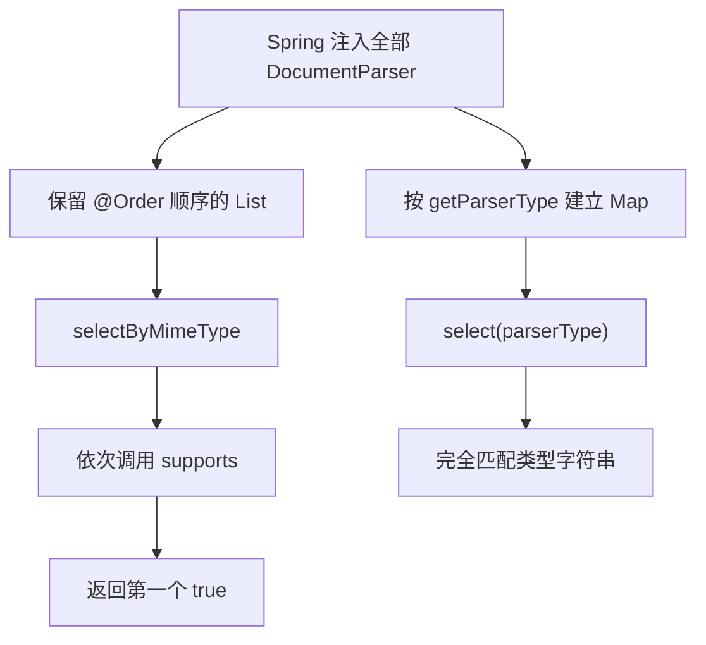
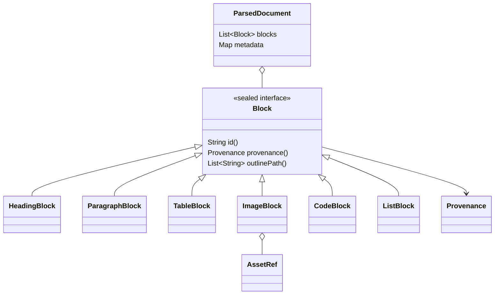
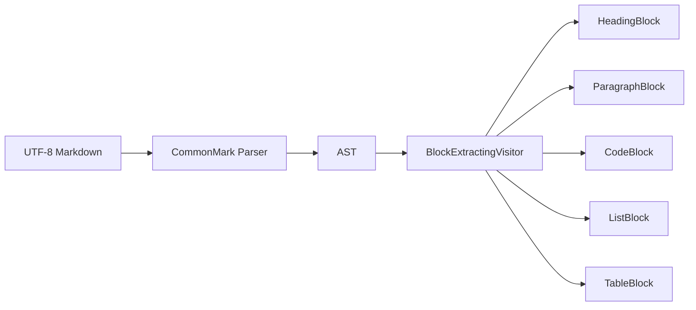
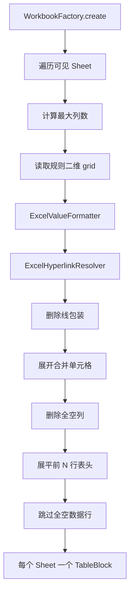
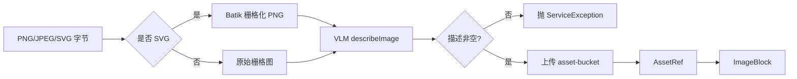
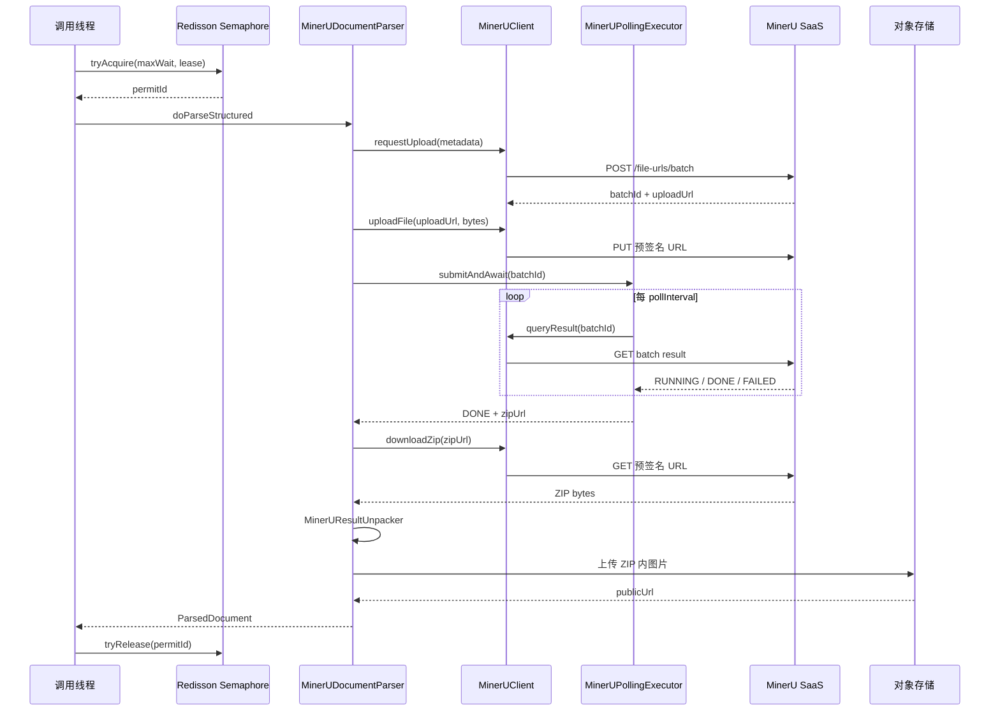
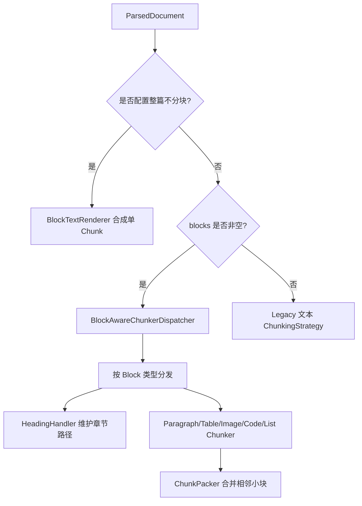

# Parser 文档解析模块源码学习指南

## 1. 模块定位

`core/parser` 位于“原始文件”与“结构化分块”之间。它解决的核心问题不是把文件简单转成一段字符串，而是尽可能保留标题、段落、列表、代码、表格和图片等结构，让下游能够按照内容类型选择更合适的分块策略。

本文基于 `study_0731` 分支提交 `12d86ba`，覆盖 `parser` 目录下 39 个 Java 文件。



应始终记住这个模块的边界：

- 它负责识别文件内部结构，并生成统一的中间表示；
- 它不负责决定 Chunk 大小、生成 Embedding 或写入检索索引；
- 图片解析器和 MinerU 解包器会额外写入对象存储，这是解析模块中少数带外部副作用的实现；
- `ParsedDocument.metadata` 用于诊断和任务关联，不应承载需要被检索的正文。

## 2. 目录与类型地图

| 目录 | 文件数 | 职责 |
| --- | ---: | --- |
| `parser/` | 10 | 统一接口、选择器、类型枚举、文本渲染以及 Tika、CSV、Markdown 解析器 |
| `parser/model/` | 11 | `ParsedDocument`、密封 `Block` 接口及六种内容块 |
| `parser/excel/` | 5 | Apache POI 工作簿解析、值格式化、超链接恢复和表格规范化 |
| `parser/image/` | 3 | 独立图片的 VLM 图生文、SVG 栅格化和资产上传 |
| `parser/mineru/` | 10 | MinerU 提交、上传、轮询、下载、解包和分布式并发控制 |

建议先阅读各包的学习导览：

- [parser/package-info.java](../../bootstrap/src/main/java/com/hjs/study/ragent/core/parser/package-info.java)
- [model/package-info.java](../../bootstrap/src/main/java/com/hjs/study/ragent/core/parser/model/package-info.java)
- [excel/package-info.java](../../bootstrap/src/main/java/com/hjs/study/ragent/core/parser/excel/package-info.java)
- [image/package-info.java](../../bootstrap/src/main/java/com/hjs/study/ragent/core/parser/image/package-info.java)
- [mineru/package-info.java](../../bootstrap/src/main/java/com/hjs/study/ragent/core/parser/mineru/package-info.java)

## 3. Parser 在系统中的两个入口

Parser 没有 Controller，它由知识入库流程调用。当前有两条主要入口。

### 3.1 简单分块模式

[KnowledgeDocumentServiceImpl](../../bootstrap/src/main/java/com/hjs/study/ragent/knowledge/service/impl/KnowledgeDocumentServiceImpl.java) 的 `runChunkProcess` 直接完成：



这条路径会把 `sourceFile` 放入 `options`。Excel 默认走 POI；当分块配置自由键 `excelParser` 为 `mineru` 时，业务层会显式切换到 MinerU。

### 3.2 可配置 Ingestion Pipeline

[ParserNode](../../bootstrap/src/main/java/com/hjs/study/ragent/ingestion/node/ParserNode.java) 是 Pipeline 模式的适配层：

1. 检查 `rawBytes`；
2. 缺少 MIME 时调用 [MimeTypeDetector](../../bootstrap/src/main/java/com/hjs/study/ragent/ingestion/util/MimeTypeDetector.java)；
3. 用 `ParserSettings.rules` 验证文件类型；
4. 按 MIME 选择解析器；
5. 把规则中的 `options`、`sourceFile` 和 `documentId=taskId` 交给解析器；
6. 将 Block 渲染为兼容纯文本；
7. 同时写入 `context.rawText` 和 [StructuredDocument](../../bootstrap/src/main/java/com/hjs/study/ragent/ingestion/domain/context/StructuredDocument.java)。

这里有一个重要区别：

> `ParserSettings.ParserRule` 只有 `mimeType` 和 `options`。它负责准入校验和参数传递，不包含 parserType。具体解析器仍由 `selectByMimeType()` 决定。

因此，把规则写成 `{"mimeType":"PDF"}` 表示“允许 PDF”，并不是在规则中直接指定 MinerU。PDF 最终命中 MinerU，是由 MinerU 的 `supports()` 和排序共同决定的。

## 4. 三个核心契约

### 4.1 DocumentParser：策略接口

[DocumentParser](../../bootstrap/src/main/java/com/hjs/study/ragent/core/parser/DocumentParser.java) 统一所有格式：

```text
byte[] + mimeType + options -> ParsedDocument
```

| 方法 | 含义 | 关键约束 |
| --- | --- | --- |
| `getParserType()` | 返回稳定类型字符串 | 同一 Spring 容器内应唯一 |
| `supports(mimeType)` | 声明愿意处理的 MIME | 自动选择时第一个 `true` 获胜 |
| `parseStructured(...)` | 解析为结构化文档 | Block 顺序必须保持原文阅读顺序 |

解析器都是 Spring 单例 Bean。单次解析产生的可变状态必须放在局部变量中，不能保存在实例字段中。

`options` 是弱类型扩展区。它避免为每种解析器建立不同的方法签名，但也意味着：

- 键名必须由实现和调用方共同约定；
- 实现应忽略自己不认识的键；
- 读取时需要处理 `null`、类型不符和空字符串；
- 新增公共键时应同时检查两条调用入口。

### 4.2 DocumentParserSelector：策略注册与选择

[DocumentParserSelector](../../bootstrap/src/main/java/com/hjs/study/ragent/core/parser/DocumentParserSelector.java) 同时维护：

- 有序 `List<DocumentParser>`：供 MIME 的“第一个匹配”选择；
- `Map<String, DocumentParser>`：供 parserType 精确选择。



找不到解析器时，选择器返回 `null`，由调用方生成带文件上下文的错误。它不会自行静默回退到 Tika。

### 4.3 ParsedDocument：解析阶段输出

[ParsedDocument](../../bootstrap/src/main/java/com/hjs/study/ragent/core/parser/model/ParsedDocument.java) 包含：

- `blocks`：有序的内容 Block；
- `metadata`：解析器类型、MIME、行列数、外部 batchId 等文档级信息。

工厂方法只把 `null` 归一化为空集合，不做防御性复制。Java `record` 只保证集合引用不能重新赋值，并不保证集合内容不可变。

[ParseResult](../../bootstrap/src/main/java/com/hjs/study/ragent/core/parser/ParseResult.java) 是早期“纯文本 + metadata”契约的兼容模型；当前主解析链已经使用 `ParsedDocument`。

## 5. 解析器路由规则

[ParserType](../../bootstrap/src/main/java/com/hjs/study/ragent/core/parser/ParserType.java) 定义的稳定字符串为 `Tika`、`Markdown`、`ExcelPoi`、`Csv`、`MinerU` 和 `Image`。精确选择区分大小写。

Spring 排序值越小，自动匹配优先级越高：

| 顺序 | 解析器 | 自动支持范围 |
| --- | --- | --- |
| `HIGHEST_PRECEDENCE` | `MinerUDocumentParser` | PDF、Word、PowerPoint |
| `HIGHEST_PRECEDENCE + 10` | `CsvDocumentParser` | 三种 CSV MIME |
| `HIGHEST_PRECEDENCE + 10` | `ExcelDocumentParser` | XLS/XLSX 以及两个 Tika Office MIME |
| `HIGHEST_PRECEDENCE + 20` | `MarkdownDocumentParser` | Markdown 和 `text/plain` |
| `HIGHEST_PRECEDENCE + 30` | `ImageDocumentParser` | PNG、JPEG、SVG |
| `LOWEST_PRECEDENCE` | `TikaDocumentParser` | 其余基础文本、JSON、XML、XHTML、RTF |

两个 `+10` 解析器的正常 MIME 范围不重叠，因此相同 Order 不影响常规 CSV/Excel 选择。

需要特别留意两个边界：

- Excel 接受 `application/x-tika-msoffice` 和 `application/x-tika-ooxml` 这两个泛化 MIME。若上游只能探测到泛化 Office 类型，选择结果可能依赖该声明，而不是文件扩展名表达的 Word/PPT 语义。
- `ParserNode` 的规则归一化把 GIF、BMP、WEBP 归为 `IMAGE`，但当前 `ImageDocumentParser.supports()` 只接受 PNG、JPEG 和 SVG。这些格式可能通过规则校验，随后仍因没有解析器而失败。

## 6. Block：解析与分块之间的中间表示

[Block](../../bootstrap/src/main/java/com/hjs/study/ragent/core/parser/model/Block.java) 是带 Jackson 多态信息的密封接口：



| Block | 保留的信息 | 下游典型行为 |
| --- | --- | --- |
| `HeadingBlock` | 标题级别和文本 | 更新章节路径，通常不单独形成 Chunk |
| `ParagraphBlock` | 自然段文本 | 长段落切分、短段落合并 |
| `TableBlock` | 表头、二维数据、标题 | 按行分组，每个 Chunk 重复表头 |
| `ImageBlock` | 资产引用、caption、alt、VLM 描述 | 作为原子块，描述用于检索，URL 用于展示 |
| `CodeBlock` | 语言和代码正文 | 尽量作为原子块避免破坏语法 |
| `ListBlock` | 是否有序、列表项 | 短列表整体保留，长列表按项分组 |

所有 Block 都携带三个公共字段：

- `id`：解析期生成的 UUID，不等于数据库 Chunk ID；
- `provenance`：当前保存源文件和可选 Sheet 名；
- `outlinePath`：解析器通常传空列表，后续 `HeadingHandler` 根据标题顺序计算章节上下文。

[AssetRef](../../bootstrap/src/main/java/com/hjs/study/ragent/core/parser/model/AssetRef.java) 的 `sourceBlockId` 应与所属 `ImageBlock.id` 对齐。`publicUrl` 是资产引用，不是二进制内容。

Jackson 使用 `@type` 区分六种子类型。若将来增加新的 Block 类型，必须同步更新：

1. `Block` 的 `permits`；
2. `@JsonSubTypes`；
3. [BlockTextRenderer](../../bootstrap/src/main/java/com/hjs/study/ragent/core/parser/BlockTextRenderer.java)；
4. [BlockAwareChunkerDispatcher](../../bootstrap/src/main/java/com/hjs/study/ragent/core/chunk/blockaware/BlockAwareChunkerDispatcher.java)；
5. 对应的专用 Chunker 和序列化测试。

## 7. 六种解析实现

### 7.1 Tika：受控的基础文本兜底

[TikaDocumentParser](../../bootstrap/src/main/java/com/hjs/study/ragent/core/parser/TikaDocumentParser.java) 的流程是：

```text
Tika.parseToString
    -> TextCleanupUtil.cleanup
    -> 按两个以上 LF 切段
    -> 每段生成 ParagraphBlock
```

尽管 Apache Tika 能解析多种文档，本项目有意缩窄了它的 `supports()`：

- PDF、Word、PPT 交给 MinerU；
- Markdown、CSV、Excel、图片交给专用解析器；
- Tika 只处理其余 `text/*`、JSON、XML、XHTML 和 RTF。

它不会恢复标题、表格、页码和图片。类中的静态初始化块创建了 `PDFParserConfig`，但没有把配置连接到静态 `TIKA` 实例，因此两个 setter 当前不会改变 `parseToString()` 的行为。

[TextCleanupUtil](../../bootstrap/src/main/java/com/hjs/study/ragent/core/parser/TextCleanupUtil.java) 只做保守清理：移除 BOM、行尾空格、过多 LF 和首尾空白，不负责 HTML 清洗、分词或跨平台换行统一。

### 7.2 Markdown：AST 到 Block IR

[MarkdownDocumentParser](../../bootstrap/src/main/java/com/hjs/study/ragent/core/parser/MarkdownDocumentParser.java) 用 CommonMark 和 GFM Tables 扩展解析 UTF-8 Markdown：



Visitor 中几个值得学习的处理：

- 标题、代码和列表被整体消费，不继续递归，避免重复生成 Block；
- 列表项内部的 Paragraph 不单独产生 `ParagraphBlock`；
- 普通链接保留为 Markdown 链接；
- 强调只保留文字，不保留强调标记；
- 软换行和硬换行统一为 LF；
- 嵌套列表被拍平成直接列表项文本；
- Markdown 图片没有上传上下文，只留下 alt 文本，不生成 `ImageBlock`。

该解析器也支持 `text/plain`，因此普通 TXT 会被当成“只包含段落语法的 Markdown”处理，而不是进入 Tika。

### 7.3 CSV：字符集探测与线性状态机

[CsvDocumentParser](../../bootstrap/src/main/java/com/hjs/study/ragent/core/parser/CsvDocumentParser.java) 将整个 CSV 转成一个 `TableBlock`：

1. `AutoDetectReader` 探测字符集，失败时回退 UTF-8；
2. 去掉开头 BOM；
3. 单次线性扫描处理逗号、引号、CR/LF/CRLF；
4. 删除全空记录；
5. 第一条有效记录作为表头；
6. 数据短行右侧补空；
7. 输出行列数 metadata。

状态机支持字段内逗号、换行和 `""` 转义。它采用“尽量摄取”策略：未闭合引号不会报严格语法错误，而会把剩余文本放入最后一个字段。

当前固定使用逗号，不探测分号、Tab 等 CSV 方言。超过表头宽度的长行不会截断，因此异常 CSV 的个别行可能比 `headers` 更长。

### 7.4 Excel：一张可见 Sheet 对应一张规整表

[ExcelDocumentParser](../../bootstrap/src/main/java/com/hjs/study/ragent/core/parser/excel/ExcelDocumentParser.java) 负责工作簿生命周期，[ExcelTableNormalizer](../../bootstrap/src/main/java/com/hjs/study/ragent/core/parser/excel/ExcelTableNormalizer.java) 负责二维结构清洗：



关键设计取舍：

- 隐藏和 very-hidden Sheet 不进入知识库；
- `DataFormatter` 保留用户看到的日期、百分比和货币格式；
- 公式优先实时求值，失败后依次回退缓存值和公式字符串；
- 超链接从 Cell metadata 恢复为 `[文字](URL)`；
- 删除线单元格包装为 `~~值~~`，表达业务上的软删除语义；
- 合并区域把左上角值复制到所有覆盖单元格，使每个行级 Chunk 自包含；
- `headerRows` 默认 1，多行表头用 `|` 拼接；
- 先建立 `行数 × 最大列数` 内存网格，因此不适合超大或极稀疏工作表。

POI 路径适合规整数据表。多块区域、复杂排版或 OCR 场景可由简单分块入口通过 `excelParser=mineru` 显式切换 MinerU。

### 7.5 Image：VLM 图生文与资产存储

[ImageDocumentParser](../../bootstrap/src/main/java/com/hjs/study/ragent/core/parser/image/ImageDocumentParser.java) 解决“图片链接本身无法被语义检索”的问题：



`ImageBlock.description` 是检索文本，`AssetRef.publicUrl` 是展示资源。SVG 会铺白底并限制最大宽度，然后作为 PNG 继续处理。

调用顺序是先生成描述、再上传资产：

- VLM 失败不会留下已上传孤立图片；
- 上传成功后若后续数据库事务失败，资产存储不会自动回滚；
- 空描述被视为失败，因为只包含图片 URL 的 Chunk 几乎没有召回价值。

[ImageParseProperties](../../bootstrap/src/main/java/com/hjs/study/ragent/core/parser/image/ImageParseProperties.java) 绑定 `rag.image-parse`。修改描述 Prompt 或 token 上限会改变新入库图片的向量语义，但不会自动重算历史数据。

### 7.6 MinerU：远程异步任务封装成同步 Parser

[MinerUDocumentParser](../../bootstrap/src/main/java/com/hjs/study/ragent/core/parser/mineru/MinerUDocumentParser.java) 对外仍实现同步 `parseStructured()`，内部串联远程异步任务：



#### 分布式并发控制

- `RPermitExpirableSemaphore` 跨应用实例限制 outstanding 任务总数；
- `maxWaitSeconds` 控制等待许可的最长时间；
- `leaseSeconds` 负责实例崩溃后的许可自动回收；
- `leaseSeconds` 应大于业务超时和合理的网络、下载、解包缓冲；
- 释放许可必须使用获取时返回的同一个 `permitId`。

#### 轮询模型

[MinerUPollingExecutor](../../bootstrap/src/main/java/com/hjs/study/ragent/core/parser/mineru/MinerUPollingExecutor.java) 使用 4 个共享调度线程：

- 一个 batch 只占一个 `CompletableFuture` 和定时句柄，不独占线程；
- 首次查询延迟一个轮询间隔；
- 单次网络异常会等待下一轮，持续到 deadline 才失败；
- `DONE`、`FAILED`、超时或取消都会撤销后续调度；
- 调度线程执行的是同步 HTTP，因此慢请求仍会占用这 4 个线程；
- 调用业务线程最终在 `Future.get()` 上阻塞，所以这是“异步轮询、同步等待”。

本地超时不会主动取消 MinerU 远端 batch，远端任务可能继续运行。

#### HTTP 边界

[MinerUClient](../../bootstrap/src/main/java/com/hjs/study/ragent/core/parser/mineru/MinerUClient.java) 区分两种请求：

- MinerU 业务 API：携带 `Authorization: Bearer ...`；
- 预签名上传/下载 URL：不携带业务 Token。

第三方响应用 `JsonNode` 容错读取，并由 [MinerUTaskState](../../bootstrap/src/main/java/com/hjs/study/ragent/core/parser/mineru/MinerUTaskState.java) 归一化为 `RUNNING`、`DONE`、`FAILED`、`UNKNOWN`。未知状态继续轮询，最终受 deadline 限制。

预签名 URL 具有临时凭据属性。当前上传成功日志会输出完整 `uploadUrl`，生产日志采集时应脱敏；结果 `zipUrl` 也不应被当作永久资产地址。

#### ZIP 解包与图片迁移

[MinerUResultUnpacker](../../bootstrap/src/main/java/com/hjs/study/ragent/core/parser/mineru/MinerUResultUnpacker.java)：

1. 顺序读取 ZIP，选择第一份 `.md`，收集所有支持的图片；
2. 把所有图片上传到应用自己的资产桶；
3. 用 CommonMark 解析 Markdown；
4. 将段首图片提升为独立 `ImageBlock`；
5. 行内图片保留在 `ParagraphBlock` 文本中，并替换成资产 URL；
6. GFM 表格转为 `TableBlock`；
7. HTML Block 作为 Paragraph 原样保留。

解包不向本地路径写文件，因此没有传统的 Zip Slip 写盘路径；但 ZIP、Markdown 和图片都完整驻留内存。图片上传发生在 Markdown AST 转换之前，失败时已经上传的资产不会自动回滚。

MinerU 抽取的文档内图片当前没有额外执行 VLM 图生文，主要依赖标题、caption 和相邻正文参与召回。

## 8. BlockTextRenderer 与下游分块

[BlockTextRenderer](../../bootstrap/src/main/java/com/hjs/study/ragent/core/parser/BlockTextRenderer.java) 是兼容层，不是完整 Markdown 序列化器：

- 标题输出最小 Markdown 标题；
- 段落保留原文；
- 表格用 ` | ` 连接，但不生成对齐分隔行；
- 图片先输出描述，再输出图片 Markdown；
- 代码使用围栏；
- 列表重新生成序号或项目符号。

它主要服务于：

- Pipeline 的 `context.rawText`；
- `StructuredChunkingService` 的 legacy fallback；
- “整篇不分块”模式；
- 调试和集成测试中的可读输出。

真正的结构化分块由 [StructuredChunkingService](../../bootstrap/src/main/java/com/hjs/study/ragent/core/chunk/StructuredChunkingService.java) 决定：



这解释了为什么 Parser 应保留 Block 类型，而不应提前把所有内容拍平成 String。

## 9. options、metadata 与配置速查

### 9.1 输入 options

| 键 | 使用者 | 作用 | 缺省行为 |
| --- | --- | --- | --- |
| `sourceFile` | 全部主要解析器 | 写入 `Provenance`，图片还用作 caption | 空字符串 |
| `documentId` | Image、MinerU | 构造 `assets/{documentId}/...` | 随机 UUID |
| `headerRows` | Excel | 指定多行表头数量 | `1` |

Pipeline 模式会把 `taskId` 作为 `documentId`；简单分块模式当前只统一传入 `sourceFile`，因此需要 `documentId` 的解析器会使用自己的 UUID 兜底。

### 9.2 输出 metadata

| 解析器 | 主要字段 |
| --- | --- |
| Tika | `parser`、`mimeType` |
| Markdown | `parser`、`mimeType`、`blocks` |
| CSV | `parser`、`mimeType`、`rows`、`columns` |
| Excel | `parser`、`mimeType`、`totalSheets`、`parsedTables`、`headerRows` |
| Image | `parser`、`mimeType`、`descriptionChars` |
| MinerU | `parser`、`mimeType`、`blocks`、`imagesUploaded`、`minerU.batchId`、`minerU.zipUrl` |

metadata 适合日志、任务详情和排障。正文、OCR 结果和图片描述必须进入 Block，否则下游不会把它们当作知识内容。

### 9.3 application.yaml

| 前缀 | 关键配置 |
| --- | --- |
| `rag.image-parse` | `description-prompt`、`max-output-tokens` |
| `mineru` | `api-url`、`api-key`、轮询与超时、表格/公式/OCR、语言、并发许可 |

`MINERU_API_KEY` 通过环境变量注入。不要把真实 Token、预签名上传地址或下载地址复制到学习文档和普通日志中。

## 10. 异常、并发与一致性边界

### 10.1 空输入策略并不统一

| 解析器 | 空字节行为 |
| --- | --- |
| Tika、Markdown、CSV、Excel | 返回空 `ParsedDocument` |
| Image、MinerU | 抛出 `ServiceException` |

调用方不能假设所有实现对空输入行为一致。Pipeline 的 `ParserNode` 会更早拒绝空 `rawBytes`。

### 10.2 线程模型

- 解析器 Bean 是单例，但大部分解析过程只使用局部变量；
- Markdown/CommonMark Parser 作为无文档状态的静态对象复用；
- Excel 的 `DataFormatter` 和 `FormulaEvaluator` 每次解析创建，不跨线程共享；
- MinerU 轮询共享 4 个调度线程，业务线程同步等待；
- Redisson 信号量控制的是跨实例任务总数，不是本地调度线程数。

### 10.3 事务边界

纯文本、CSV、Markdown、Excel 解析主要是内存计算。Image 与 MinerU 还会调用：

- VLM；
- MinerU SaaS；
- 预签名对象存储；
- 应用资产桶；
- Redis 分布式信号量。

这些操作不在关系数据库事务中，失败可能留下：

- 已上传但未被最终文档引用的图片；
- 本地已超时但远端仍运行的 MinerU batch；
- 已下载或已解包、但后续入库失败的中间结果。

理解这些边界后，才能正确设计补偿、对账和孤立资产清理。

## 11. 扩展 Parser 时必须维护的约束

新增一种文件解析器时，至少检查以下内容：

1. 实现 `DocumentParser` 并注册为 Spring Bean；
2. 在 `ParserType` 中定义唯一、稳定的类型字符串；
3. 精确实现 `supports()`，避免用默认 `true` 抢占其他格式；
4. 用 `@Order` 放在正确的专用/兜底层级；
5. 保持 Block 顺序与原文一致；
6. 为每个 Block 生成唯一 ID，并填写可用的 `Provenance`；
7. 把正文放进 Block，把诊断信息放进 metadata；
8. 明确空输入、损坏文件和不支持内容的处理方式；
9. 不在单例实例字段中保存本次解析状态；
10. 如果产生资产，明确命名、访问权限、失败补偿和清理策略；
11. 同时验证简单分块模式与 Pipeline 模式；
12. 增加 MIME 路由、解析输出和下游分块测试。

如果只是新增解析器而复用现有 Block，通常不需要修改 Chunker。只有引入新的内容语义时，才应增加新的 Block 子类型并同步更新序列化、渲染与分块分发。

## 12. 测试现状与建议

当前 parser 包下可见的专项测试主要是 [MinerUPdfUploadFlowTest](../../bootstrap/src/test/java/com/hjs/study/ragent/core/parser/mineru/MinerUPdfUploadFlowTest.java)。它是连接真实 MinerU、Redis、对象存储和本地 PDF 的集成测试，不属于可离线稳定运行的单元测试。

学习或二次开发时，建议按下表补齐验证：

| 层级 | 推荐用例 |
| --- | --- |
| Selector | MIME 重叠、Order、未知 MIME、重复 parserType |
| Markdown | 标题、嵌套列表、代码、链接、图片 alt、GFM 表格 |
| CSV | UTF-8 BOM、GBK、CRLF、字段内换行、转义引号、短行和长行 |
| Excel | 合并单元格、多行表头、公式失败回退、超链接、隐藏 Sheet、删除线 |
| Image | 空 VLM 描述、SVG 栅格化、上传失败、资产命名 |
| MinerU Client | HTTP 错误、业务错误、缺字段、未知状态 |
| Polling | DONE、FAILED、瞬时网络异常、deadline、Future 取消、停机 |
| Unpacker | 无 Markdown、多个 Markdown、相对图片路径、HTML、损坏 ZIP |
| End-to-end | Parser 输出 Block 经分块器后，内容、章节路径和资产仍正确 |

对 MinerU 测试应把“纯状态机/JSON/ZIP 单测”和“真实 SaaS 集成测试”分开，避免外部网络失败掩盖本地逻辑回归。

## 13. 推荐阅读顺序

### 第一遍：建立抽象

1. [package-info.java](../../bootstrap/src/main/java/com/hjs/study/ragent/core/parser/package-info.java)
2. [DocumentParser.java](../../bootstrap/src/main/java/com/hjs/study/ragent/core/parser/DocumentParser.java)
3. [DocumentParserSelector.java](../../bootstrap/src/main/java/com/hjs/study/ragent/core/parser/DocumentParserSelector.java)
4. [ParsedDocument.java](../../bootstrap/src/main/java/com/hjs/study/ragent/core/parser/model/ParsedDocument.java)
5. [Block.java](../../bootstrap/src/main/java/com/hjs/study/ragent/core/parser/model/Block.java)

### 第二遍：学习本地解析

1. `MarkdownDocumentParser`
2. `CsvDocumentParser`
3. `ExcelDocumentParser`
4. `ExcelTableNormalizer`
5. `TikaDocumentParser`

### 第三遍：学习外部副作用和异步编排

1. `ImageDocumentParser`
2. `MinerUDocumentParser`
3. `MinerUClient`
4. `MinerUPollingExecutor`
5. `MinerUResultUnpacker`

### 第四遍：从调用方反向核对

1. [ParserNode](../../bootstrap/src/main/java/com/hjs/study/ragent/ingestion/node/ParserNode.java)
2. [KnowledgeDocumentServiceImpl](../../bootstrap/src/main/java/com/hjs/study/ragent/knowledge/service/impl/KnowledgeDocumentServiceImpl.java)
3. [StructuredChunkingService](../../bootstrap/src/main/java/com/hjs/study/ragent/core/chunk/StructuredChunkingService.java)
4. [BlockAwareChunkerDispatcher](../../bootstrap/src/main/java/com/hjs/study/ragent/core/chunk/blockaware/BlockAwareChunkerDispatcher.java)

## 14. 阅读自检

完成本模块学习后，应能回答：

1. 为什么 Parser 返回 `List<Block>`，而不是直接返回 String？
2. MIME 自动选择和 parserType 精确选择有什么区别？
3. `ParserSettings.rules` 为什么不能直接决定 Parser 实现？
4. 标题为什么通常不单独生成 Chunk？
5. Excel 为什么要先展开合并单元格，再删除空列？
6. 图片的 `description` 与 `publicUrl` 分别解决什么问题？
7. MinerU 为什么既有分布式信号量，又有本地 4 线程调度池？
8. 为什么 MinerU 的异步轮询最终仍会阻塞调用线程？
9. 哪些失败会留下数据库事务无法回滚的外部副作用？
10. 新增 Block 子类型时，为什么只修改 Parser 还不够？

如果这些问题都能结合源码回答，就已经掌握了该模块的核心设计，而不只是记住类名。
