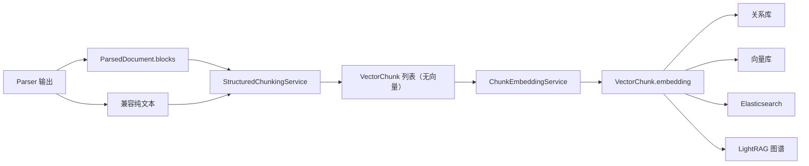
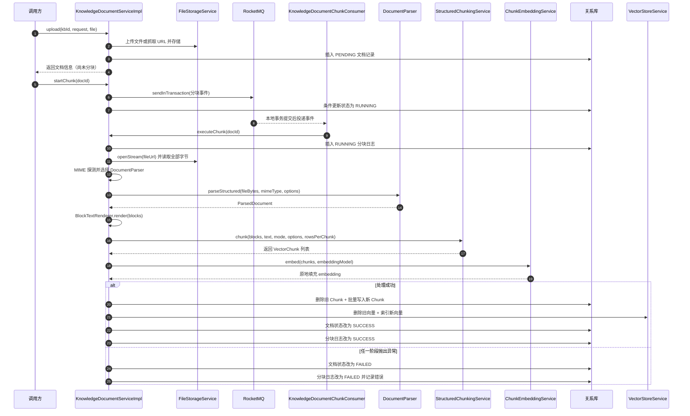
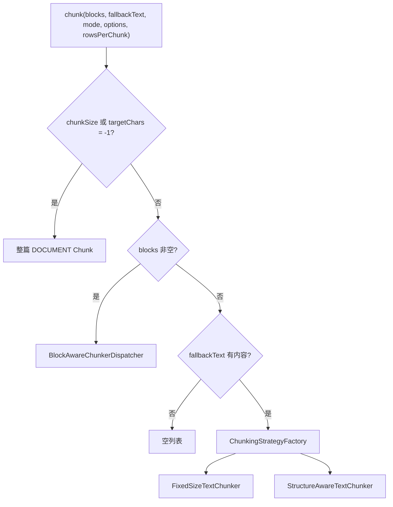
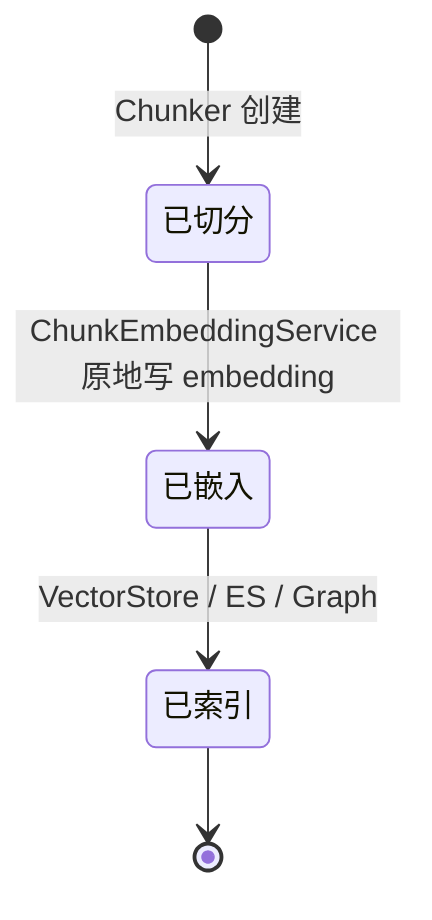
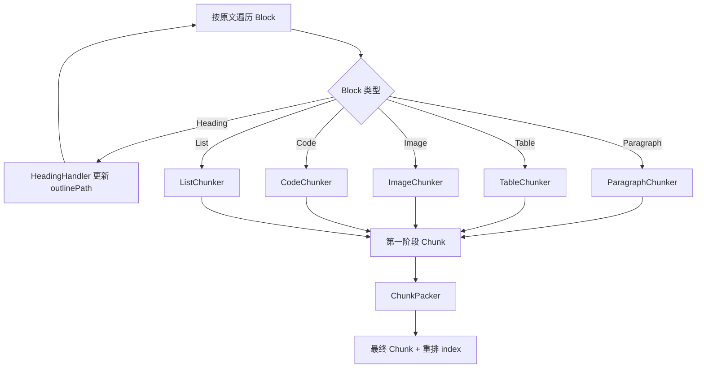
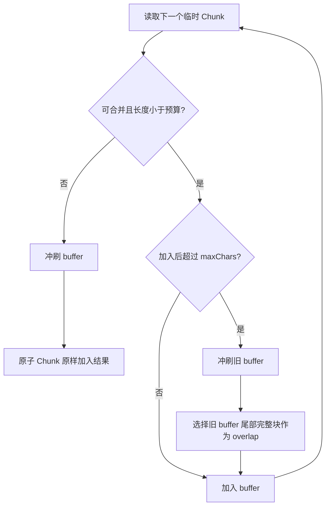
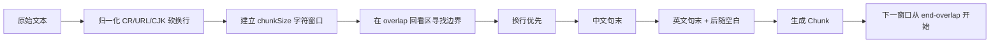

# Chunk 文档分块模块源码学习指南

## 1. 模块定位

`core/chunk` 位于 Parser 和索引之间：它把整篇文档转换成大小适中、语义尽量自包含的 `VectorChunk`，再由 Embedding 服务补充向量，最终交给关系库、向量库、关键词索引和图谱系统。

本文以 `study_0731` 分支提交 `12d86ba` 的业务实现为基线，覆盖 `chunk` 目录原有 22 个生产 Java 文件，以及新增的 3 个包级源码导览。



分块模块负责：

- 选择整篇、Block-aware 或纯文本分块路径；
- 控制 Chunk 字符预算和重叠；
- 保留章节、表格、代码、列表和图片语义；
- 区分展示正文和向量化正文；
- 批量调用 Embedding 并回填向量。

分块模块不负责：

- 解析 PDF、Excel 或图片；
- 把 Chunk 写入数据库或索引；
- 执行召回、融合和 Rerank；
- 按模型 Token 精确计费。当前所有大小预算均是 Java 字符长度。

## 2. 目录地图

| 目录 | 文件数 | 职责 |
| --- | ---: | --- |
| `chunk/` | 10 | 统一入口、配置模型、策略注册、结果 DTO 和 Embedding 适配 |
| `chunk/strategy/` | 3 | 没有 Parser Block 时使用的两种 legacy 纯文本策略 |
| `chunk/blockaware/` | 12 | 强类型 Block 分发、专用 Chunker、章节状态和最终打包 |

包级学习入口：

- [chunk/package-info.java](../../bootstrap/src/main/java/com/hjs/study/ragent/core/chunk/package-info.java)
- [strategy/package-info.java](../../bootstrap/src/main/java/com/hjs/study/ragent/core/chunk/strategy/package-info.java)
- [blockaware/package-info.java](../../bootstrap/src/main/java/com/hjs/study/ragent/core/chunk/blockaware/package-info.java)

## 3. 两条业务调用链

### 3.1 普通分块模式（CHUNK）

[KnowledgeDocumentServiceImpl](../../bootstrap/src/main/java/com/hjs/study/ragent/knowledge/service/impl/KnowledgeDocumentServiceImpl.java) 的入口不是一条“上传后立即同步分块”的调用链，而是“上传登记”和“异步执行”两个阶段：



关键边界：

- `upload()` 只完成来源校验、文件存储、Parser 能力预检和文档记录创建，不调用 Parser、Chunker 或 Embedding；
- `startChunk()` 使用事务消息，并在本地事务中以条件更新把文档切换为 `RUNNING`，防止同一文档重复启动；
- [KnowledgeDocumentChunkConsumer](../../bootstrap/src/main/java/com/hjs/study/ragent/knowledge/mq/KnowledgeDocumentChunkConsumer.java) 恢复操作者的 `UserContext` 后调用 `executeChunk()`；
- `runChunkTask()` 才是异步任务编排入口；普通 CHUNK 模式进入 `runChunkProcess()`，PIPELINE 模式进入 `runPipelineProcess()`；
- `runChunkProcess()` 从文档保存的 `chunkStrategy` 和 `chunkConfig` 创建 `ChunkingOptions`，依次执行 Extract、Chunk、Embed；
- `persistChunksAndVectorsAtomically()` 在一个 Spring 数据库事务回调中依次更新关系库和向量索引，但外部向量存储不具备与数据库相同的 ACID 事务语义；
- `runChunkTask()` 会捕获处理异常、将文档和分块日志标记为 `FAILED`，且不会把该异常继续抛给 MQ 消费者。

普通 CHUNK 模式的配置还读取两个自由键：

- `rowsPerChunk`：每个表格 Chunk 的数据行硬上限；
- `excelParser`：属于 Parser 选择，不是 Chunk 算法参数。

### 3.2 Ingestion Pipeline 模式

[ChunkerNode](../../bootstrap/src/main/java/com/hjs/study/ragent/ingestion/node/ChunkerNode.java) 是 Pipeline 适配层：

1. 读取 `ChunkerSettings`；
2. 优先取 `context.document.blocks`；
3. 纯文本优先使用 `enhancedText`，否则使用 `rawText`；
4. 调用 `StructuredChunkingService`；
5. 调用 `ChunkEmbeddingService`；
6. 把结果写入 `context.chunks`。

Pipeline 的 `chunkSize` 和 `overlapSize` 是通用表单字段，通过 `ChunkingMode.createDefaultOptions()` 投影为具体 record：

- `fixed_size`：对应 `chunkSize/overlapSize`；
- `structure_aware`：对应 `targetChars/overlapChars`，而 `maxChars/minChars` 使用枚举内默认值。

## 4. 统一入口的三条路由

[StructuredChunkingService](../../bootstrap/src/main/java/com/hjs/study/ragent/core/chunk/StructuredChunkingService.java) 是最重要的类。它按严格优先级选择路径：



### 4.1 整篇不分块

`chunkSize=-1` 或 `targetChars=-1` 是统一哨兵。它优先于 Block 判断：

- 优先用 `fallbackText`，因为它可能是增强后的全文；
- 没有 fallback 时用 `BlockTextRenderer`；
- 输出单个 `blockType=DOCUMENT` 的 Chunk；
- 收集所有 Parser Block ID；
- 不复制 `ImageBlock.assets` 和各专用 `embeddingText`。

因此“不分块”不是简单地把 Block-aware 结果数量设为 1，而是主动走全文拍平路径。

### 4.2 Block-aware

只要 `blocks` 非空，`mode` 不再决定算法实现。`fixed_size` 或 `structure_aware` 仅提供可转换的字符预算，真正执行的是 `blockaware` 包。

这是理解本模块的关键：

> 策略名称属于纯文本兼容层；Block 类型属于结构化主路径。

### 4.3 Legacy text

只有 blocks 为空且 fallbackText 有内容时，才会通过 [ChunkingStrategyFactory](../../bootstrap/src/main/java/com/hjs/study/ragent/core/chunk/ChunkingStrategyFactory.java) 选择字符串策略。

## 5. 配置模型

### 5.1 ChunkingMode

[ChunkingMode](../../bootstrap/src/main/java/com/hjs/study/ragent/core/chunk/ChunkingMode.java) 同时承担：

- 数据库/JSON 稳定值；
- 管理端标签和可见性；
- 弱类型 Map 到强类型 options 的转换；
- 默认配置生成；
- Jackson 序列化与反序列化。

| 模式 | 外部值 | 配置 record | 默认参数 |
| --- | --- | --- | --- |
| 固定大小 | `fixed_size` | `FixedSizeOptions` | `chunkSize=512`、`overlapSize=128` |
| 结构感知 | `structure_aware` | `TextBoundaryOptions` | `targetChars=1400`、`overlapChars=0`、`maxChars=1800`、`minChars=600` |

`fromValue()` 同时接受外部 value、Java 枚举名和连字符形式，例如 `structure-aware`。未知值抛异常，不静默回退。

`toInt()` 是宽松转换：数字、数字字符串都接受；缺失、空串和非法字符串使用默认值。record 本身不做范围校验，具体算法在使用时收敛或容忍。

### 5.2 ChunkingOptions

[ChunkingOptions](../../bootstrap/src/main/java/com/hjs/study/ragent/core/chunk/ChunkingOptions.java) 是 sealed interface，当前只允许：

- [FixedSizeOptions](../../bootstrap/src/main/java/com/hjs/study/ragent/core/chunk/FixedSizeOptions.java)
- [TextBoundaryOptions](../../bootstrap/src/main/java/com/hjs/study/ragent/core/chunk/TextBoundaryOptions.java)

`toConfigMap()` 不只是 API 展示方法，还被统一入口用于：

- 查找整篇哨兵；
- 从 legacy 配置推导 Block-aware 预算；
- 返回管理端所需默认键。

因此键名属于持久化契约，不能随意重命名。

### 5.3 BlockChunkConfig

[BlockChunkConfig](../../bootstrap/src/main/java/com/hjs/study/ragent/core/chunk/blockaware/BlockChunkConfig.java) 是 Block-aware 链内部配置：

| 字段 | 使用者 | 含义 |
| --- | --- | --- |
| `maxChars` | Paragraph、Table、Packer | 字符窗口或合并预算 |
| `overlapChars` | Paragraph、Packer | 段内字符重叠和跨块完整块重叠预算 |
| `rowsPerChunk` | Table | 数据行硬上限 |
| `maxListItems` | List | 短列表原子阈值 |
| `listItemsPerChunk` | List | 长列表每组项目数 |

从 legacy 配置派生时：

```text
maxChars     = chunkSize -> targetChars -> maxChars -> 默认 512
overlapChars = overlapSize -> overlapChars -> 默认 64
rowsPerChunk = 调用方正数 -> 默认 50
maxListItems = 15
itemsPerChunk = 10
```

这意味着 `TextBoundaryOptions` 进入 Block-aware 路径时，实际首先采用 `targetChars`，而不是它自己的 `maxChars` 字段。例如默认结构感知配置会得到 Block-aware `maxChars=1400`。

紧凑构造器保证：

- `maxChars > 0`；
- `0 <= overlapChars < maxChars`；
- 行数和列表项参数都为正数。

## 6. VectorChunk 数据契约

[VectorChunk](../../bootstrap/src/main/java/com/hjs/study/ragent/core/chunk/VectorChunk.java) 是可变 DTO。它在不同阶段被逐步填充：



### 6.1 字段分组

| 字段 | 生产者 | 作用 |
| --- | --- | --- |
| `chunkId` | Chunker/Packer | Chunk 身份，通常是雪花 ID |
| `index` | Chunker，最终由 Packer 重排 | 文档内顺序 |
| `content` | 所有 Chunker | 展示、关系库、LLM 和全文索引正文 |
| `embeddingText` | Table/Image/Packer | 向量化专用文本，不展示 |
| `embedding` | ChunkEmbeddingService | 向量库输入 |
| `blockType` | Block-aware/整篇路径 | DOCUMENT、PARAGRAPH、TABLE、IMAGE、CODE、LIST |
| `outlinePath` | HeadingHandler + 专用 Chunker | 章节层级 |
| `sourceBlockIds` | 专用 Chunker/Packer | 反查 Parser Block |
| `assets` | ImageChunker/Packer | 图片资产引用 |
| `sectionContext` | Table/Image/Packer | Sheet、caption、表头等上下文 |
| `metadata` | 扩展调用方 | 通用索引元数据 |

### 6.2 三类文本必须区分

```text
content        = 人和 LLM 看到的正文
embeddingText  = Embedding 模型看到的优化文本
sectionContext = 所属表格/Sheet 等补充上下文
```

表格示例：

```text
content:
| 姓名 | 年龄 |
|---|---|
| 张三 | 25 |

embeddingText:
sheet=员工; headers=姓名, 年龄
姓名: 张三; 年龄: 25
```

图片示例：

```text
content:
一张系统架构图，展示网关、服务和数据库之间的调用关系。


embeddingText:
一张系统架构图，展示网关、服务和数据库之间的调用关系。
```

这样既保留展示资源，又减少 URL 对向量语义的干扰。

### 6.3 下游消费边界

不同索引后端读取的字段并不完全相同：

- PGVector/Milvus 主要保存 `content`、`embedding`、通用 metadata、docId 和 index；
- Elasticsearch 还显式写入 `blockType` 与 `outlinePath`；
- LightRAG 把 Chunk content 重新拼接成全文；
- 关系库的基础 Chunk 记录主要保存 ID、index 和 content。

扩展 VectorChunk 字段时，不能只修改 DTO；必须逐一反查关系库、所有向量实现、ES、图谱和检索结果组装器。

## 7. Block-aware 主链

### 7.1 Dispatcher：一次有状态遍历

[BlockAwareChunkerDispatcher](../../bootstrap/src/main/java/com/hjs/study/ragent/core/chunk/blockaware/BlockAwareChunkerDispatcher.java) 在单次方法调用中维护：

- 当前 `outlinePath`；
- 第一阶段 `chunkIndex`；
- 已生成临时 Chunk 列表。



组件是 Spring 单例，但章节路径和 index 都是局部变量，因此不同文档可并发执行。

### 7.2 HeadingHandler

[HeadingHandler](../../bootstrap/src/main/java/com/hjs/study/ragent/core/chunk/blockaware/HeadingHandler.java) 不生成 Chunk，只转换章节路径：

```text
H1 A -> [A]
H2 B -> [A, B]
H2 C -> [A, C]
H1 D -> [D]
H3 E -> [D, E]
```

跳级标题不会制造空层级。返回值是不可变新列表，不修改旧路径。

### 7.3 ParagraphChunker

[ParagraphChunker](../../bootstrap/src/main/java/com/hjs/study/ragent/core/chunk/blockaware/ParagraphChunker.java)：

- 短段落先形成一个临时 Chunk；
- 长段落按 `maxChars` 固定字符窗口切分；
- 相邻窗口重叠 `overlapChars`；
- 不额外寻找句末边界，因为 Parser 已建立自然段 Block；
- 每个结果保留同一个 sourceBlockId 和章节路径。

这里的重叠发生在“一个长段落内部”。后续 ChunkPacker 还可能在“多个完整小块之间”建立重叠，两者不是同一层概念。

### 7.4 TableChunker

[TableChunker](../../bootstrap/src/main/java/com/hjs/study/ragent/core/chunk/blockaware/TableChunker.java) 同时受两个条件控制：

```text
加入下一行后 key-value 成本是否超过 maxChars
或
当前组数据行是否达到 rowsPerChunk
```

设计要点：

- 每个 Chunk 都复制完整表头；
- content 使用 Markdown；
- embeddingText 使用 key-value；
- 空 Cell 不进入 key-value 文本；
- Cell 内换行在 embeddingText 中变空格，在 Markdown 中变 `<br>`；
- Cell 中的 `|` 会转义；
- 单行超预算仍保持完整；
- 只有表头、没有数据行时仍生成一个 Chunk；
- TABLE 是 Packer 原子边界。

`maxChars` 是近似预算：行成本不包含 sectionContext、换行、Markdown 表头和分隔行，因此最终文本可能略大于配置值。

### 7.5 ImageChunker

[ImageChunker](../../bootstrap/src/main/java/com/hjs/study/ragent/core/chunk/blockaware/ImageChunker.java)：

- asset 缺失时丢弃该 Block；
- caption 优先于 altText；
- description 存在时进入 content 和 embeddingText；
- URL 只进入 content；
- AssetRef 进入 assets；
- IMAGE 可被 Packer 与相邻文字合并。

独立图片 Parser 通常有 VLM description；MinerU 文档内图片当前可能只有链接和 caption，此时 embeddingText 为 null，Embedding 服务会回退 content。

### 7.6 CodeChunker

[CodeChunker](../../bootstrap/src/main/java/com/hjs/study/ragent/core/chunk/blockaware/CodeChunker.java) 为代码补回 Markdown 围栏，并始终生成一个原子 Chunk。

代码完整性优先于字符预算：即使代码超过 maxChars，也不会切断语法。CODE 会截断 Packer 两侧的合并与重叠传播。

### 7.7 ListChunker

[ListChunker](../../bootstrap/src/main/java/com/hjs/study/ragent/core/chunk/blockaware/ListChunker.java)：

- 项目数不超过 `maxListItems` 时整表原子保留；
- 长列表按 `listItemsPerChunk` 分组；
- 有序列表的后续组延续全局编号；
- 阈值按项目数，不按字符数；
- LIST 属于 Packer 可流动类型。

因此一个非常长的单项列表仍可能超出 maxChars，这是“不切断一个业务项目”的取舍。

## 8. ChunkPacker：为什么分完还要再打包

每个专用 Chunker 一次只看一个 Block。如果文档由很多短段落构成，第一阶段会产生大量小 Chunk。 [ChunkPacker](../../bootstrap/src/main/java/com/hjs/study/ragent/core/chunk/blockaware/ChunkPacker.java) 用第二阶段贪心合并把字符预算从“上限”变成更接近“目标”。

### 8.1 可流动与原子类型

| 类型 | 是否可合并 | 原因 |
| --- | --- | --- |
| PARAGRAPH | 是 | 相邻短段落需要共同上下文 |
| LIST | 是 | 短列表可与说明段落组合 |
| IMAGE | 是 | 图片应跟随前导语或解释文字 |
| TABLE | 否 | Markdown 表格和行语义需完整 |
| CODE | 否 | 围栏与语法需完整 |
| 长度 `>= maxChars` 的流动块 | 否 | 自身已用满或突破预算 |

### 8.2 贪心合并



合并时：

- content 用双换行连接；
- embeddingText 对每个成员执行“显式值优先，否则 content”；
- sourceBlockIds 保序去重；
- assets 按成员顺序连接，当前不去重；
- outlinePath 取最长公共前缀；
- sectionContext 取第一个非空值；
- 同质类型保留，异质流动块标为 PARAGRAPH；
- 生成新的 chunkId；
- 最终 index 从 0 重排。

新合并对象不会继承成员 embedding 和 metadata。因此 Packer 必须运行在 Embedding 之前。

### 8.3 完整块级重叠

Packer 不截取上一结果末尾的任意字符，而是从旧 buffer 尾部选择预算内的连续完整 Chunk：

```text
上一组: [段落 A][短列表 B][图片 C]
overlap 预算能容纳 B+C
下一组: [短列表 B][图片 C][段落 D]
```

如果最后一个完整块本身已超过 overlap 预算，就不跳过它选择更早内容，因为那不再是“尾部上下文”。分隔符和当前新块也会预先占用预算，避免合并结果越界。

## 9. 两种 legacy 纯文本策略

### 9.1 FixedSizeTextChunker

[FixedSizeTextChunker](../../bootstrap/src/main/java/com/hjs/study/ragent/core/chunk/strategy/FixedSizeTextChunker.java) 的流程：



归一化规则值得单独理解：

- 删除 CR；
- 拼接 `https://example.\ncom` 等明显 URL 断行；
- 不跨两个以上换行拼接 URL；
- 不吞掉新行开头的 `2.`、`2)`、`2）` 数字列表；
- 合并两个 CJK 词字符之间的单个软换行；
- 只识别显式 `http://` 和 `https://`，不识别裸域名。

边界对齐最多向前回看 overlap 字符。英文 `.` 只有后面是空白或文本结束才算句末，避免在域名中切分。

普通非法参数会被钳制：chunkSize 至少 1，overlap 被限制到小于 chunkSize。`chunkSize=-1` 是整篇模式。

### 9.2 StructureAwareTextChunker

[StructureAwareTextChunker](../../bootstrap/src/main/java/com/hjs/study/ragent/core/chunk/strategy/StructureAwareTextChunker.java) 不是 CommonMark Parser，也不消费 Parser Block。它是字符串上的轻量扫描器：

1. 把 CRLF/CR 统一为 LF；
2. 识别 ATX 标题、三反引号代码、独占一行的图片/链接和自然段；
3. 用原文半开坐标保存轻量 Block；
4. 把块间空白归入前块；
5. 按 max 贪心打包；
6. 必要时为满足 min 吸收一个超限块；
7. 尝试把过小末块并回前块；
8. 可选复制上一范围尾部字符作为 overlap。

预算语义：

- `maxChars` 是主体软上限；
- `minChars` 允许算法为避免碎块“忍一次超限”；
- `targetChars` 当前主要参与末块过小阈值；
- 末块与前块合并时最多放宽到 `maxChars * 2`；
- 单个代码或原子链接本身超长时不切分；
- overlap 是字符尾部复制，可能从一个语法块中间开始，并扩大下一 Chunk。

它只识别 `#` 标题和三反引号围栏，不识别 Setext 标题、波浪线代码围栏或完整 Markdown AST。

## 10. ChunkEmbeddingService

[ChunkEmbeddingService](../../bootstrap/src/main/java/com/hjs/study/ragent/core/chunk/ChunkEmbeddingService.java) 的职责很窄：

```text
List<VectorChunk>
    -> 选择 embeddingText，空白则回退 content
    -> EmbeddingService.embedBatch
    -> 校验结果行数
    -> List<Float> 转 float[]
    -> 按原顺序写回每个 Chunk
```

几个重要行为：

- chunks 为 null/空时直接返回；
- 所有 Chunk 已有向量时跳过；
- 只要一个 Chunk 缺向量，就整批重新计算并覆盖全部结果；
- 显式模型 ID 为空时使用系统默认模型；
- 返回行数必须与 Chunk 数量严格一致；
- 某一行向量为 null 会失败；
- 维度一致性主要由模型服务或向量存储继续校验。

该方法原地修改对象，因此不能把输入当成不可变值列表。

## 11. 三种 ID 与顺序

| 标识 | 产生阶段 | 用途 |
| --- | --- | --- |
| `Block.id` | Parser | 解析结构身份、资产关联 |
| `VectorChunk.chunkId` | Chunker/Packer | 关系库和索引主键 |
| `VectorChunk.index` | Chunker，Packer 最终重排 | 文档内阅读顺序 |

一个 Block 可以产生多个 Chunk，例如长段落、长列表和大表格；多个 Block 也可以经 Packer 合并为一个 Chunk。因此 `sourceBlockIds` 是列表，而不是单值。

## 12. 重要设计边界

### 12.1 字符预算不是 Token 预算

所有算法使用 `String.length()`。中文、英文、Emoji 与模型分词的对应关系不同，配置只能作为近似体量控制。Embedding Provider 的真实 token 上限仍需独立保护。

### 12.2 maxChars 不是所有路径的绝对硬上限

允许超限的情况包括：

- 单个代码块；
- 单条超长表格记录；
- 单个超长列表项；
- StructureAware 为满足 min 吸收下一结构块；
- StructureAware 合并过小末块；
- Table 的上下文、表头和 Markdown 额外开销。

这是语义完整性优先于机械长度的设计。

### 12.3 两种重叠语义

| 位置 | 重叠单位 | 特点 |
| --- | --- | --- |
| FixedSize/Paragraph | 字符 | 精确控制长度，但可能从语句中间开始 |
| StructureAware legacy | 字符尾部 | 主体边界结构化，重叠本身仍可能切结构 |
| ChunkPacker | 完整临时 Chunk | 不切段落/列表/图片，但可能无法用满预算 |

### 12.4 增强文本与 Block 的优先级

Pipeline 同时可能存在 `enhancedText` 和 Parser Block。统一入口只要看到 blocks 非空，就走 Block-aware；enhancedText 主要作为整篇模式或 legacy fallback。也就是说，文档级增强文本不会自动替换每个 Block 的正文。

### 12.5 可变 DTO 与调用顺序

正确顺序是：

```text
专用 Chunker -> ChunkPacker -> ChunkEmbeddingService -> 持久化/索引
```

如果先 Embedding 再 Packer，合并产生的新 Chunk 不会继承已有向量。

## 13. 扩展约束

### 13.1 新增纯文本策略

1. 实现 `ChunkingStrategy` 并注册为 Spring Bean；
2. 在 `ChunkingMode` 增加模式、外部 value、标签和 options 工厂；
3. 扩展 `ChunkingOptions permits`；
4. 确保 getType 唯一，工厂会拒绝重复；
5. 明确空输入、哨兵、非法配置和超长原子内容行为；
6. 返回稳定顺序、唯一 ID 和连续 index；
7. 同步前端默认配置和文档配置校验。

### 13.2 新增 Parser Block 类型

除 Parser 文档中列出的 sealed/Jackson 变更外，Chunk 模块还需：

1. 新建专用 `BlockChunker<B>`；
2. 注入并扩展 Dispatcher 的类型分发；
3. 决定它是否可被 Packer 合并；
4. 定义 content、embeddingText、assets 和 sectionContext；
5. 决定超长内容是切分还是保持原子；
6. 更新所有索引后端对 blockType/metadata 的处理；
7. 增加序列化、分块、合并和检索回填测试。

### 13.3 新增 VectorChunk 字段

必须反查：

- ChunkPacker 合并传播；
- ChunkEmbeddingService 文本选择；
- PGVector/Milvus 写入；
- Elasticsearch 文档；
- LightRAG 全文同步；
- 关系库 Chunk DTO；
- 检索结果和前端来源展示。

## 14. 测试现状与建议

当前 `core/chunk` 专项测试主要是 [ChunkPackerTest](../../bootstrap/src/test/java/com/hjs/study/ragent/core/chunk/blockaware/ChunkPackerTest.java)，覆盖：

- overlap 计算后合并正文不超过 maxChars；
- 合并不丢失图片优化后的 embeddingText 和 sectionContext。

建议补齐：

| 层级 | 推荐用例 |
| --- | --- |
| ChunkingMode | JSON 值、枚举名、连字符、非法数字、未知模式 |
| StructuredChunkingService | 三条路由优先级、-1 哨兵、空输入、配置投影 |
| FixedSize | URL 断行、数字列表、CJK 软换行、英文域名点、边界推进 |
| StructureAware | 标题、未闭合代码、原子图片、空行归属、min/max/末块合并 |
| Heading | 同级替换、降级、跳级、非法 level |
| Paragraph | 窗口与字符重叠、空段落、sourceBlockId |
| Table | 宽表、空值、超长单行、仅表头、转义、sectionContext |
| Image | VLM 描述、无描述、缺资产、caption 优先级 |
| List/Code | 编号连续、长项目、原子超限 |
| Packer | 原子边界、完整块 overlap、公共章节前缀、assets/source ID 传播 |
| Embedding | 默认/显式模型、部分已有向量、行数错位、空返回 |
| End-to-end | Parser Block -> Chunk -> Embedding -> 各索引字段一致性 |

纯算法测试应使用离线单元测试；Embedding 和索引测试应与外部 Provider/中间件集成测试分开。

## 15. 推荐阅读顺序

### 第一遍：掌握统一决策

1. [package-info.java](../../bootstrap/src/main/java/com/hjs/study/ragent/core/chunk/package-info.java)
2. [StructuredChunkingService.java](../../bootstrap/src/main/java/com/hjs/study/ragent/core/chunk/StructuredChunkingService.java)
3. [ChunkingMode.java](../../bootstrap/src/main/java/com/hjs/study/ragent/core/chunk/ChunkingMode.java)
4. [VectorChunk.java](../../bootstrap/src/main/java/com/hjs/study/ragent/core/chunk/VectorChunk.java)

### 第二遍：掌握 Block-aware

1. [BlockAwareChunkerDispatcher.java](../../bootstrap/src/main/java/com/hjs/study/ragent/core/chunk/blockaware/BlockAwareChunkerDispatcher.java)
2. [HeadingHandler.java](../../bootstrap/src/main/java/com/hjs/study/ragent/core/chunk/blockaware/HeadingHandler.java)
3. [ParagraphChunker.java](../../bootstrap/src/main/java/com/hjs/study/ragent/core/chunk/blockaware/ParagraphChunker.java)
4. [TableChunker.java](../../bootstrap/src/main/java/com/hjs/study/ragent/core/chunk/blockaware/TableChunker.java)
5. [ImageChunker.java](../../bootstrap/src/main/java/com/hjs/study/ragent/core/chunk/blockaware/ImageChunker.java)
6. [ChunkPacker.java](../../bootstrap/src/main/java/com/hjs/study/ragent/core/chunk/blockaware/ChunkPacker.java)

### 第三遍：掌握兼容路径

1. [ChunkingStrategyFactory.java](../../bootstrap/src/main/java/com/hjs/study/ragent/core/chunk/ChunkingStrategyFactory.java)
2. [FixedSizeTextChunker.java](../../bootstrap/src/main/java/com/hjs/study/ragent/core/chunk/strategy/FixedSizeTextChunker.java)
3. [StructureAwareTextChunker.java](../../bootstrap/src/main/java/com/hjs/study/ragent/core/chunk/strategy/StructureAwareTextChunker.java)

### 第四遍：反向追踪消费者

1. [ChunkerNode.java](../../bootstrap/src/main/java/com/hjs/study/ragent/ingestion/node/ChunkerNode.java)
2. [ChunkEmbeddingService.java](../../bootstrap/src/main/java/com/hjs/study/ragent/core/chunk/ChunkEmbeddingService.java)
3. [PgVectorStoreService.java](../../bootstrap/src/main/java/com/hjs/study/ragent/rag/core/vector/PgVectorStoreService.java)
4. [MilvusVectorStoreService.java](../../bootstrap/src/main/java/com/hjs/study/ragent/rag/core/vector/MilvusVectorStoreService.java)
5. [EsKeywordIndexService.java](../../bootstrap/src/main/java/com/hjs/study/ragent/rag/core/keyword/EsKeywordIndexService.java)

## 16. 阅读自检

完成本模块学习后，应能回答：

1. 为什么 `ChunkingMode` 不一定决定最终使用哪个 Chunker？
2. 整篇不分块为什么优先于 Block-aware？
3. `content`、`embeddingText` 和 `sectionContext` 分别给谁使用？
4. 为什么表格 embedding 不直接使用 Markdown？
5. `targetChars` 和 `maxChars` 在 StructureAware 中分别起什么作用？
6. 为什么代码、表格和超长列表项允许突破预算？
7. Paragraph 重叠与 ChunkPacker 重叠有什么区别？
8. ChunkPacker 为什么必须运行在 Embedding 之前？
9. 多个 Block 合并后 outlinePath 为什么取最长公共前缀？
10. 新增 VectorChunk 字段时为什么必须检查所有索引后端？

能够沿着源码回答这些问题，就已经掌握了该模块的决策逻辑、数据契约和扩展边界。
