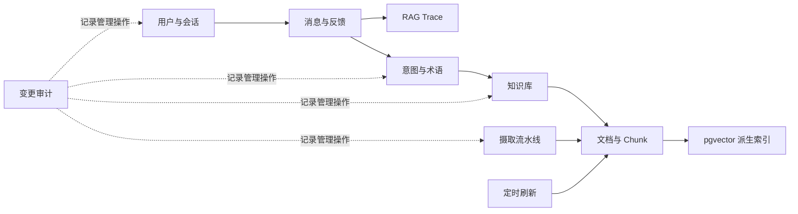
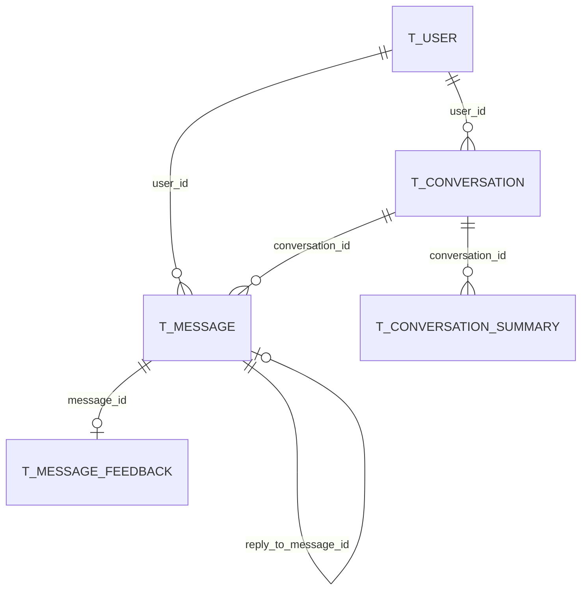
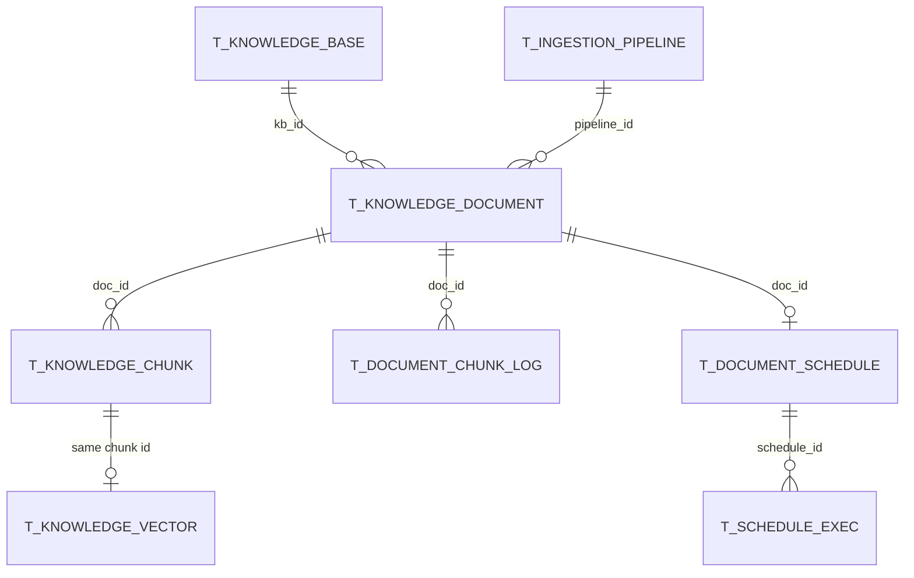
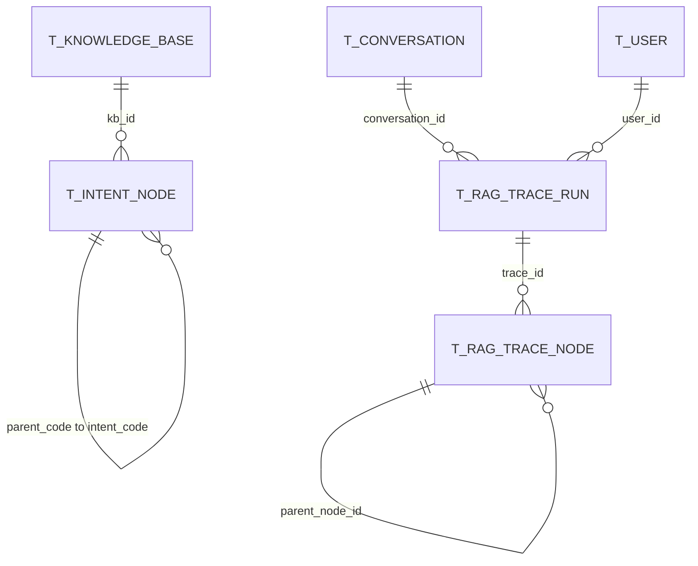
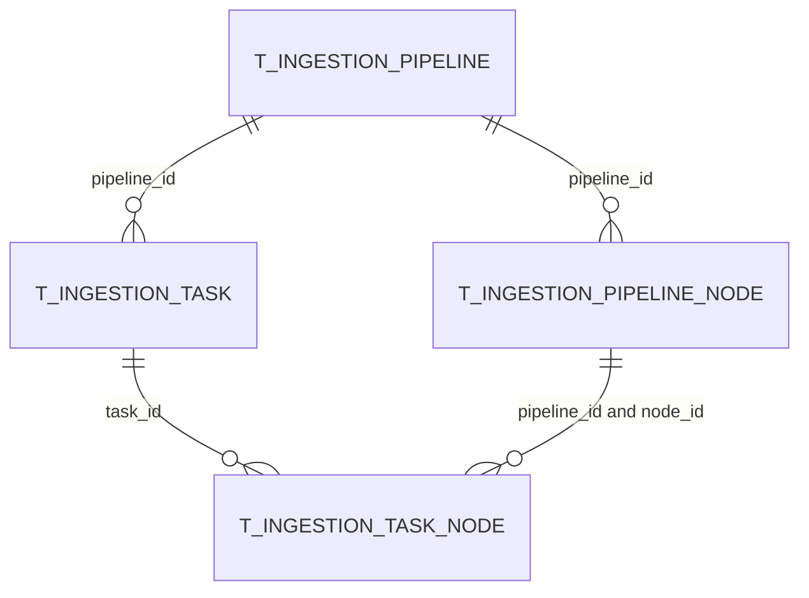

# 数据库表完整参考

## 1. 文档范围与权威来源

本文面向需要理解数据模型、排查数据问题或进行二次开发的读者，逐项说明项目自有的 22 张 PostgreSQL 表。内容以当前 `study_0731` 分支提交 `12d86ba4303fd23b29700afacf05cb3a463cec51` 的源码与工作树为基线。

权威来源按优先级排列：

1. [schema_pg.sql](../../resources/database/schema_pg.sql)：新环境完整建库脚本，是字段类型、默认值、唯一约束和索引的首要依据；
2. [upgrade_v1.0_to_v1.1.sql](../../resources/database/upgrade_v1.0_to_v1.1.sql) 至 [upgrade_v1.5_to_v1.6.sql](../../resources/database/upgrade_v1.5_to_v1.6.sql)：已有环境的增量演进路径；
3. 各表对应的 `DO`、Mapper 和 Service：解释字段在当前代码中的真实读写语义；
4. [init_data_pg.sql](../../resources/database/init_data_pg.sql)：只负责初始化管理员数据，不定义额外表。

`resources/database/backups/schema_table.sql` 是旧 MySQL 结构备份，不是当前 PostgreSQL 运行时 schema。它只有 20 张业务表，没有当前的 `t_biz_change_log` 和 `t_knowledge_vector`，不能用于判断现行表结构。

本文所说的“22 张表”只包括项目仓库自行创建和维护的 PostgreSQL 表。Milvus collection、Elasticsearch index、Neo4j 图以及 LightRAG 自动创建的 `LIGHTRAG_*` 表在第 10 节单独说明，不混入项目表数量。

## 2. 全局设计约定

### 2.1 领域分组

| 领域 | 表数 | 表 |
| --- | ---: | --- |
| 用户、会话与反馈 | 6 | `t_user`、`t_conversation`、`t_conversation_summary`、`t_message`、`t_message_feedback`、`t_sample_question` |
| 业务审计 | 1 | `t_biz_change_log` |
| 知识库与向量 | 7 | `t_knowledge_base`、`t_knowledge_document`、`t_knowledge_chunk`、`t_knowledge_document_chunk_log`、`t_knowledge_document_schedule`、`t_knowledge_document_schedule_exec`、`t_knowledge_vector` |
| 意图、术语与 Trace | 4 | `t_intent_node`、`t_query_term_mapping`、`t_rag_trace_run`、`t_rag_trace_node` |
| 摄取流水线 | 4 | `t_ingestion_pipeline`、`t_ingestion_pipeline_node`、`t_ingestion_task`、`t_ingestion_task_node` |



### 2.2 主键与关联

- 绝大多数主键是 `VARCHAR(20)`，Java Entity 使用 `IdType.ASSIGN_ID`，由 [CustomIdentifierGenerator](../../framework/src/main/java/com/hjs/study/ragent/framework/distributedid/CustomIdentifierGenerator.java) 生成 Snowflake ID。数据库没有使用自增序列。
- 22 张表之间没有声明任何 `FOREIGN KEY`。`user_id`、`kb_id`、`doc_id`、`pipeline_id`、`trace_id` 等都是应用层逻辑关联。
- 没有外键让异步删除、数据迁移和多存储同步更灵活，但数据库不能阻止孤儿数据。删除服务、事务消息、清理消费者和一致性巡检因此非常重要。
- `t_knowledge_vector.id` 与 `t_knowledge_chunk.id` 使用同一个 Chunk ID，使关系记录、向量记录和 Elasticsearch `_id` 可以对齐。

### 2.3 时间、逻辑删除与自动填充

- 大多数业务时间使用无时区 `TIMESTAMP`；只有审计表 `t_biz_change_log.create_time` 使用 `TIMESTAMPTZ`。
- 16 张 Entity 在 `deleted` 字段上使用 `@TableLogic`，MyBatis-Plus 查询会自动附加未删除条件，删除会转为 `deleted=1`。
- `t_query_term_mapping` 的 SQL 中存在 `deleted` 列，但 [QueryTermMappingDO](../../bootstrap/src/main/java/com/hjs/study/ragent/rag/dao/entity/QueryTermMappingDO.java) 没有映射它，当前 `deleteById()` 是物理删除。
- 审计、分块日志、调度、调度执行和向量表本身没有逻辑删除字段。
- [MyMetaObjectHandler](../../framework/src/main/java/com/hjs/study/ragent/framework/database/MyMetaObjectHandler.java) 只会为带相应 `@TableField(fill=...)` 的 Entity 字段填充 `createTime`、`updateTime` 和 `deleted`。使用 Wrapper 更新时可能需要显式刷新 `update_time`。

### 2.4 JSONB 与派生数据

| JSONB 字段 | Java 形态 | 主要用途 |
| --- | --- | --- |
| `t_message.sources` | `List<SourceRef>` | 回答来源面板与原文预览 |
| `t_message.retrieved_chunks` | `List<GroundingChunk>` | 推荐追问生成的 Grounding |
| `t_message.recommended_questions` | `List<String>` | 已生成推荐问题缓存 |
| `t_biz_change_log.*_snapshot/change_diff` | JSON 字符串 | 变更前后快照与字段差异 |
| `t_knowledge_document.chunk_config` | JSON 字符串 | 分块策略参数和 Parser 自由键 |
| `t_ingestion_pipeline_node.settings_json/condition_json` | JSON 字符串 | 节点配置与条件 |
| `t_ingestion_task.logs_json/metadata_json` | JSON 字符串 | 任务日志和扩展元数据 |
| `t_knowledge_vector.metadata` | JSON 对象 | `doc_id`、`chunk_index` 及扩展过滤字段 |

这些字段通过自定义 TypeHandler 或 JDBC 显式 `::jsonb` 转换写入。修改 JSON 结构时要同时检查历史数据兼容、前端反序列化和缓存内容。

## 3. 用户、会话与反馈



图中的连线表示应用逻辑关系，不是数据库外键。

### 3.1 `t_user`：系统用户

对应 [UserDO](../../bootstrap/src/main/java/com/hjs/study/ragent/user/dao/entity/UserDO.java)，主要由 [AuthServiceImpl](../../bootstrap/src/main/java/com/hjs/study/ragent/user/service/impl/AuthServiceImpl.java) 和 [UserServiceImpl](../../bootstrap/src/main/java/com/hjs/study/ragent/user/service/impl/UserServiceImpl.java) 读写。

| 字段 | PostgreSQL 类型 | 约束/默认值 | 业务含义 |
| --- | --- | --- | --- |
| `id` | `VARCHAR(20)` | 主键，非空 | Snowflake 用户 ID，也是 Sa-Token 登录 ID |
| `username` | `VARCHAR(64)` | 非空，唯一 | 登录名；唯一约束为 `uk_user_username` |
| `password` | `VARCHAR(128)` | 非空 | 登录密码。当前源码直接比较和保存字符串，没有执行密码哈希 |
| `role` | `VARCHAR(32)` | 非空 | `admin` 或 `user`，见 [UserRole](../../bootstrap/src/main/java/com/hjs/study/ragent/user/enums/UserRole.java) |
| `avatar` | `VARCHAR(128)` | 可空 | 头像 URL |
| `create_time` | `TIMESTAMP` | 默认当前时间 | 创建时间 |
| `update_time` | `TIMESTAMP` | 默认当前时间 | 最近更新时间 |
| `deleted` | `SMALLINT` | 默认 `0` | 逻辑删除：`0` 正常，`1` 删除 |

索引与关系：

- `uk_user_username(username)` 防止用户名重复；
- `id` 被会话、消息、反馈、Trace 等表的 `user_id` 逻辑引用；
- 用户删除不会由数据库级联清理这些关联记录。

### 3.2 `t_conversation`：会话列表

对应 [ConversationDO](../../bootstrap/src/main/java/com/hjs/study/ragent/rag/dao/entity/ConversationDO.java)，由 [ConversationServiceImpl](../../bootstrap/src/main/java/com/hjs/study/ragent/rag/service/impl/ConversationServiceImpl.java) 管理会话标题和最近活动时间。

| 字段 | PostgreSQL 类型 | 约束/默认值 | 业务含义 |
| --- | --- | --- | --- |
| `id` | `VARCHAR(20)` | 主键，非空 | 表记录主键，不等同于外部会话标识 |
| `conversation_id` | `VARCHAR(20)` | 非空 | 在聊天请求、消息和摘要之间传播的会话 ID |
| `user_id` | `VARCHAR(20)` | 非空 | 会话所属用户 |
| `title` | `VARCHAR(128)` | 非空 | 会话展示标题，可在首次回答后生成或更新 |
| `last_time` | `TIMESTAMP` | 可空 | 最近一条消息时间，用于会话列表排序 |
| `create_time` | `TIMESTAMP` | 默认当前时间 | 创建时间 |
| `update_time` | `TIMESTAMP` | 默认当前时间 | 更新时间 |
| `deleted` | `SMALLINT` | 默认 `0` | 逻辑删除标志 |

索引与关系：

- `uk_conversation_user(conversation_id,user_id)` 保证一个用户只有一条同会话记录；
- `idx_user_time(user_id,last_time)` 支持按用户查询最近会话；
- 消息和摘要使用 `conversation_id + user_id` 关联，而不是使用本表的 `id`。

### 3.3 `t_conversation_summary`：会话压缩摘要

对应 [ConversationSummaryDO](../../bootstrap/src/main/java/com/hjs/study/ragent/rag/dao/entity/ConversationSummaryDO.java)。[JdbcConversationMemorySummaryService](../../bootstrap/src/main/java/com/hjs/study/ragent/rag/core/memory/JdbcConversationMemorySummaryService.java) 生成摘要，[ConversationMessageServiceImpl](../../bootstrap/src/main/java/com/hjs/study/ragent/rag/service/impl/ConversationMessageServiceImpl.java) 在读取历史时使用它。

| 字段 | PostgreSQL 类型 | 约束/默认值 | 业务含义 |
| --- | --- | --- | --- |
| `id` | `VARCHAR(20)` | 主键，非空 | 摘要记录 ID |
| `conversation_id` | `VARCHAR(20)` | 非空 | 所属会话 |
| `user_id` | `VARCHAR(20)` | 非空 | 所属用户，用于租户隔离 |
| `last_message_id` | `VARCHAR(20)` | 非空 | 本摘要已经覆盖到的最后一条消息 ID |
| `content` | `TEXT` | 非空 | LLM 压缩后的历史摘要 |
| `create_time` | `TIMESTAMP` | 默认当前时间 | 创建时间 |
| `update_time` | `TIMESTAMP` | 默认当前时间 | 摘要最近刷新时间 |
| `deleted` | `SMALLINT` | 默认 `0` | 逻辑删除标志 |

`idx_conv_user(conversation_id,user_id)` 支持按会话与用户读取摘要。Schema 没有限制每个会话只能有一条摘要，当前服务逻辑负责维护有效记录。

### 3.4 `t_message`：会话消息

对应 [ConversationMessageDO](../../bootstrap/src/main/java/com/hjs/study/ragent/rag/dao/entity/ConversationMessageDO.java)，是聊天主链最核心的事实表之一。[ConversationMessageServiceImpl](../../bootstrap/src/main/java/com/hjs/study/ragent/rag/service/impl/ConversationMessageServiceImpl.java) 负责查询与转换，[StreamChatEventHandler](../../bootstrap/src/main/java/com/hjs/study/ragent/rag/service/handler/StreamChatEventHandler.java) 在流结束或取消时构造最终助手消息。

| 字段 | PostgreSQL 类型 | 约束/默认值 | 业务含义 |
| --- | --- | --- | --- |
| `id` | `VARCHAR(20)` | 主键，非空 | 消息 ID |
| `conversation_id` | `VARCHAR(20)` | 非空 | 所属会话 ID |
| `user_id` | `VARCHAR(20)` | 非空 | 消息所属用户 |
| `role` | `VARCHAR(16)` | 非空 | `user` 或 `assistant`；数据库通常不保存 Prompt 中临时的 `system` 消息 |
| `content` | `TEXT` | 非空 | 用户问题或助手最终回答 |
| `thinking_content` | `TEXT` | 可空 | 深度思考文本，仅助手消息通常有值 |
| `thinking_duration` | `INTEGER` | 可空 | 深度思考耗时，单位秒 |
| `sources` | `JSONB` | 可空 | 文档级 `SourceRef` 列表，用于来源面板和预览 |
| `recommended_questions` | `JSONB` | 可空 | 推荐追问列表；空数组也可作为“成功但无推荐”的负缓存 |
| `retrieved_chunks` | `JSONB` | 可空 | 推荐问题生成使用的 `GroundingChunk` 列表，不作为回答模型上下文 |
| `reply_to_message_id` | `VARCHAR(20)` | 可空 | 助手消息对应的用户消息 ID，形成一轮问答的自关联 |
| `message_status` | `VARCHAR(16)` | 非空，默认 `NORMAL` | `NORMAL`、`INTERRUPTED` 或 `REJECTED` |
| `create_time` | `TIMESTAMP` | 默认当前时间 | 消息创建时间，也是历史排序依据 |
| `update_time` | `TIMESTAMP` | 默认当前时间 | 消息更新时间，推荐问题异步回填时会变化 |
| `deleted` | `SMALLINT` | 默认 `0` | 逻辑删除标志 |

索引与注意点：

- `idx_conversation_user_time(conversation_id,user_id,create_time)` 支持加载某用户的会话历史；
- `idx_conversation_summary` 与上一个索引包含完全相同的列，是当前 schema 中的重复索引；
- `reply_to_message_id` 没有外键或索引；推荐问题回填通常通过助手消息 ID 直接定位；
- JSONB 字段没有 GIN 索引，因为当前代码按消息主键或会话读取后整体反序列化，不在 JSON 内部做数据库过滤。

### 3.5 `t_message_feedback`：消息赞踩反馈

对应 [MessageFeedbackDO](../../bootstrap/src/main/java/com/hjs/study/ragent/rag/dao/entity/MessageFeedbackDO.java)，由 [MessageFeedbackServiceImpl](../../bootstrap/src/main/java/com/hjs/study/ragent/rag/service/impl/MessageFeedbackServiceImpl.java) 写入。Mapper 使用 PostgreSQL `ON CONFLICT` 实现同一用户对同一消息的反馈覆盖。

| 字段 | PostgreSQL 类型 | 约束/默认值 | 业务含义 |
| --- | --- | --- | --- |
| `id` | `VARCHAR(20)` | 主键，非空 | 反馈 ID |
| `message_id` | `VARCHAR(20)` | 非空 | 被评价的助手消息 ID |
| `conversation_id` | `VARCHAR(20)` | 非空 | 冗余会话 ID，便于会话级统计 |
| `user_id` | `VARCHAR(20)` | 非空 | 提交反馈的用户 |
| `vote` | `SMALLINT` | 非空 | `1` 表示赞，`-1` 表示踩；Service 会校验取值 |
| `reason` | `VARCHAR(255)` | 可空 | 结构化或简短反馈原因 |
| `comment` | `VARCHAR(1024)` | 可空 | 用户补充说明 |
| `create_time` | `TIMESTAMP` | 非空 | 首次反馈时间 |
| `update_time` | `TIMESTAMP` | 非空 | 最近一次修改时间 |
| `deleted` | `SMALLINT` | 非空，默认 `0` | 逻辑删除标志 |

`uk_msg_user(message_id,user_id)` 保证一个用户对一条消息只有一个有效槽位；`idx_conversation_id` 和 `idx_user_id` 分别支持按会话或用户统计。

### 3.6 `t_sample_question`：示例问题

对应 [SampleQuestionDO](../../bootstrap/src/main/java/com/hjs/study/ragent/rag/dao/entity/SampleQuestionDO.java)，由 [SampleQuestionServiceImpl](../../bootstrap/src/main/java/com/hjs/study/ragent/rag/service/impl/SampleQuestionServiceImpl.java) 管理，主要用于首页或空会话状态的提问入口。

| 字段 | PostgreSQL 类型 | 约束/默认值 | 业务含义 |
| --- | --- | --- | --- |
| `id` | `VARCHAR(20)` | 主键，非空 | 示例问题 ID |
| `title` | `VARCHAR(64)` | 可空 | 展示标题 |
| `description` | `VARCHAR(255)` | 可空 | 辅助描述或提示 |
| `question` | `VARCHAR(255)` | 非空 | 点击后真正发送的问题 |
| `create_time` | `TIMESTAMP` | 默认当前时间 | 创建时间 |
| `update_time` | `TIMESTAMP` | 默认当前时间 | 更新时间 |
| `deleted` | `SMALLINT` | 默认 `0` | 逻辑删除标志 |

`idx_sample_question_deleted(deleted)` 支持过滤逻辑删除数据；在数据量很小时收益有限，但与后台列表查询模式一致。

## 4. 业务变更审计

### 4.1 `t_biz_change_log`：管理操作审计日志

对应 [BizChangeLogDO](../../bootstrap/src/main/java/com/hjs/study/ragent/audit/dao/entity/BizChangeLogDO.java)。[BizChangeLogRecordService](../../bootstrap/src/main/java/com/hjs/study/ragent/audit/service/impl/BizChangeLogRecordService.java) 接收 LogRecord 事件并保存操作快照，[BizChangeLogServiceImpl](../../bootstrap/src/main/java/com/hjs/study/ragent/audit/service/impl/BizChangeLogServiceImpl.java) 提供后台查询。

| 字段 | PostgreSQL 类型 | 约束/默认值 | 业务含义 |
| --- | --- | --- | --- |
| `id` | `VARCHAR(20)` | 主键，非空 | 审计记录 ID |
| `biz_type` | `VARCHAR(64)` | 非空 | 业务对象类型，例如用户、知识库、文档或意图 |
| `biz_id` | `VARCHAR(64)` | 非空 | 被操作业务对象的主键 |
| `operation_type` | `VARCHAR(32)` | 非空 | CREATE、UPDATE、DELETE、ENABLE、RUN 等操作分类 |
| `action_desc` | `VARCHAR(512)` | 可空 | 面向管理员的操作描述 |
| `before_snapshot` | `JSONB` | 可空 | 操作前对象快照 |
| `after_snapshot` | `JSONB` | 可空 | 操作后对象快照 |
| `change_diff` | `JSONB` | 可空 | 变更字段差异 |
| `operator_id` | `VARCHAR(64)` | 可空 | 操作人 ID |
| `operator_name` | `VARCHAR(128)` | 可空 | 操作人名称快照，避免用户改名后丢失语义 |
| `operator_role` | `VARCHAR(64)` | 可空 | 操作时角色快照 |
| `success` | `BOOLEAN` | 非空，默认 `TRUE` | 操作是否成功 |
| `error_message` | `TEXT` | 可空 | 失败异常信息 |
| `class_name` | `VARCHAR(255)` | 可空 | 触发审计的 Java 类 |
| `method_name` | `VARCHAR(255)` | 可空 | 触发审计的方法 |
| `ip` | `VARCHAR(64)` | 可空 | 请求来源 IP |
| `user_agent` | `VARCHAR(512)` | 可空 | 请求 User-Agent |
| `create_time` | `TIMESTAMPTZ` | 非空，默认 `now()` | 带时区的审计发生时间 |

索引：

- `idx_biz_change_log_biz(biz_type,biz_id)` 支持查看一个业务对象的完整变更历史；
- `idx_biz_change_log_time(create_time)` 支持按时间倒序分页和归档；
- `idx_biz_change_log_operator(operator_id)` 支持按操作人审计；
- 该表没有 `deleted` 和 `update_time`，设计上是追加式事实记录，不应作为普通业务数据修改。

## 5. 知识库、文档、分块与向量



### 5.1 `t_knowledge_base`：知识库

对应 [KnowledgeBaseDO](../../bootstrap/src/main/java/com/hjs/study/ragent/knowledge/dao/entity/KnowledgeBaseDO.java)，由 [KnowledgeBaseServiceImpl](../../bootstrap/src/main/java/com/hjs/study/ragent/knowledge/service/impl/KnowledgeBaseServiceImpl.java) 管理。

| 字段 | PostgreSQL 类型 | 约束/默认值 | 业务含义 |
| --- | --- | --- | --- |
| `id` | `VARCHAR(20)` | 主键，非空 | 知识库 ID |
| `name` | `VARCHAR(128)` | 非空 | 知识库展示名称 |
| `embedding_model` | `VARCHAR(64)` | 非空 | 该知识库写入与查询时使用的 Embedding 模型标识 |
| `collection_name` | `VARCHAR(64)` | 非空，唯一 | 跨 pgvector、Milvus、ES 和图谱同步使用的逻辑空间名 |
| `created_by` | `VARCHAR(20)` | 非空 | 创建人 |
| `updated_by` | `VARCHAR(20)` | 可空 | 最近修改人 |
| `create_time` | `TIMESTAMP` | 非空，默认当前时间 | 创建时间 |
| `update_time` | `TIMESTAMP` | 非空，默认当前时间 | 更新时间 |
| `deleted` | `SMALLINT` | 非空，默认 `0` | 逻辑删除标志 |

约束与生命周期：

- `uk_collection_name(collection_name)` 保证逻辑检索空间全局唯一；
- `idx_kb_name(name)` 支持名称查询，但知识库名称本身不唯一；
- 删除知识库时，关系记录、原文件和派生索引通过事务消息及清理消费者协调，不由数据库级联；
- 修改 `embedding_model` 必须考虑已有向量维度与语义空间兼容，通常需要重新 Embedding 和重建索引。

### 5.2 `t_knowledge_document`：知识文档主记录

对应 [KnowledgeDocumentDO](../../bootstrap/src/main/java/com/hjs/study/ragent/knowledge/dao/entity/KnowledgeDocumentDO.java)，[KnowledgeDocumentServiceImpl](../../bootstrap/src/main/java/com/hjs/study/ragent/knowledge/service/impl/KnowledgeDocumentServiceImpl.java) 负责上传登记、异步分块编排、启停和删除。

| 字段 | PostgreSQL 类型 | 约束/默认值 | 业务含义 |
| --- | --- | --- | --- |
| `id` | `VARCHAR(20)` | 主键，非空 | 文档 ID，贯穿文件、Chunk、调度和检索来源 |
| `kb_id` | `VARCHAR(20)` | 非空 | 所属知识库 ID |
| `doc_name` | `VARCHAR(256)` | 非空 | 原文件名或远程资源名称 |
| `enabled` | `SMALLINT` | 非空，默认 `1` | `1` 可检索，`0` 禁用；切换时同步 Chunk 和向量索引 |
| `chunk_count` | `INTEGER` | 默认 `0` | 最近成功处理后的 Chunk 数量 |
| `file_url` | `VARCHAR(1024)` | 非空 | 对象存储 URL 或可解析存储定位 |
| `file_type` | `VARCHAR(16)` | 非空 | 探测后的文件类型，用于预览和 Parser 路由辅助 |
| `file_size` | `BIGINT` | 可空 | 文件大小，单位字节 |
| `process_mode` | `VARCHAR(16)` | 默认 `chunk` | `chunk` 普通模式或 `pipeline` 摄取流水线模式 |
| `status` | `VARCHAR(16)` | 非空，默认 `pending` | `pending`、`running`、`success`、`failed` |
| `source_type` | `VARCHAR(16)` | 可空 | `file` 或 `url` |
| `source_location` | `VARCHAR(1024)` | 可空 | URL 来源地址；本地上传通常为空 |
| `schedule_enabled` | `SMALLINT` | 可空 | URL 文档是否启用定时刷新 |
| `schedule_cron` | `VARCHAR(64)` | 可空 | URL 文档的 Cron 表达式 |
| `chunk_strategy` | `VARCHAR(32)` | 可空 | 普通模式下的 `fixed_size` 或 `structure_aware` |
| `chunk_config` | `JSONB` | 可空 | 分块配置，如大小、重叠、`rowsPerChunk`、`excelParser` |
| `pipeline_id` | `VARCHAR(20)` | 可空 | Pipeline 模式关联的摄取流水线 ID |
| `created_by` | `VARCHAR(20)` | 非空 | 创建人 |
| `updated_by` | `VARCHAR(20)` | 可空 | 最近操作人 |
| `create_time` | `TIMESTAMP` | 非空，默认当前时间 | 上传登记时间 |
| `update_time` | `TIMESTAMP` | 非空，默认当前时间 | 状态变更或配置更新时间，也用于卡死任务判定 |
| `deleted` | `SMALLINT` | 非空，默认 `0` | 逻辑删除标志 |

只有 `idx_kb_id(kb_id)` 这一业务索引。数据库没有检查以下互斥条件，均由 Service 保证：

- `process_mode=chunk` 时使用 `chunk_strategy/chunk_config`，`pipeline_id` 应为空；
- `process_mode=pipeline` 时使用 `pipeline_id`，普通分块配置应为空；
- `source_type=url` 才允许启用 Cron，并要求 `source_location` 非空；
- 文档处于 `running` 时禁止重复启动分块或修改关键配置。

### 5.3 `t_knowledge_chunk`：可管理的 Chunk 正文

对应 [KnowledgeChunkDO](../../bootstrap/src/main/java/com/hjs/study/ragent/knowledge/dao/entity/KnowledgeChunkDO.java)，由 [KnowledgeChunkServiceImpl](../../bootstrap/src/main/java/com/hjs/study/ragent/knowledge/service/impl/KnowledgeChunkServiceImpl.java) 批量创建、手工编辑、排序和启停。

| 字段 | PostgreSQL 类型 | 约束/默认值 | 业务含义 |
| --- | --- | --- | --- |
| `id` | `VARCHAR(20)` | 主键，非空 | Chunk ID；与向量记录和 ES `_id` 对齐 |
| `kb_id` | `VARCHAR(20)` | 非空 | 冗余知识库 ID，减少跨文档查找成本 |
| `doc_id` | `VARCHAR(20)` | 非空 | 所属文档 ID |
| `chunk_index` | `INTEGER` | 非空 | 文档内顺序，通常从 `0` 开始 |
| `content` | `TEXT` | 非空 | 可编辑、可展示并进入回答上下文的 Chunk 正文 |
| `content_hash` | `VARCHAR(64)` | 可空 | 内容哈希，用于变化判断或一致性辅助 |
| `char_count` | `INTEGER` | 可空 | Java 字符数量 |
| `token_count` | `INTEGER` | 可空 | Token 估算或计数；不是所有写入路径都会填充 |
| `enabled` | `SMALLINT` | 非空，默认 `1` | Chunk 是否启用 |
| `created_by` | `VARCHAR(20)` | 非空 | 创建人 |
| `updated_by` | `VARCHAR(20)` | 可空 | 最近编辑人 |
| `create_time` | `TIMESTAMP` | 非空，默认当前时间 | 创建时间 |
| `update_time` | `TIMESTAMP` | 非空，默认当前时间 | 更新时间；文档列表用它判断 Chunk 是否被人工编辑 |
| `deleted` | `SMALLINT` | 非空，默认 `0` | 逻辑删除标志 |

注意：

- `idx_doc_id(doc_id)` 支持按文档读取和删除 Chunk；
- Schema 没有 `(doc_id,chunk_index)` 唯一约束，顺序唯一性依赖应用逻辑；
- 关系表只保存 `VectorChunk.content` 等基础字段，不保存 `blockType`、`outlinePath`、`assets`、`sourceBlockIds` 和 `embeddingText`；
- 人工编辑 Chunk 时会重新 Embedding 并同步当前向量后端和可选的关键词/图谱派生索引。

### 5.4 `t_knowledge_document_chunk_log`：分块执行日志

对应 [KnowledgeDocumentChunkLogDO](../../bootstrap/src/main/java/com/hjs/study/ragent/knowledge/dao/entity/KnowledgeDocumentChunkLogDO.java)，由 `KnowledgeDocumentServiceImpl.runChunkTask()` 在每次处理开始时插入，结束时回填结果。

| 字段 | PostgreSQL 类型 | 约束/默认值 | 业务含义 |
| --- | --- | --- | --- |
| `id` | `VARCHAR(20)` | 主键，非空 | 一次分块执行日志 ID |
| `doc_id` | `VARCHAR(20)` | 非空 | 被处理文档 ID |
| `status` | `VARCHAR(16)` | 非空 | `running`、`success` 或 `failed` |
| `process_mode` | `VARCHAR(16)` | 可空 | 本次执行采用 `chunk` 还是 `pipeline` |
| `chunk_strategy` | `VARCHAR(16)` | 可空 | 普通模式采用的分块策略 |
| `pipeline_id` | `VARCHAR(20)` | 可空 | Pipeline 模式使用的流水线 |
| `extract_duration` | `BIGINT` | 可空 | 文本提取耗时，毫秒 |
| `chunk_duration` | `BIGINT` | 可空 | 分块耗时，毫秒；Pipeline 模式下当前记录的是整个 Pipeline 执行时间 |
| `embed_duration` | `BIGINT` | 可空 | Embedding API 耗时，毫秒；Pipeline 模式通常保留为 `0` |
| `persist_duration` | `BIGINT` | 可空 | 持久化阶段耗时，包含关系库更新和向量索引调用 |
| `total_duration` | `BIGINT` | 可空 | 从任务编排开始到处理结束的总耗时 |
| `chunk_count` | `INTEGER` | 可空 | 成功保存的 Chunk 数；失败时写 `0` |
| `error_message` | `TEXT` | 可空 | 失败异常消息 |
| `start_time` | `TIMESTAMP` | 可空 | 开始时间 |
| `end_time` | `TIMESTAMP` | 可空 | 结束时间 |
| `create_time` | `TIMESTAMP` | 默认当前时间 | 日志创建时间 |
| `update_time` | `TIMESTAMP` | 默认当前时间 | 日志状态更新时间 |

`idx_doc_id_log(doc_id)` 支持查询一篇文档的历史分块记录。该表无逻辑删除，删除文档时 `KnowledgeDocumentServiceImpl.delete()` 会显式物理删除其日志。

### 5.5 `t_knowledge_document_schedule`：URL 文档刷新计划

对应 [KnowledgeDocumentScheduleDO](../../bootstrap/src/main/java/com/hjs/study/ragent/knowledge/dao/entity/KnowledgeDocumentScheduleDO.java)。[KnowledgeDocumentScheduleServiceImpl](../../bootstrap/src/main/java/com/hjs/study/ragent/knowledge/service/impl/KnowledgeDocumentScheduleServiceImpl.java) 负责配置，[ScheduleLockManager](../../bootstrap/src/main/java/com/hjs/study/ragent/knowledge/schedule/ScheduleLockManager.java) 使用表内租约字段做多实例抢占。

| 字段 | PostgreSQL 类型 | 约束/默认值 | 业务含义 |
| --- | --- | --- | --- |
| `id` | `VARCHAR(20)` | 主键，非空 | 调度记录 ID |
| `doc_id` | `VARCHAR(20)` | 非空，唯一 | 被刷新文档；一篇文档最多一条调度配置 |
| `kb_id` | `VARCHAR(20)` | 非空 | 所属知识库 ID |
| `cron_expr` | `VARCHAR(64)` | 可空 | Cron 表达式 |
| `enabled` | `SMALLINT` | 默认 `0` | 是否参与调度扫描 |
| `next_run_time` | `TIMESTAMP` | 可空 | 下次应运行时间 |
| `last_run_time` | `TIMESTAMP` | 可空 | 最近一次尝试时间 |
| `last_success_time` | `TIMESTAMP` | 可空 | 最近一次成功刷新时间 |
| `last_status` | `VARCHAR(16)` | 可空 | `running`、`success`、`failed` 或 `skipped` |
| `last_error` | `VARCHAR(512)` | 可空 | 最近一次失败摘要 |
| `last_etag` | `VARCHAR(256)` | 可空 | 最近成功响应的 ETag |
| `last_modified` | `VARCHAR(256)` | 可空 | 最近成功响应的 Last-Modified 原始值 |
| `last_content_hash` | `VARCHAR(128)` | 可空 | 最近内容哈希，用于无变化跳过 |
| `lock_owner` | `VARCHAR(128)` | 可空 | 当前数据库租约持有实例 |
| `lock_until` | `TIMESTAMP` | 可空 | 租约过期时间；过期后其他实例可接管 |
| `create_time` | `TIMESTAMP` | 非空，默认当前时间 | 创建时间 |
| `update_time` | `TIMESTAMP` | 非空，默认当前时间 | 配置或运行状态更新时间 |

约束与索引：

- `uk_doc_id(doc_id)` 实现“一文档一计划”；
- `idx_next_run(next_run_time)` 支持扫描到期计划；
- `idx_lock_until(lock_until)` 支持判断租约是否已过期；
- 该表没有 `deleted`，关闭调度通过 `enabled=0`，删除文档时由应用物理删除计划。

### 5.6 `t_knowledge_document_schedule_exec`：刷新执行明细

对应 [KnowledgeDocumentScheduleExecDO](../../bootstrap/src/main/java/com/hjs/study/ragent/knowledge/dao/entity/KnowledgeDocumentScheduleExecDO.java)，由 [ScheduleRefreshProcessor](../../bootstrap/src/main/java/com/hjs/study/ragent/knowledge/schedule/ScheduleRefreshProcessor.java) 创建，[ScheduleStateManager](../../bootstrap/src/main/java/com/hjs/study/ragent/knowledge/schedule/ScheduleStateManager.java) 完成状态回填。

| 字段 | PostgreSQL 类型 | 约束/默认值 | 业务含义 |
| --- | --- | --- | --- |
| `id` | `VARCHAR(20)` | 主键，非空 | 一次刷新执行 ID |
| `schedule_id` | `VARCHAR(20)` | 非空 | 所属调度记录 ID |
| `doc_id` | `VARCHAR(20)` | 非空 | 被刷新文档 ID |
| `kb_id` | `VARCHAR(20)` | 非空 | 所属知识库 ID |
| `status` | `VARCHAR(16)` | 非空 | `running`、`success`、`failed` 或 `skipped` |
| `message` | `VARCHAR(512)` | 可空 | 成功、跳过或失败说明 |
| `start_time` | `TIMESTAMP` | 可空 | 开始时间 |
| `end_time` | `TIMESTAMP` | 可空 | 结束时间 |
| `file_name` | `VARCHAR(512)` | 可空 | 本次获取到的文件名 |
| `file_size` | `BIGINT` | 可空 | 本次获取文件大小 |
| `content_hash` | `VARCHAR(128)` | 可空 | 本次内容哈希 |
| `etag` | `VARCHAR(256)` | 可空 | 本次远端响应 ETag |
| `last_modified` | `VARCHAR(256)` | 可空 | 本次远端 Last-Modified |
| `create_time` | `TIMESTAMP` | 非空，默认当前时间 | 记录创建时间 |
| `update_time` | `TIMESTAMP` | 非空，默认当前时间 | 状态更新时间 |

`idx_schedule_time(schedule_id,start_time)` 支持按计划查看执行历史，`idx_doc_id_exec(doc_id)` 支持按文档排查。该表是物理历史记录，没有逻辑删除。

### 5.7 `t_knowledge_vector`：PostgreSQL 向量索引

该表没有 MyBatis Entity，由 [PgVectorStoreService](../../bootstrap/src/main/java/com/hjs/study/ragent/rag/core/vector/PgVectorStoreService.java)、[PgVectorRetrieverService](../../bootstrap/src/main/java/com/hjs/study/ragent/rag/core/vector/PgVectorRetrieverService.java) 和 [PgVectorStoreAdmin](../../bootstrap/src/main/java/com/hjs/study/ragent/rag/core/vector/PgVectorStoreAdmin.java) 通过 `JdbcTemplate` 直接操作。

| 字段 | PostgreSQL 类型 | 约束/默认值 | 业务含义 |
| --- | --- | --- | --- |
| `id` | `VARCHAR(20)` | 主键 | Chunk ID，与关系 Chunk 和 ES `_id` 对齐 |
| `collection_name` | `VARCHAR(64)` | 非空 | 逻辑知识库空间；所有知识库共享一张物理表 |
| `content` | `TEXT` | 可空 | 检索命中后返回的 Chunk 文本 |
| `metadata` | `JSONB` | 可空 | 至少包含 `doc_id`、`chunk_index`，也可合并扩展 metadata |
| `embedding` | `vector(1536)` | 可空 | 1536 维向量；查询使用余弦距离操作符 `<=>` |

索引与访问模式：

- `idx_kv_collection_name(collection_name)`：知识库范围过滤；
- `idx_kv_metadata USING gin(metadata)`：JSONB 通用检索；当前按文档删除使用 `metadata->>'doc_id'`，未建立专用表达式索引；
- `idx_kv_embedding USING hnsw(embedding vector_cosine_ops)`：近似最近邻余弦检索；
- 写入是普通 `INSERT`，完整重建前会按 `collection_name + metadata.doc_id` 删除旧向量；单 Chunk 编辑使用 `ON CONFLICT(id) DO UPDATE`；
- PostgreSQL schema 把维度固定为 1536。更换不同维度的 Embedding 模型必须迁移列并重建 HNSW；Milvus 后端则从配置读取维度。

## 6. 意图、术语归一化与 RAG Trace



### 6.1 `t_intent_node`：可配置意图树节点

对应 [IntentNodeDO](../../bootstrap/src/main/java/com/hjs/study/ragent/rag/dao/entity/IntentNodeDO.java)。[IntentTreeServiceImpl](../../bootstrap/src/main/java/com/hjs/study/ragent/ingestion/service/impl/IntentTreeServiceImpl.java) 管理树结构，[DefaultIntentClassifier](../../bootstrap/src/main/java/com/hjs/study/ragent/rag/core/intent/DefaultIntentClassifier.java) 加载启用节点用于分类。

| 字段 | PostgreSQL 类型 | 约束/默认值 | 业务含义 |
| --- | --- | --- | --- |
| `id` | `VARCHAR(20)` | 主键，非空 | 节点记录 ID；SQL 注释中的“自增主键”已经过时，实际仍是 Snowflake ID |
| `kb_id` | `VARCHAR(20)` | 可空 | KB 类型意图关联的知识库 ID |
| `intent_code` | `VARCHAR(64)` | 非空 | 业务稳定标识，父节点通过它关联 |
| `name` | `VARCHAR(64)` | 非空 | 管理端与日志中的展示名称 |
| `level` | `SMALLINT` | 非空 | `0=DOMAIN`、`1=CATEGORY`、`2=TOPIC` |
| `parent_code` | `VARCHAR(64)` | 可空 | 父节点 `intent_code`；根节点为空 |
| `description` | `VARCHAR(512)` | 可空 | 供分类器理解意图的语义描述 |
| `examples` | `TEXT` | 可空 | 示例问题集合，当前按文本配置解析 |
| `collection_name` | `VARCHAR(128)` | 可空 | KB 类节点的逻辑向量空间名称 |
| `top_k` | `INTEGER` | 可空 | 该意图检索候选数覆盖值 |
| `mcp_tool_id` | `VARCHAR(128)` | 可空 | MCP 类节点要调用的工具 ID |
| `kind` | `SMALLINT` | 非空，默认 `0` | `0=KB`、`1=SYSTEM`、`2=MCP` |
| `prompt_snippet` | `TEXT` | 可空 | 注入总 Prompt 的意图片段 |
| `prompt_template` | `TEXT` | 可空 | SYSTEM 或意图专属回答模板 |
| `param_prompt_template` | `TEXT` | 可空 | MCP 参数提取模板 |
| `sort_order` | `INTEGER` | 非空，默认 `0` | 同层节点展示和装配顺序 |
| `enabled` | `SMALLINT` | 非空，默认 `1` | `1` 启用，`0` 禁用 |
| `create_by` | `VARCHAR(20)` | 可空 | 创建人。注意命名是 `create_by`，不同于多数表的 `created_by` |
| `update_by` | `VARCHAR(20)` | 可空 | 修改人 |
| `create_time` | `TIMESTAMP` | 非空，默认当前时间 | 创建时间 |
| `update_time` | `TIMESTAMP` | 非空，默认当前时间 | 修改时间 |
| `deleted` | `SMALLINT` | 非空，默认 `0` | 逻辑删除标志 |

结构约束完全由应用层维护：

- Schema 没有给 `intent_code` 建唯一约束，也没有外键保证 `parent_code` 一定存在；
- SQL 列注释只写了 `kind=0/1`，但当前 [IntentKind](../../bootstrap/src/main/java/com/hjs/study/ragent/rag/enums/IntentKind.java) 已增加 `2=MCP`，应以 Java 枚举为准；
- KB 节点使用 `kb_id/collection_name/top_k`，MCP 节点使用 `mcp_tool_id/param_prompt_template`，SYSTEM 节点主要使用 Prompt 字段；数据库不检查这些条件字段组合。

### 6.2 `t_query_term_mapping`：查询术语归一化

对应 [QueryTermMappingDO](../../bootstrap/src/main/java/com/hjs/study/ragent/rag/dao/entity/QueryTermMappingDO.java)。后台由 [QueryTermMappingAdminServiceImpl](../../bootstrap/src/main/java/com/hjs/study/ragent/rag/service/impl/QueryTermMappingAdminServiceImpl.java) 管理，聊天改写前由 [QueryTermMappingService](../../bootstrap/src/main/java/com/hjs/study/ragent/rag/core/rewrite/QueryTermMappingService.java) 加载并缓存规则。

| 字段 | PostgreSQL 类型 | 约束/默认值 | 业务含义 |
| --- | --- | --- | --- |
| `id` | `VARCHAR(20)` | 主键，非空 | 映射规则 ID |
| `domain` | `VARCHAR(64)` | 可空 | 业务域或系统标识；当前在线归一化逻辑没有按 domain 过滤 |
| `source_term` | `VARCHAR(128)` | 非空 | 用户原始词或短语 |
| `target_term` | `VARCHAR(128)` | 非空 | 替换后的标准术语 |
| `match_type` | `SMALLINT` | 非空，默认 `1` | 规则类型；当前在线逻辑只执行值为 `1` 的规则 |
| `priority` | `INTEGER` | 非空，默认 `100` | 规则排序值 |
| `enabled` | `SMALLINT` | 非空，默认 `1` | 是否参与归一化 |
| `remark` | `VARCHAR(255)` | 可空 | 管理备注 |
| `create_by` | `VARCHAR(20)` | 可空 | 创建人 |
| `update_by` | `VARCHAR(20)` | 可空 | 修改人 |
| `create_time` | `TIMESTAMP` | 非空，默认当前时间 | 创建时间 |
| `update_time` | `TIMESTAMP` | 非空，默认当前时间 | 更新时间 |
| `deleted` | `SMALLINT` | 非空，默认 `0` | Schema 预留的删除标志，当前 Entity 未映射 |

索引与当前行为：

- `idx_domain(domain)` 和 `idx_source(source_term)` 支持管理查询；没有源词唯一约束，允许多条规则竞争；
- SQL 注释称 `1=精确、2=模糊`，Entity 注释列出更多类型，但运行时代码只接受并执行 `match_type=1`；
- 运行时排序实际对 `priority` 使用降序，再对源词长度降序。Entity 中“数值越小优先级越高”的注释与当前实现相反；
- 删除调用 `deleteById()`，因为 Entity 无 `deleted/@TableLogic`，所以当前执行物理删除；
- 生效规则会缓存到 Redis，后台增删改后需要清理缓存，Service 已执行该动作。

### 6.3 `t_rag_trace_run`：一次 RAG 链路

对应 [RagTraceRunDO](../../bootstrap/src/main/java/com/hjs/study/ragent/rag/dao/entity/RagTraceRunDO.java)。[RagTraceRecordServiceImpl](../../bootstrap/src/main/java/com/hjs/study/ragent/rag/service/impl/RagTraceRecordServiceImpl.java) 写入，[RagTraceQueryServiceImpl](../../bootstrap/src/main/java/com/hjs/study/ragent/rag/service/impl/RagTraceQueryServiceImpl.java) 供后台排障查询。

| 字段 | PostgreSQL 类型 | 约束/默认值 | 业务含义 |
| --- | --- | --- | --- |
| `id` | `VARCHAR(20)` | 主键，非空 | 数据库记录 ID |
| `trace_id` | `VARCHAR(64)` | 非空，唯一 | 全局链路 ID，连接所有 Trace 节点 |
| `trace_name` | `VARCHAR(128)` | 可空 | 链路展示名称 |
| `entry_method` | `VARCHAR(256)` | 可空 | 入口 Java 方法 |
| `conversation_id` | `VARCHAR(20)` | 可空 | 所属会话 ID |
| `task_id` | `VARCHAR(20)` | 可空 | 流式问答任务 ID，用于取消和排障对齐 |
| `user_id` | `VARCHAR(20)` | 可空 | 发起用户 ID |
| `status` | `VARCHAR(16)` | 非空，默认 `RUNNING` | `RUNNING`、`SUCCESS` 或 `ERROR` |
| `error_message` | `VARCHAR(1000)` | 可空 | 失败摘要 |
| `start_time` | `TIMESTAMP(3)` | 可空 | 毫秒精度开始时间 |
| `end_time` | `TIMESTAMP(3)` | 可空 | 毫秒精度结束时间 |
| `duration_ms` | `BIGINT` | 可空 | 总耗时毫秒 |
| `extra_data` | `TEXT` | 可空 | JSON 字符串形式的扩展上下文，但数据库类型不是 JSONB |
| `create_time` | `TIMESTAMP` | 默认当前时间 | 创建时间 |
| `update_time` | `TIMESTAMP` | 默认当前时间 | 状态更新时间 |
| `deleted` | `SMALLINT` | 默认 `0` | 逻辑删除标志 |

`uk_run_id(trace_id)` 保证链路唯一；`idx_task_id(task_id)` 和 `idx_user_id_trace(user_id)` 支持按任务、用户查询。`conversation_id` 没有单独索引。

### 6.4 `t_rag_trace_node`：链路节点树

对应 [RagTraceNodeDO](../../bootstrap/src/main/java/com/hjs/study/ragent/rag/dao/entity/RagTraceNodeDO.java)，记录一次 RAG 运行中的改写、意图、召回、融合、Rerank、Prompt、模型等步骤。

| 字段 | PostgreSQL 类型 | 约束/默认值 | 业务含义 |
| --- | --- | --- | --- |
| `id` | `VARCHAR(20)` | 主键，非空 | 数据库记录 ID |
| `trace_id` | `VARCHAR(20)` | 非空 | 所属 `t_rag_trace_run.trace_id` |
| `node_id` | `VARCHAR(20)` | 非空 | 链路内节点 ID |
| `parent_node_id` | `VARCHAR(20)` | 可空 | 父节点 ID；为空表示根节点 |
| `depth` | `INTEGER` | 默认 `0` | 节点深度 |
| `node_type` | `VARCHAR(16)` | 可空 | 节点类别 |
| `node_name` | `VARCHAR(128)` | 可空 | 节点展示名 |
| `class_name` | `VARCHAR(256)` | 可空 | 被追踪 Java 类 |
| `method_name` | `VARCHAR(128)` | 可空 | 被追踪方法 |
| `status` | `VARCHAR(16)` | 非空，默认 `RUNNING` | `RUNNING`、`SUCCESS` 或 `ERROR` |
| `error_message` | `VARCHAR(1000)` | 可空 | 节点错误摘要 |
| `start_time` | `TIMESTAMP(3)` | 可空 | 开始时间 |
| `end_time` | `TIMESTAMP(3)` | 可空 | 结束时间 |
| `duration_ms` | `BIGINT` | 可空 | 节点耗时毫秒 |
| `extra_data` | `TEXT` | 可空 | JSON 字符串形式的入参、结果摘要或扩展数据 |
| `create_time` | `TIMESTAMP` | 默认当前时间 | 创建时间 |
| `update_time` | `TIMESTAMP` | 默认当前时间 | 状态更新时间 |
| `deleted` | `SMALLINT` | 默认 `0` | 逻辑删除标志 |

`uk_run_node(trace_id,node_id)` 保证一条链路内节点 ID 唯一，同时可作为以 `trace_id` 为前缀的查询索引。需要注意：Run 表的 `trace_id` 是 `VARCHAR(64)`，Node 表只有 `VARCHAR(20)`；当前实现使用不超过 20 位的 Snowflake 字符串，因此可工作，但两表容量定义并不一致。

## 7. 摄取流水线



### 7.1 `t_ingestion_pipeline`：流水线定义

对应 [IngestionPipelineDO](../../bootstrap/src/main/java/com/hjs/study/ragent/ingestion/dao/entity/IngestionPipelineDO.java)，由 [IngestionPipelineServiceImpl](../../bootstrap/src/main/java/com/hjs/study/ragent/ingestion/service/impl/IngestionPipelineServiceImpl.java) 管理。

| 字段 | PostgreSQL 类型 | 约束/默认值 | 业务含义 |
| --- | --- | --- | --- |
| `id` | `VARCHAR(20)` | 主键，非空 | Pipeline ID |
| `name` | `VARCHAR(100)` | 非空 | 流水线名称 |
| `description` | `TEXT` | 可空 | 功能说明 |
| `created_by` | `VARCHAR(20)` | 默认空字符串 | 创建人 |
| `updated_by` | `VARCHAR(20)` | 默认空字符串 | 修改人 |
| `create_time` | `TIMESTAMP` | 非空，默认当前时间 | 创建时间 |
| `update_time` | `TIMESTAMP` | 非空，默认当前时间 | 更新时间 |
| `deleted` | `SMALLINT` | 非空，默认 `0` | 逻辑删除标志 |

`uk_ingestion_pipeline_name(name,deleted)` 允许删除旧记录后重新创建同名 Pipeline，但同一个 `deleted` 值下名称必须唯一。

### 7.2 `t_ingestion_pipeline_node`：流水线节点定义

对应 [IngestionPipelineNodeDO](../../bootstrap/src/main/java/com/hjs/study/ragent/ingestion/dao/entity/IngestionPipelineNodeDO.java)，描述 Fetcher → Parser → Enhancer → Chunker → Enricher → Indexer 的节点配置和连线。

| 字段 | PostgreSQL 类型 | 约束/默认值 | 业务含义 |
| --- | --- | --- | --- |
| `id` | `VARCHAR(20)` | 主键，非空 | 节点记录 ID |
| `pipeline_id` | `VARCHAR(20)` | 非空 | 所属 Pipeline |
| `node_id` | `VARCHAR(20)` | 非空 | Pipeline 内稳定节点标识 |
| `node_type` | `VARCHAR(16)` | 非空 | `fetcher`、`parser`、`enhancer`、`chunker`、`enricher`、`indexer` |
| `next_node_id` | `VARCHAR(20)` | 可空 | 下一个节点 ID；末节点为空 |
| `settings_json` | `JSONB` | 可空 | 节点类型对应的设置对象 |
| `condition_json` | `JSONB` | 可空 | 条件执行配置；当前流程定义保留的扩展字段 |
| `created_by` | `VARCHAR(20)` | 默认空字符串 | 创建人 |
| `updated_by` | `VARCHAR(20)` | 默认空字符串 | 修改人 |
| `create_time` | `TIMESTAMP` | 非空，默认当前时间 | 创建时间 |
| `update_time` | `TIMESTAMP` | 非空，默认当前时间 | 更新时间 |
| `deleted` | `SMALLINT` | 非空，默认 `0` | 逻辑删除标志 |

约束与实现：

- `uk_ingestion_pipeline_node(pipeline_id,node_id,deleted)` 保证同一 Pipeline 内节点标识唯一；
- `idx_ingestion_pipeline_node_pipeline(pipeline_id)` 支持加载完整节点集；
- `next_node_id` 没有自外键，环、悬空节点、多个入口和不合法顺序由 Definition 校验负责；
- `IngestionPipelineNodeMapper.deleteByPipelineId()` 使用原生 `DELETE`，保存 Pipeline 定义时会物理替换节点记录，而不是逐条逻辑删除。

### 7.3 `t_ingestion_task`：一次 Pipeline 执行

对应 [IngestionTaskDO](../../bootstrap/src/main/java/com/hjs/study/ragent/ingestion/dao/entity/IngestionTaskDO.java)，由 [IngestionTaskServiceImpl](../../bootstrap/src/main/java/com/hjs/study/ragent/ingestion/service/impl/IngestionTaskServiceImpl.java) 创建并回填执行结果。

| 字段 | PostgreSQL 类型 | 约束/默认值 | 业务含义 |
| --- | --- | --- | --- |
| `id` | `VARCHAR(20)` | 主键，非空 | 摄取任务 ID |
| `pipeline_id` | `VARCHAR(20)` | 非空 | 使用的 Pipeline ID |
| `source_type` | `VARCHAR(20)` | 非空 | `file`、`url` 或 `feishu` |
| `source_location` | `TEXT` | 可空 | 文件位置、URL 或外部来源标识 |
| `source_file_name` | `VARCHAR(255)` | 可空 | 原始文件名 |
| `status` | `VARCHAR(16)` | 非空 | `pending`、`running`、`failed`、`completed` |
| `chunk_count` | `INTEGER` | 默认 `0` | 最终生成 Chunk 数 |
| `error_message` | `TEXT` | 可空 | 任务级失败信息 |
| `logs_json` | `JSONB` | 可空 | 汇总后的节点日志 |
| `metadata_json` | `JSONB` | 可空 | 来源和执行扩展元数据 |
| `started_at` | `TIMESTAMP` | 可空 | 任务真正开始时间 |
| `completed_at` | `TIMESTAMP` | 可空 | 完成或失败时间 |
| `created_by` | `VARCHAR(20)` | 默认空字符串 | 创建人 |
| `updated_by` | `VARCHAR(20)` | 默认空字符串 | 修改人 |
| `create_time` | `TIMESTAMP` | 非空，默认当前时间 | 记录创建时间 |
| `update_time` | `TIMESTAMP` | 非空，默认当前时间 | 状态更新时间 |
| `deleted` | `SMALLINT` | 非空，默认 `0` | 逻辑删除标志 |

`idx_ingestion_task_pipeline(pipeline_id)` 支持查看某 Pipeline 的历史任务，`idx_ingestion_task_status(status)` 支持任务状态筛选。数据库没有限制终态转换，状态机由 [IngestionStatus](../../bootstrap/src/main/java/com/hjs/study/ragent/ingestion/domain/enums/IngestionStatus.java) 和 Engine 控制。

### 7.4 `t_ingestion_task_node`：节点执行快照

对应 [IngestionTaskNodeDO](../../bootstrap/src/main/java/com/hjs/study/ragent/ingestion/dao/entity/IngestionTaskNodeDO.java)。它把一次任务中每个节点的状态、耗时和完整输出持久化，适合排查 Pipeline 卡在哪一步。

| 字段 | PostgreSQL 类型 | 约束/默认值 | 业务含义 |
| --- | --- | --- | --- |
| `id` | `VARCHAR(20)` | 主键，非空 | 节点执行记录 ID |
| `task_id` | `VARCHAR(20)` | 非空 | 所属任务 ID |
| `pipeline_id` | `VARCHAR(20)` | 非空 | 冗余 Pipeline ID，便于跨任务统计 |
| `node_id` | `VARCHAR(20)` | 非空 | 对应定义中的节点标识 |
| `node_type` | `VARCHAR(16)` | 非空 | 执行时节点类型快照 |
| `node_order` | `INTEGER` | 非空，默认 `0` | 本次执行顺序 |
| `status` | `VARCHAR(16)` | 非空 | 节点执行状态 |
| `duration_ms` | `BIGINT` | 非空，默认 `0` | 节点耗时毫秒 |
| `message` | `TEXT` | 可空 | 节点执行摘要 |
| `error_message` | `TEXT` | 可空 | 节点失败详情 |
| `output_json` | `TEXT` | 可空 | 节点完整输出的 JSON 字符串；数据库类型是 TEXT，不是 JSONB |
| `create_time` | `TIMESTAMP` | 非空，默认当前时间 | 创建时间 |
| `update_time` | `TIMESTAMP` | 非空，默认当前时间 | 状态更新时间 |
| `deleted` | `SMALLINT` | 非空，默认 `0` | 逻辑删除标志 |

索引为 `idx_ingestion_task_node_task(task_id)`、`idx_ingestion_task_node_pipeline(pipeline_id)` 和 `idx_ingestion_task_node_status(status)`。Schema 没有 `(task_id,node_id)` 唯一约束；同一节点是否只产生一条记录由任务服务保证。

## 8. 状态与枚举速查

| 表.字段 | 当前合法值或约定 | 权威源码 |
| --- | --- | --- |
| `t_user.role` | `admin`、`user` | [UserRole](../../bootstrap/src/main/java/com/hjs/study/ragent/user/enums/UserRole.java) |
| `t_message.role` | `user`、`assistant` | [ChatMessage.Role](../../framework/src/main/java/com/hjs/study/ragent/framework/convention/ChatMessage.java) |
| `t_message.message_status` | `NORMAL`、`INTERRUPTED`、`REJECTED` | `ChatMessage.MessageStatus` |
| `t_message_feedback.vote` | `1`、`-1` | `MessageFeedbackServiceImpl` 校验 |
| `t_knowledge_document.process_mode` | `chunk`、`pipeline` | [ProcessMode](../../bootstrap/src/main/java/com/hjs/study/ragent/knowledge/enums/ProcessMode.java) |
| `t_knowledge_document.status`、分块日志 status | `pending`、`running`、`success`、`failed` | [DocumentStatus](../../bootstrap/src/main/java/com/hjs/study/ragent/knowledge/enums/DocumentStatus.java) |
| 文档调度 status | `running`、`success`、`failed`、`skipped` | [ScheduleRunStatus](../../bootstrap/src/main/java/com/hjs/study/ragent/knowledge/enums/ScheduleRunStatus.java) |
| `t_intent_node.level` | `0=DOMAIN`、`1=CATEGORY`、`2=TOPIC` | [IntentLevel](../../bootstrap/src/main/java/com/hjs/study/ragent/rag/enums/IntentLevel.java) |
| `t_intent_node.kind` | `0=KB`、`1=SYSTEM`、`2=MCP` | `IntentKind` |
| `t_ingestion_task.status` | `pending`、`running`、`failed`、`completed` | `IngestionStatus` |
| 摄取 `source_type` | `file`、`url`、`feishu` | [ingestion SourceType](../../bootstrap/src/main/java/com/hjs/study/ragent/ingestion/domain/enums/SourceType.java) |
| Trace status | `RUNNING`、`SUCCESS`、`ERROR` | [RagTraceAspect](../../bootstrap/src/main/java/com/hjs/study/ragent/rag/aop/RagTraceAspect.java) |

PostgreSQL 没有为这些列建立 `CHECK` 约束。直接写 SQL 时必须遵守大小写和实际枚举值，否则 Java 代码可能无法识别状态。

## 9. Schema 升级历史

| 升级 | 结构变化 | 兼容含义 |
| --- | --- | --- |
| v1.0 → v1.1 | 分块日志 `embedding_duration` 重命名为 `embed_duration`，新增 `persist_duration` | 把 Embedding API 耗时与持久化耗时拆开 |
| v1.1 → v1.2 | `t_message` 新增 `thinking_content`、`thinking_duration` | 支持深度思考展示与计时 |
| v1.2 → v1.3 | `t_knowledge_vector` 新增 `collection_name` 及索引 | 从单空间向共享表多知识库隔离演进 |
| v1.3 → v1.4 | 新建 `t_biz_change_log` 及三个索引 | 增加管理操作审计 |
| v1.4 → v1.5 | `t_message` 新增 `sources` | 持久化回答来源面板数据 |
| v1.5 → v1.6 | `t_message` 新增推荐问题、Grounding、问答关联和结束状态字段 | 支持推荐追问、取消与限流拒绝的完整消息语义 |

升级脚本是顺序增量，不应跳版本执行。`schema_pg.sql` 已包含最终结构，新环境不需要再重复执行这些历史迁移。

## 10. 其他存储中的“表状结构”

### 10.1 Milvus 共享 Collection

当 `rag.vector.type=milvus` 时，[MilvusVectorStoreAdmin](../../bootstrap/src/main/java/com/hjs/study/ragent/rag/core/vector/MilvusVectorStoreAdmin.java) 创建一个共享物理 collection。它与 `t_knowledge_vector` 字段同构：

| 字段 | Milvus 类型 | 约束/用途 |
| --- | --- | --- |
| `id` | `VarChar(20)` | 手工主键，Chunk ID |
| `collection_name` | `VarChar(64)` | 知识库逻辑隔离字段，建立 INVERTED 索引 |
| `content` | `VarChar(65535)` | Chunk 文本，超长时截断 |
| `metadata` | `JSON` | `doc_id`、`chunk_index` 等 |
| `embedding` | `FloatVector` | 维度来自配置，建立 HNSW/COSINE 索引 |

所有知识库共用一个 Milvus collection，并通过 `collection_name` 过滤，不是“一知识库一物理 collection”。

### 10.2 Elasticsearch 共享索引

[EsKeywordIndexService](../../bootstrap/src/main/java/com/hjs/study/ragent/rag/core/keyword/EsKeywordIndexService.java) 启动时幂等创建共享索引：

| 字段 | ES 类型 | 用途 |
| --- | --- | --- |
| `_id` | 文档元字段 | Chunk ID，与关系库及向量库主键对齐 |
| `content` | `text` | Chunk 正文，使用配置的 analyzer/search analyzer |
| `outline` | `text` | 章节路径拼接文本，参与 BM25 multi-match |
| `collection_name` | `keyword` | 知识库范围过滤 |
| `doc_id` | `keyword` | 按文档删除索引 |
| `block_type` | `keyword` | TABLE、IMAGE、CODE 等结构类型 |
| `chunk_index` | `integer` | 文档内顺序 |

这是可重建的关键词派生索引，不是 PostgreSQL 事实表。

### 10.3 Redis、Neo4j 与 LightRAG

- Redis 保存登录会话、缓存、锁、限流队列、幂等记录和取消信号，没有关系型“表”；
- Neo4j 保存实体节点和关系边，不使用表结构；主应用不直连 Neo4j，而是通过 LightRAG HTTP API 查询；
- LightRAG 会在其配置的 PostgreSQL 中创建 `LIGHTRAG_*` 内部表。表名和字段由外部 LightRAG 版本决定，本仓库没有对应 DDL，也不应把它们当作主应用可依赖的稳定契约；
- 清理 LightRAG 数据或更换其 Embedding 维度时，应按照 [GraphRAG 部署说明](../../resources/docker/graphrag/README.md) 操作。

## 11. 关系完整性与排障检查

### 11.1 需要应用层保证的关系

| 父记录 | 子记录或派生数据 | 主要清理责任 |
| --- | --- | --- |
| 用户 | 会话、消息、反馈、Trace | 用户与会话服务；数据库不级联 |
| 会话 | 消息、摘要 | Conversation Service/Group Service |
| 知识库 | 文档、Chunk、向量、ES、图谱、对象文件 | Knowledge Base 清理事务消息与消费者 |
| 文档 | Chunk、分块日志、调度、调度执行、派生索引 | Knowledge Document Service |
| Pipeline | 节点定义、执行任务、文档引用 | Ingestion Pipeline Service 与配置校验 |
| Trace Run | Trace Node | Trace 记录与清理逻辑 |

### 11.2 常用一致性检查 SQL

以下查询只读，可用于发现应用层逻辑关联断裂：

```sql
-- 没有有效知识库的文档
SELECT d.id, d.kb_id, d.doc_name
FROM t_knowledge_document d
LEFT JOIN t_knowledge_base kb
  ON kb.id = d.kb_id AND kb.deleted = 0
WHERE d.deleted = 0 AND kb.id IS NULL;

-- 没有有效文档的 Chunk
SELECT c.id, c.doc_id, c.chunk_index
FROM t_knowledge_chunk c
LEFT JOIN t_knowledge_document d
  ON d.id = c.doc_id AND d.deleted = 0
WHERE c.deleted = 0 AND d.id IS NULL;

-- 文档记录的 chunk_count 与有效 Chunk 实数不一致
SELECT d.id, d.chunk_count, COUNT(c.id) AS actual_count
FROM t_knowledge_document d
LEFT JOIN t_knowledge_chunk c
  ON c.doc_id = d.id AND c.deleted = 0
WHERE d.deleted = 0
GROUP BY d.id, d.chunk_count
HAVING d.chunk_count <> COUNT(c.id);

-- pgvector 中找不到关系 Chunk 的向量孤儿
SELECT v.id, v.collection_name, v.metadata->>'doc_id' AS doc_id
FROM t_knowledge_vector v
LEFT JOIN t_knowledge_chunk c
  ON c.id = v.id AND c.deleted = 0
WHERE c.id IS NULL;
```

### 11.3 当前 schema 的重要注意点

1. 没有外键、枚举 `CHECK` 或多数业务复合唯一约束，直接手工改库风险较高；
2. `t_message` 存在两个完全相同的复合索引；
3. `t_query_term_mapping` 的 SQL 注释、Entity 注释与运行时行为不完全一致；
4. `t_intent_node.kind` 的 SQL 注释遗漏当前的 `MCP=2`；
5. Trace Run 与 Trace Node 的 `trace_id` 长度定义不一致；
6. `t_knowledge_vector.embedding` 固定为 1536 维，而模型配置可以变化；
7. 数据库事务无法让 Milvus、Elasticsearch、对象存储或 LightRAG 获得同一个 ACID 提交边界，出现部分失败时需要重建或补偿。

这些条目描述的是当前数据契约和维护边界；涉及安全性、严重度和整改建议时，应结合[代码审查报告](12-code-review-report.md)阅读。
