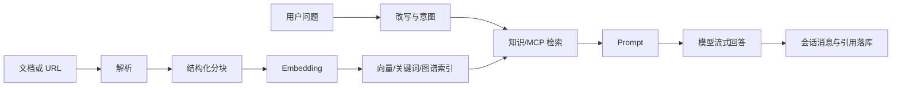

# Ragent Monster 源码学习指南

## 1. 文档定位

这套文档面向已经熟悉 Java 与 Spring Boot、但刚开始系统学习 RAG（Retrieval-Augmented Generation，检索增强生成）的开发者。它不替代部署手册，也不逐行翻译源码，而是回答下面几个更重要的问题：

- 系统由哪些进程、模块与中间件组成，它们为什么这样划分？
- 一次聊天请求、一次知识入库分别经过哪些对象、线程和存储？
- 意图识别、MCP、多通道召回、融合、重排与 Prompt 如何衔接？
- Chat、Embedding、Rerank、VLM 为什么共享模型路由基础设施？
- 哪些接口是稳定扩展点，哪些实现细节不宜直接依赖？
- 当前实现有哪些已确认的安全、可靠性、测试与维护风险？

运行、部署和日常操作请优先阅读[根 README](../../README.md)与[详细使用手册](../USER_GUIDE.md)。本目录专注于源码结构、设计意图和工程判断。

## 2. 审阅基线

| 项目 | 基线 |
| --- | --- |
| Git 分支 | `master` / `origin/master` |
| Git 提交 | `445730538941698b265303442737cfe910e684d4` |
| 提交时间 | 2026-07-27 02:23:27 +08:00 |
| 已跟踪文件 | 797 |
| Java 文件 | 579，含生产代码与测试 |
| TypeScript/TSX 文件 | 118 |
| PostgreSQL 业务表 | 22 |
| Spring MVC 映射注解 | 80 |

审阅范围包括 `bootstrap`、`framework`、`infra-ai`、`mcp-server`、`frontend`、SQL、Prompt、Docker Compose、脚本、测试与已有文档。`node_modules`、IDE 元数据、构建产物以及本地未跟踪的 `.reasonix/`、`frontend/vite.config.js`、`frontend/vite.config.d.ts` 不属于源码基线。

“完整审阅”不等于给 579 个 Java 文件相同篇幅。核心编排、并发、持久化与扩展接口会深入讲解；DTO、VO、DO、Mapper 和 UI 原子组件按职责归类。完整目录映射见[源码地图](11-source-atlas.md)。

## 3. 文档地图

| 顺序 | 文档 | 重点 |
| --- | --- | --- |
| 1 | [项目全景](01-project-overview.md) | 进程、模块、中间件、总体数据流 |
| 2 | [后端架构](02-backend-architecture.md) | Spring 分层、认证、异常、幂等、MQ、Trace |
| 3 | [RAG 聊天流水线](03-rag-chat-pipeline.md) | 从 HTTP/SSE 入口到答案落库 |
| 4 | [检索、意图与 MCP](04-retrieval-intent-mcp.md) | 改写、意图、多路召回、RRF、Rerank、工具调用 |
| 5 | [知识库与摄取](05-knowledge-ingestion.md) | 文档解析、分块、增强、向量化和索引 |
| 6 | [AI 基础设施](06-ai-infrastructure.md) | 多厂商客户端、模型路由、熔断和首包切换 |
| 7 | [数据与中间件](07-data-and-middleware.md) | 表模型、各类存储、消息与一致性 |
| 8 | [前端架构](08-frontend-architecture.md) | 路由、Store、Service、SSE 状态机 |
| 9 | [API、配置与 Prompt](09-api-config-and-prompts.md) | 接口目录、配置层次和模板资产 |
| 10 | [测试与可观测性](10-testing-observability.md) | 测试边界、Trace、日志和排障 |
| 11 | [源码地图](11-source-atlas.md) | 所有一方目录、包和关键类型索引 |
| 12 | [代码审查报告](12-code-review-report.md) | 严重度、证据、影响与改进建议 |
| 13 | [Parser 文档解析模块](13-parser-module.md) | 解析器路由、Block IR、Excel/Image/MinerU 实现与扩展约束 |
| 14 | [Chunk 文档分块模块](14-chunk-module.md) | 分块路由、Block-aware、纯文本策略、打包、Embedding 与扩展约束 |
| 15 | [数据库表完整参考](15-database-table-reference.md) | 22 张 PostgreSQL 表的全部字段、约束、索引、关系、状态、读写方与迁移历史 |

## 4. 推荐阅读路线

### 4.1 第一次建立全局认识

依次阅读 `01 → 03 → 05 → 08`。先理解两个最重要的业务闭环：

### 4.2 深入 RAG

依次阅读 `03 → 04 → 06 → 07`，同时打开以下入口源码：

- [StreamChatPipeline](../../bootstrap/src/main/java/com/hjs/study/ragent/rag/service/pipeline/StreamChatPipeline.java)
- [RetrievalEngine](../../bootstrap/src/main/java/com/hjs/study/ragent/rag/core/retrieval/RetrievalEngine.java)
- [MultiChannelRetrievalEngine](../../bootstrap/src/main/java/com/hjs/study/ragent/rag/core/retrieval/MultiChannelRetrievalEngine.java)
- [RoutingLLMService](../../infra-ai/src/main/java/com/hjs/study/ragent/infra/chat/RoutingLLMService.java)

### 4.3 做架构与代码审查

依次阅读 `02 → 07 → 10 → 12`。审查报告中的问题按“已确认事实、影响、建议、验证方式”记录；建议不表示当前代码一定必须立即重构。

## 5. 阅读约定

- 文档中的“主服务”指 `bootstrap` 产生的 Spring Boot 应用。
- “知识入库”泛指从原始文档到可检索索引；源码中的 `ingestion` 特指可配置摄取流水线。
- “KB”指 Knowledge Base；“Chunk”指可检索的文档片段。
- “召回”指从一个检索通道取候选；“融合”指合并不同通道名次；“重排”指用 Rerank 模型重新估计相关性。
- “逻辑关系”不等于数据库外键。当前 PostgreSQL schema 主要依赖 ID 字段与应用层维护关系。
- 配置示例只解释键和覆盖规则，不复制凭据值。

## 6. 核心术语

| 术语 | 在本项目中的含义 |
| --- | --- |
| RAG | 先检索证据，再把证据与问题交给 LLM 生成答案 |
| Intent | 数据库中可配置的意图节点，可指向知识库、MCP 工具或系统回答 |
| MCP | Model Context Protocol；主服务作为客户端发现并调用独立 MCP Server 的工具 |
| Rewrite | 术语归一化、上下文补全与多问题拆分 |
| Retrieval Budget | `recallBudget → candidateLimit → contextTopK` 三段收窄预算 |
| RRF | Reciprocal Rank Fusion，只用名次融合异构检索分数 |
| Grounding | 支撑答案的检索片段；与前端展示的文档级 `SourceRef` 不完全相同 |
| Tier | Chat 模型档位，如 `fast`、`standard`、`deep` |
| TTFT | Time To First Token/Packet，用户感知的首包耗时 |
| Ingestion Pipeline | 可配置的 Fetcher、Parser、Enhancer、Chunker、Enricher、Indexer 节点链 |

## 7. 学习时应始终追踪的四个 ID

| ID | 产生位置 | 用途 |
| --- | --- | --- |
| `conversationId` | 新会话时生成，或沿用请求参数 | 聚合会话、消息和摘要 |
| `taskId` | 每次流式回答生成 | 取消、限流与 Trace 关联 |
| `traceId` | Trace 开启时生成 | 聚合一次 RAG 运行及其节点 |
| `docId` / `chunkId` | 文档与分块创建时生成 | 连接关系库记录和检索索引 |

理解这四类标识如何跨线程、跨存储传播，比背诵类名更有价值。
